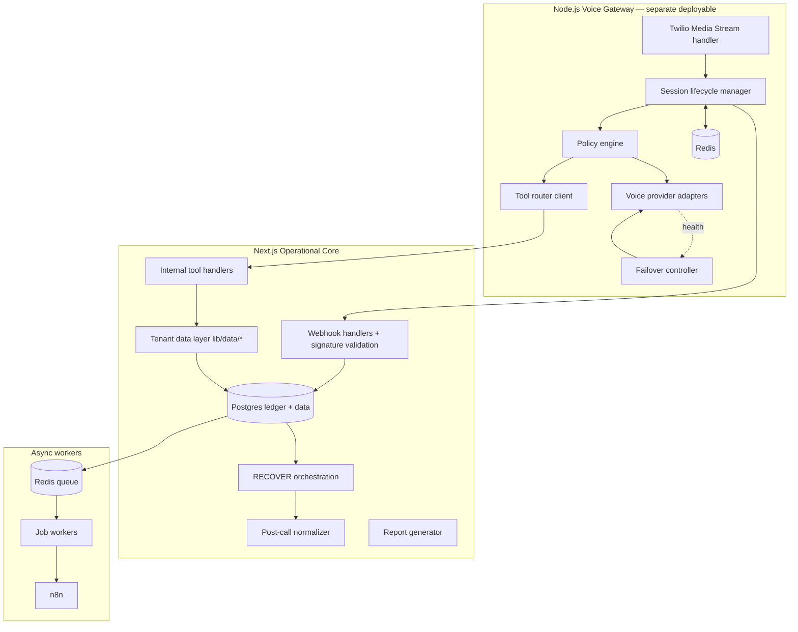
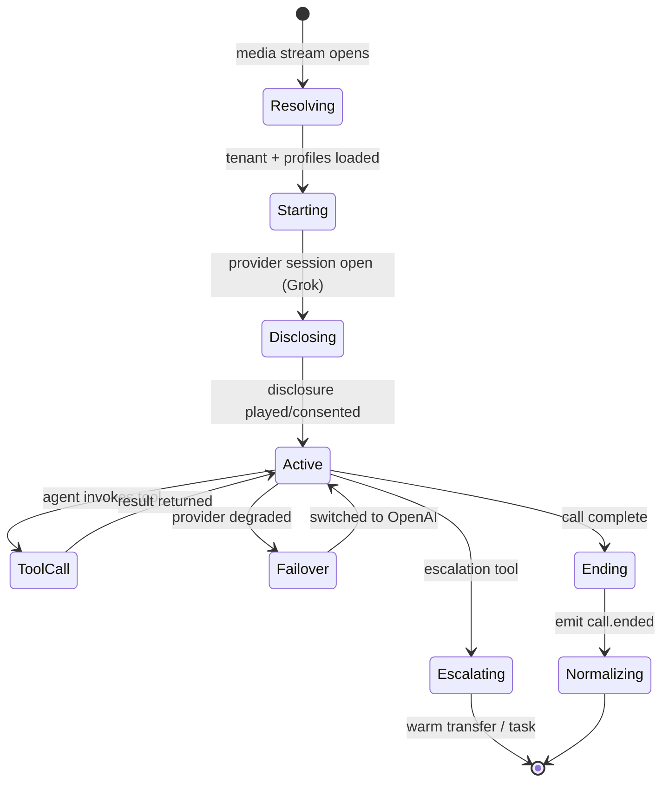
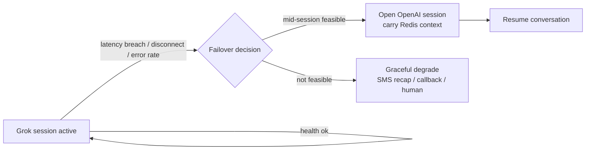

# ResponseOS — Backend Spec

**Owner:** AJ Digital LLC / Audio Jones
**Status:** Canonical (go-forward).
**Read first:** [`RESPONSEOS_SYSTEM_ARCHITECTURE.md`](./RESPONSEOS_SYSTEM_ARCHITECTURE.md) · [`RESPONSEOS_EVENT_SCHEMA.md`](./RESPONSEOS_EVENT_SCHEMA.md) · [`RESPONSEOS_API_CONTRACTS.md`](./RESPONSEOS_API_CONTRACTS.md)
**Anchored by:** ADR-0012 (Grok primary/OpenAI fallback), ADR-0013 (voice gateway), ADR-0014 (Redis), ADR-0017 (n8n async)

> Two backend domains: the **Next.js operational core** (REST/webhooks, data layer, RECOVER orchestration, scoring, ROI, reporting) and the **Node.js voice gateway** (the realtime audio loop). This spec details the gateway, the provider abstraction, and the async boundaries — the parts that differ most from the original docs.

---

## 1. Backend topology



---

## 2. Twilio media stream handling

- Inbound call hits the tenant's **Twilio number** → Twilio connects a **Media Streams** WebSocket to the voice gateway (per-call socket).
- The gateway authenticates the stream (Twilio stream token), resolves the tenant from the dialed number via the routing profile, and starts a session.
- Audio frames flow bidirectionally: caller audio → provider; provider audio → caller. The gateway brokers, applies barge-in handling, and never blocks on async work.
- Outbound calls (campaigns, warm transfer) are initiated via Twilio REST from the core/async plane, then bridged through the gateway when realtime AI is involved.

---

## 3. Realtime session lifecycle



| Phase | Actions | Ledger / state |
|---|---|---|
| Resolving | Match number → tenant + routing profile; spam check | Redis: create `sess_*`; `call.received` |
| Starting | Load prompt/policy/routing **versions**; open provider session | `voice.session_started` (records versions) |
| Disclosing | Play recording/AI disclosure per tenant + jurisdiction | `disclosure_played=true` |
| Active | Stream audio; partial transcripts → Redis; turn-taking/barge-in | Redis working memory; finalized turns optionally ledgered |
| ToolCall | Policy-checked tool via tool router → core | `tool.invoked` / `tool.result` |
| Failover | Switch Grok→OpenAI mid-session if feasible | `voice.provider_failover` |
| Escalating | Warm transfer (bridge) or async task | `escalation.triggered` |
| Ending/Normalizing | Emit final transcript + outcome; hand to normalizer | `voice.session_ended`, `call.ended` |

Session state lives in Redis (ADR-0014), keyed `org:<id>:sess:<id>`, TTL'd; durable truth is the ledger. Redis loss degrades only in-flight calls.

---

## 4. Provider abstraction layer

A single provider-neutral interface (in `lib/providers/voice/*` and the gateway adapters):

```ts
interface VoiceProvider {
  startSession(ctx: SessionContext): Promise<ProviderSession>;
  streamAudio(session: ProviderSession, frame: AudioFrame): void;
  onPartialTranscript(cb: (t: PartialTranscript) => void): void;
  onToolCall(cb: (call: ToolCall) => Promise<ToolResult>): void;
  onTurnComplete(cb: (turn: Turn) => void): void;
  endSession(session: ProviderSession): Promise<SessionSummary>;
}
```

- **Grok adapter** (primary) and **OpenAI Realtime adapter** (fallback) implement this; Retell/Vapi/Bland adapters remain optional/future.
- **No provider-specific business logic** above the interface. Adapters translate provider payloads into canonical events (Event Schema) and canonical tool-call shapes.
- **Mock adapter** returns deterministic fixtures so the gateway boots and runs without keys (ADR-0001) until v0.3.

---

## 5. Provider failover (Grok → OpenAI)



| Trigger | Threshold (tunable per readiness gate) | Action |
|---|---|---|
| Connection lost | socket drop | reconnect once; else failover |
| Latency breach | turn latency > N ms sustained | failover |
| Error rate | provider errors > N% in window | failover; circuit-break new sessions to fallback |
| Hard outage | provider unreachable | route new sessions to OpenAI |

- Failover carries Redis session context (partial transcript, qualification facts so far) so the conversation resumes coherently.
- All failovers emit `voice.provider_failover` and increment `call_sessions.failover_count` for SLO tracking (target > 99% of failovers complete the call).
- If neither provider is healthy → graceful degrade: SMS recap + self-schedule link + human callback task (never a dropped lead).

---

## 6. Policy engine

- Loads the tenant **policy profile** (version recorded on the session) at start.
- Enforces during the call: allowed tools, escalation triggers (high value, edge case, explicit human ask, repeated AI failure, regulated context), price/quote ceilings, disclosure requirements, and compliance-lane behavior (recording/retention mode).
- Provider-neutral; reads from the data layer, not a provider. A policy breach attempt is logged (`tool.invoked` rejected) and routed to escalation rather than silently allowed.

---

## 7. Tool router

- Maps agent tool calls to internal handlers (`/internal/tools/:name`, see API Contracts §4.2).
- Standard tools: `lookup_contact`, `check_availability`, `create_quote`, `book_appointment`, `escalate_to_human`, `capture_callback`, `record_consent`.
- Each tool: policy-checked → executed against core/data layer + integrations → result returned to the agent → `tool.invoked`/`tool.result` ledgered.
- Tools are idempotent where they mutate (e.g., `book_appointment` keyed by session + slot) and degrade gracefully on `VENDOR_UNAVAILABLE`.

---

## 8. Event bus, queues, retries

| Concern | Implementation |
|---|---|
| Event bus | Ledger writes enqueue downstream jobs (Postgres → Redis queue) |
| Queue | Redis-backed (BullMQ-style); per-tenant fairness; queue depth = scaling/alert signal |
| Retries | Exponential backoff + jitter; per-job-class max attempts; dead-letter for poison jobs |
| Idempotency | Dedupe key (webhooks) + `Idempotency-Key` (POST) + `workflow_run_id` (n8n) |
| Ordering | Per-conversation/per-entity ordering where required |
| Backpressure | Downstream rate-limit → queue + `VENDOR_UNAVAILABLE`; never drop |

---

## 9. Post-call normalization

The single place raw realtime output becomes durable business objects:

1. Triggered by `call.ended`/`voice.session_ended`.
2. Applies the tenant's **retention/redaction lane** (Full / PII-scrubbed / Metadata-only) **before** persistence — raw and redacted artifacts to separate storage paths.
3. Extracts entities → writes/links `contacts`/`leads`, `lead_events`, `lead_qualification`, `call_segments`, `call_transcripts`.
4. Mirrors to HubSpot via the tenant connector (`crm_mappings`).
5. Updates ROI period facts and fires follow-up workflows (async, via n8n).

Normalization is replayable from the ledger (Event Schema §5).

---

## 10. Async workflow boundary (n8n)

- n8n is triggered **downstream of the ledger** (and via signed webhooks). It runs follow-up cadences, CRM fan-out, scheduled jobs, and tenant-specific glue.
- n8n **never** participates in the realtime audio loop (ADR-0017). A live call calling into n8n is prohibited.
- Workflow definitions are versioned in Git (Git upstream of n8n). Every run is logged to `workflow_runs` with `workflow_run_id` for idempotency.

---

## 11. Redis usage

| Use | Key pattern | TTL | Notes |
|---|---|---|---|
| Realtime session state | `org:<id>:sess:<id>` | minutes–hours | working memory; lost = degrade only |
| Failover context | within session hash | session TTL | carried Grok→OpenAI |
| Queue backing | BullMQ namespaces | job-dependent | async jobs |
| Rate-limit counters | `rl:<scope>` | window | per-tenant/per-key |

Redis is **never** the system of record. Every durable fact is in the ledger.

---

## 12. Provider readiness gate (v0.3, before live traffic)

Grok Voice and OpenAI Realtime must pass before any live tenant call (ADR-0012):

| Criterion | Pass condition |
|---|---|
| Telephony path | Twilio Media Streams ↔ provider verified end-to-end |
| Barge-in / turn-taking | Natural interruption handling at target latency |
| Latency | Turn latency within budget (< 3s inbound handoff; tunable) |
| Concurrency | Sustains target concurrent sessions per tenant + platform-wide |
| Webhook reliability | Lifecycle/tool/transcript events delivered + signature-validatable |
| Tool calling | Tool invocation + result round-trip works under load |
| Failover | Grok→OpenAI mid-session resume verified |
| Transcript/recording handling | Storage + redaction per lane |
| Escalation/handoff | Warm transfer + async task verified |
| Compliance posture | Retention + training-data policy reviewed; **regulated lanes blocked until verified** |

Until the gate passes, the gateway runs on the mock adapter. The gate is owned by backend/voice and tracked in [`../ops/RESPONSEOS_QA_VALIDATION_PLAN.md`](../ops/RESPONSEOS_QA_VALIDATION_PLAN.md).

---

## 13. Observability hooks

The gateway and core emit through OpenTelemetry to Sentry (errors/release health), Better Stack (uptime/logs/on-call), and PostHog (product analytics) — all tagged with `account_id`, never raw PII (ADR-0018). Realtime-specific signals: concurrent sessions, barge-in latency, provider-failover rate, tool-call latency, normalization lag. Detail in [`../ops/RESPONSEOS_OBSERVABILITY_AND_GOVERNANCE.md`](../ops/RESPONSEOS_OBSERVABILITY_AND_GOVERNANCE.md).

---

## 14. Assumptions & open questions

**Assumptions:** the gateway is a Node.js service deployable separately from Next.js; Grok/OpenAI realtime SDKs fit the `VoiceProvider` interface; Redis is acceptable for ephemeral state + queue on the Standard lane.

**Open questions:** (1) gateway↔core transport (REST vs gRPC) under load; (2) whether partial transcripts are ledgered or Redis-only (Event Schema §9); (3) per-tenant concurrency ceiling defaults; (4) circuit-breaker thresholds finalized at the readiness gate.

---

*ResponseOS Backend Spec — AJ Digital LLC / Audio Jones. Documentation phase only.*
