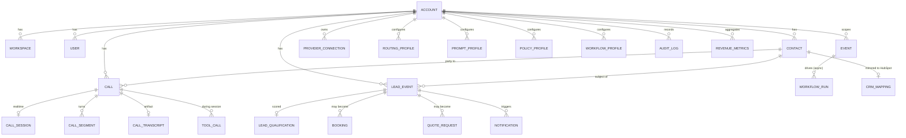
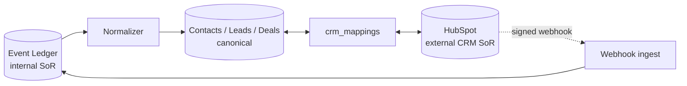

# ResponseOS — Data Model

**Owner:** AJ Digital LLC / Audio Jones
**Status:** Canonical (go-forward). Extends [`../data-schema.md`](../data-schema.md), which remains the authoritative field-level reference for the v0.1 (11 models) and v0.2 expansion tables.
**Read first:** [`RESPONSEOS_SYSTEM_ARCHITECTURE.md`](./RESPONSEOS_SYSTEM_ARCHITECTURE.md) · [`RESPONSEOS_EVENT_SCHEMA.md`](./RESPONSEOS_EVENT_SCHEMA.md)

> This document defines canonical IDs, the tenant-scoped entity set, relationships, retention, transcript strategy, and CRM mapping **for the go-forward stack**. It does not restate every column already specified in `../data-schema.md`; it adds the profile/connection/session entities the new architecture requires and ties them together.

---

## 1. Conventions (inherited from `../data-schema.md`)

- **snake_case columns** to match JSON/API shapes.
- **Tenant isolation:** every per-tenant table carries `account_id` (the v0.2 tenant root, renamed `account_id` in the expanded model). Always derived from session.
- **Money in cents** (Int).
- **JSON config** uses Postgres `jsonb`.
- **IDs are `cuid()` strings**; timestamps are ISO 8601.
- **Modeling rules:** every mutable table has `account_id`, `created_at`, `updated_at`; every provider callback lands in the immutable ledger first with a durable dedupe key; every user-visible metric is computed from normalized facts, not raw provider payloads.

---

## 2. Canonical IDs

| ID | Form | Notes |
|---|---|---|
| Internal entity id | `cuid()` | All ResponseOS rows |
| Tenant root | `account_id` / `account_id` | Scopes everything |
| Provider-stable dedupe id | provider-native | Twilio `CallSid`/`MessageSid`, voice-provider `session_id`/`call_id`, Stripe `event.id`, HubSpot `eventId` |
| Event id | `evt_` + cuid | Ledger primary key |
| Realtime session id | `sess_` + cuid | Voice gateway; mirrored in Redis key + ledger |
| Idempotency key | client/provided | 24h retention (see API contracts) |
| HubSpot object id | HubSpot-native | Stored on the mapping, never used as the ResponseOS PK |

**Rule:** ResponseOS PKs are always internal `cuid()`s. External ids (HubSpot, Twilio, Stripe) live in mapping columns/tables, never as primary keys — so a CRM swap never breaks referential integrity (ADR-0002, ADR-0015).

---

## 3. Tenant-scoped entity map

### Core entities (from `../data-schema.md`)

`organizations`/`accounts`, `users`, `contacts`, `calls`, `lead_events`, `lead_qualification`, `bookings`/`appointments`, `quote_requests`/`quotes`, `automations`, `notifications`, `revenue_metrics`/`roi_metrics`, plus the v0.2 expansion: `events`, `leads`, `call_segments`, `call_transcripts`, `qa_logs`, `provider_connections`, `conversations`, `sms_messages`, `webhook_events`, `workflow_runs`, `audit_logs`, `consent_records`, `files`/`media`. Field-level detail lives in `../data-schema.md`.

---

## 4. New / clarified entities for the go-forward stack

These extend the v0.2 set to support the voice gateway, provider abstraction, and HubSpot-as-CRM-SoR. All carry `account_id`, `created_at`, `updated_at`.

### 4.1 `call_sessions` (realtime session, durable shadow of Redis)

The durable record of a realtime voice session. Redis holds the *ephemeral* working copy (ADR-0014); this table is the auditable shadow written from ledger events.

| field | type | notes |
|---|---|---|
| id | string | `sess_` cuid; matches Redis key suffix |
| account_id | string | tenant |
| call_id | string? | FK to `calls` |
| voice_provider | enum | `grok` \| `openai` \| `retell` \| `vapi` \| `bland` \| `mock` |
| provider_session_id | string? | external id |
| started_at, ended_at | timestamp | |
| status | enum | `active` \| `completed` \| `failed` \| `failed_over` \| `abandoned` |
| failover_from | enum? | provider failed over from, if any |
| failover_count | int | default 0 |
| disclosure_played | bool | recording/AI disclosure confirmation |
| policy_profile_version | string | which policy profile governed the call |
| prompt_profile_version | string | which prompt version answered |

### 4.2 `tool_calls` (agent tool invocations)

| field | type | notes |
|---|---|---|
| id, account_id | string | |
| call_session_id | string | FK |
| tool_name | string | `check_availability` \| `create_quote` \| `escalate_to_human` \| `lookup_contact` … |
| args_json | jsonb | redacted per lane |
| result_json | jsonb | redacted per lane |
| status | enum | `invoked` \| `succeeded` \| `failed` |
| latency_ms | int? | |

### 4.3 Per-tenant configuration profiles

Provisioning a tenant is data-only (no code). Each profile is versioned (history kept for audit + prompt regression).

| Table | Purpose | Key fields |
|---|---|---|
| `routing_profiles` | Number → behavior, hours, after-hours, spam thresholds, transfer targets | `config_json`, `version`, `active` |
| `prompt_profiles` | Versioned agent prompts, greeting, disclosure, persona | `prompt_text`, `version`, `language`, `active` |
| `policy_profiles` | Guardrails, escalation triggers, allowed tools, compliance lane, price ceilings | `config_json`, `version`, `compliance_lane`, `active` |
| `workflow_profiles` | Active n8n flows + cadences + timing | `config_json`, `version`, `active` |

> Profiles are referenced by version on each `call_session` so any call is reproducible against the exact config that governed it. Source content may originate in the Obsidian SOP/brand vault (ADR-0016) but is materialized into these reviewed rows — never read free-form at runtime.

### 4.4 `provider_connections` (per-tenant credentials)

Shipped in v0.2 closeout step 2.3 PR 31A. Used for HubSpot, calendar, Twilio (future BYO), and voice-provider keys when a tenant brings their own. **Credential encryption posture is fixed by [ADR-0020](../DECISIONS.md#adr-0020--provider-credential-encryption-app-layer-env-managed-key-opaque-ciphertext-v02-substrate):** AES-256-GCM with `(account_id, provider)` AAD; opaque `Bytes` column with `[version | algorithm | nonce]` envelope header; env-managed key contract (`RESPONSEOS_PROVIDER_KEY`); mock-fallback to a redacted sentinel when the key is absent.

| field | type | notes |
|---|---|---|
| id, account_id | string | |
| provider | enum | `twilio` \| `grok` \| `openai` \| `retell` \| `vapi` \| `bland` \| `hubspot` \| `google_calendar` \| `calcom` \| `stripe` |
| credentials_encrypted | bytes | opaque AES-256-GCM ciphertext per ADR-0020; never returned by `lib/data/*` accessors |
| oauth_refresh_token_encrypted | bytes? | for OAuth providers (HubSpot, Google); same encryption posture |
| status | enum | `connected` \| `disconnected` \| `error` \| `expired` |
| scopes | string[] | granted OAuth scopes |
| connected_by | string | user id |
| last_verified_at | timestamp? | |

Unique index on `(account_id, provider)` — one connection per provider per tenant in v0.2 (planning artifact Q2 recommendation).

### 4.5 `crm_mappings` (HubSpot SoR linkage)

Maps internal entities to HubSpot objects so the ledger stays canonical while HubSpot is the external CRM SoR (ADR-0015).

| field | type | notes |
|---|---|---|
| id, account_id | string | |
| entity_type | enum | `contact` \| `deal` \| `ticket` |
| entity_id | string | internal cuid |
| hubspot_object_type | string | `contacts` \| `deals` \| `tickets` |
| hubspot_object_id | string | external id |
| last_synced_at | timestamp | |
| sync_state | enum | `synced` \| `pending` \| `conflict` \| `error` |

---

## 5. CRM mapping strategy (HubSpot SoR)

| Rule | Detail |
|---|---|
| Canonical first | Facts are written to the canonical model from the ledger; HubSpot is mirrored from canonical. |
| Mapping not identity | `crm_mappings` links internal cuid ↔ HubSpot id; HubSpot ids are never ResponseOS PKs. |
| Inbound HubSpot changes | Arrive via signed webhook (ADR-0009), land in the ledger, then reconcile into canonical + mapping. |
| Conflict handling | `sync_state = conflict` flags divergence for operator review; last-writer rules documented per object type. |
| CRM swap | Disable HubSpot connection, recompute/mirror to the new CRM from the ledger; no history loss. |
| Pluggable | GoHighLevel and others use the same canonical mapping; HubSpot is the default (ADR-0015). |
| Object mapping | ResponseOS `contact` → HubSpot contact; `lead_event`/`lead` qualified → HubSpot deal; service request/escalation → HubSpot ticket. |

---

## 6. Transcript strategy

Transcripts are PII-bearing and lane-sensitive. Two artifacts per call, in **separate storage paths/policies**:

| Artifact | Path | Visible to |
|---|---|---|
| Raw transcript | `org_id/raw/...` (object storage) + `call_transcripts.raw_ref` | `aj_admin` with break-glass only |
| Redacted transcript | `org_id/redacted/...` + `call_transcripts.redacted_ref` | QA reviewers, operators; clients per profile |
| Turn-by-turn segments | `call_segments` (speaker, sequence, text, confidence, redacted_text) | per lane |
| Inline transcript text (v0.2 substrate) | `call_transcripts.inline_text` | per lane via the standard tenant-scoped accessor |

**v0.2 substrate status (PR 31B):** `call_transcripts.raw_ref` and `call_transcripts.redacted_ref` columns exist on the model — they are the object-storage pointers the v0.3 normalizer will populate. **They are deliberately excluded from the `lib/data/callTranscripts.ts` public projection in 31B.** The privileged raw-transcript read accessor (which must record a `break_glass` audit-log entry on every elevated read) lands **after 31D** ships `audit_logs.category = "break_glass"`. In the interim, `inline_text` is the substrate read path and serves the seeded fixtures.

Retention by tenant lane (from `SECURITY.md`):

| Lane | Recordings | Transcripts |
|---|---|---|
| Full (Standard default) | Stored, configurable retention | Full + redacted |
| PII-scrubbed (Privacy-hardened) | Short retention (30d default) | Redacted only; structured facts kept |
| Metadata-only | Not stored | Not stored; outcome metrics only |

The normalizer applies the tenant's lane **before** persistence (see System Architecture § 9).

---

## 7. Retention policies (summary)

| Data class | Default retention | Notes |
|---|---|---|
| Event ledger | Long-lived; partitioned/archived by tenant + time | Internal SoR; never deleted casually |
| Redis session state | TTL (minutes–hours); self-expires | Ephemeral; never durable truth |
| Raw recordings/transcripts | Per lane (Full configurable / 30d / none) | Separate path; restricted access |
| Redacted transcripts | Per lane | QA/operator access |
| Audit logs | ≥ 1 year (incident evidence) | Immutable |
| CRM mappings | Lifetime of tenant | Cleared on offboarding/export |
| PII in analytics (PostHog) | None — `account_id` + non-PII metrics only | ADR-0018 |

Deletion/export workflows are tenant-scoped (offboarding): see [`../ops/RESPONSEOS_SECURITY_AND_COMPLIANCE.md`](../ops/RESPONSEOS_SECURITY_AND_COMPLIANCE.md).

---

## 8. Relationships to RECOVER

| RECOVER stage | Primary entities written |
|---|---|
| Respond | `events`, `calls`, `call_sessions`, `lead_events` (missed_call/answered_call) |
| Evaluate | `lead_qualification`, `tool_calls` |
| Capture | `contacts`/`leads`, `call_segments`, `call_transcripts`, `crm_mappings` |
| Offer | `quote_requests`/`quotes`, `notifications` |
| Verify | `bookings`/`appointments`, `consent_records` |
| Escalate | `lead_events` (follow_up_needed), `notifications`, escalation tasks |
| Report | `revenue_metrics`/`roi_metrics`, `qa_logs` |

---

## 9. What is NOT in the data model now

- **Billing tables** (`invoices`, `billing_accounts`, `usage_meters`, `outcome_fees`) — planning-only until v0.5 (ADR-0010).
- **Knowledge-layer tables** (`knowledge_sources`, `knowledge_chunks`, embeddings) — v0.4+ planning-only; no vector store committed (`../data-schema.md` § Future Knowledge Layer).
- **No Firebase, no provider-shaped tables as truth.**

---

## 10. Assumptions & open questions

**Assumptions:** the v0.2 `events`/`provider_connections`/`call_segments`/`call_transcripts` tables land as roadmapped and the go-forward additions (`call_sessions`, `tool_calls`, profile tables, `crm_mappings`) are forward-compatible Prisma migrations. HubSpot object model (contact/deal/ticket) suffices for MVP mapping.

**Open questions:** (1) `leads` vs `contacts`+`lead_events` final consolidation timing; (2) whether profiles are separate tables or a single versioned `tenant_config` with typed sections; (3) deal-vs-ticket mapping rules for service-request intake.

---

*ResponseOS Data Model — AJ Digital LLC / Audio Jones. Documentation phase only.*
