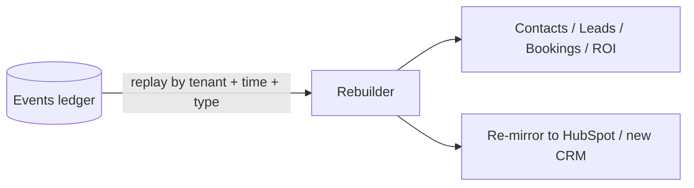

# ResponseOS — Event Schema

**Owner:** AJ Digital LLC / Audio Jones
**Status:** Canonical (go-forward).
**Read first:** [`RESPONSEOS_SYSTEM_ARCHITECTURE.md`](./RESPONSEOS_SYSTEM_ARCHITECTURE.md) § 7 · [`RESPONSEOS_DATA_MODEL.md`](./RESPONSEOS_DATA_MODEL.md)
**Anchored by:** ADR-0002 (event-ledger-first), ADR-0009 (signature validation), ADR-0017 (n8n async)

> The event ledger is ResponseOS's internal system of record. Every inbound call, outbound call, SMS, quote, schedule change, approval, payment event, tool call, and webhook lands here **first**, with a provider-stable dedupe key, **before** any business mutation. This document defines the naming convention, the canonical envelope, the catalog, and the replay/idempotency discipline.

---

## 1. Event naming convention

Events are named `domain.action` in lowercase snake/dot form. Domains are stable; actions are past-tense for facts that happened, imperative-free.

```
<domain>.<action>
```

| Domain | Meaning | Examples |
|---|---|---|
| `call` | Telephony / call lifecycle | `call.received`, `call.answered`, `call.missed`, `call.ended` |
| `voice` | Realtime voice session/provider | `voice.session_started`, `voice.partial_transcript`, `voice.provider_failover`, `voice.session_ended` |
| `sms` | Messaging | `sms.received`, `sms.sent`, `sms.failed` |
| `lead` | Lead lifecycle | `lead.created`, `lead.qualified`, `lead.status_changed` |
| `tool` | Agent tool calls | `tool.invoked`, `tool.result` |
| `quote` | Quoting | `quote.requested`, `quote.sent`, `quote.accepted`, `quote.declined` |
| `booking` | Scheduling | `booking.created`, `booking.confirmed`, `booking.cancelled`, `booking.no_show` |
| `escalation` | Human handoff | `escalation.triggered`, `escalation.resolved` |
| `crm` | HubSpot/CRM sync | `crm.contact_synced`, `crm.deal_created`, `crm.webhook_received`, `crm.conflict` |
| `payment` | Stripe (v0.5) | `payment.intent_created`, `payment.succeeded`, `payment.refunded` |
| `workflow` | n8n / async runs | `workflow.run_started`, `workflow.run_completed`, `workflow.run_failed` |
| `notification` | Outbound dispatch | `notification.queued`, `notification.sent`, `notification.failed` |
| `report` | ROI reporting | `report.generated` |
| `tenant` | Provisioning / config | `tenant.provisioned`, `tenant.profile_updated`, `tenant.offboarded` |
| `webhook` | Raw vendor callback envelope | `webhook.received` (specialization in `webhook_events`) |
| `audit` | Admin/governance | `audit.break_glass_started`, `audit.export_requested` |

**Rules:** new event types are added to this catalog in the same PR that emits them; no silent event names. Provider-specific event names are translated into these canonical names at the adapter boundary — never leaked upstream.

---

## 2. Canonical event envelope

Every ledger row shares one envelope. Payloads vary by `type`; the envelope does not.

```json
{
  "id": "evt_01JABCDEF...",
  "type": "call.missed",
  "organization_id": "acct_aj_roofing_01",
  "occurred_at": "2026-05-27T18:42:10.123Z",
  "received_at": "2026-05-27T18:42:10.456Z",
  "source": "twilio",
  "dedupe_key": "twilio:CA9f8e7d...",
  "idempotency_key": "optional-client-key",
  "correlation_id": "sess_01JXYZ...",
  "signature_valid": true,
  "schema_version": 1,
  "actor": { "type": "system|user|provider", "id": "..." },
  "compliance_lane": "standard",
  "payload": { /* type-specific, lane-redacted */ },
  "raw_ref": "object-storage-key-or-null"
}
```

| Field | Required | Notes |
|---|---|---|
| `id` | yes | `evt_` + cuid; ledger PK |
| `type` | yes | from the catalog (§3) |
| `organization_id` | yes | tenant scope; from session/route/connection, never client body |
| `occurred_at` | yes | provider/source timestamp |
| `received_at` | yes | when ResponseOS ingested it |
| `source` | yes | `twilio` \| `grok` \| `openai` \| `hubspot` \| `stripe` \| `n8n` \| `internal` \| `web` |
| `dedupe_key` | yes | `"<source>:<provider-stable-id>"` — drives idempotency |
| `correlation_id` | no | ties related events (e.g., a call session) |
| `signature_valid` | webhooks | must be `true` before any business mutation (ADR-0009) |
| `schema_version` | yes | per-`type` payload version; bump on breaking change |
| `payload` | yes | type-specific; **already lane-redacted** for PII |
| `raw_ref` | no | pointer to raw artifact in object storage (raw transcripts/recordings), access-controlled |

> The ledger row is immutable. Corrections are new events (`*.corrected`), never edits.

---

## 3. Event catalog (selected payload shapes)

### `call.received` (source: twilio)
```json
{ "call_sid": "CA...", "from": "+1305...", "to": "+1786...", "direction": "inbound", "routing_profile_version": "v3" }
```

### `voice.session_started` (source: grok|openai)
```json
{ "session_id": "sess_...", "voice_provider": "grok", "prompt_profile_version": "v5",
  "policy_profile_version": "v2", "disclosure_required": true }
```

### `voice.provider_failover` (source: internal)
```json
{ "session_id": "sess_...", "from": "grok", "to": "openai",
  "reason": "latency_breach|connection_lost|error_rate", "at_turn": 4 }
```

### `tool.invoked` / `tool.result` (source: internal)
```json
{ "session_id": "sess_...", "tool_name": "check_availability",
  "args": { "...": "lane-redacted" }, "result": { "...": "lane-redacted" }, "latency_ms": 320 }
```

### `lead.qualified` (source: internal)
```json
{ "lead_event_id": "le_...", "qualification_score": 82, "qualification_status": "qualified",
  "service_needed": "roof_repair", "urgency": "high", "service_area_match": true }
```

### `crm.webhook_received` (source: hubspot)
```json
{ "hubspot_event_id": "...", "subscription_type": "contact.propertyChange",
  "object_id": "1234", "occurred_at": "...", "signature_valid": true }
```

### `workflow.run_started` / `workflow.run_completed` (source: n8n)
```json
{ "workflow_run_id": "wfr_...", "workflow_id": "missed_call_recovery", "status": "started|completed|failed",
  "trigger_event_id": "evt_...", "error": null }
```

> Full per-type payloads are specified alongside the emitting code; this catalog fixes the **shape and naming discipline**, not every field. New types append here.

---

## 4. Dedupe & idempotency

`dedupe_key` is the spine of replay-safety. Rules (consistent with [`../api-spec.md`](../api-spec.md) § Idempotency and [`RESPONSEOS_API_CONTRACTS.md`](./RESPONSEOS_API_CONTRACTS.md)):

| Source | Dedupe key | Rule |
|---|---|---|
| Twilio voice | `twilio:<CallSid>` | duplicate `call-status` callbacks must not create duplicate calls/lead_events |
| Twilio SMS | `twilio:<MessageSid>` | duplicates collapse to one conversation entry |
| Grok/OpenAI realtime | `<provider>:<session_id>` | session-scoped; partials carry sequence numbers |
| HubSpot | `hubspot:<eventId>` | replays are no-ops |
| Stripe (v0.5) | `stripe:<event.id>` | `constructEvent` + dedupe |
| n8n | `n8n:<workflowRunId>` | same run id = replay, not a new run |
| Internal POST | `Idempotency-Key` header | 24h retention; same key + diff body → 409 |

**Write order (mandatory):** validate signature → write ledger row (dedupe) → enqueue/derive business mutation. A mutation never precedes its ledger write.

---

## 5. Replay & recomputation



- **Consumer fix → replay:** if a derived fact was computed wrong, fix the consumer and replay the ledger range; the ledger is unchanged.
- **CRM swap:** disable HubSpot, recompute canonical facts from the ledger, mirror to the new CRM (ADR-0015).
- **ROI recompute:** outcome facts and ROI marts are always recomputable from the ledger — never trusted from a vendor mart. This underpins audit-grade outcome-fee invoicing.
- **Determinism:** replay must be deterministic given the same ledger + the same versioned profiles (`prompt_profile_version`, `policy_profile_version` are recorded on `voice.session_started`).

---

## 6. Workflow event schema (async plane)

n8n and core async consumers are driven by ledger events and emit `workflow.*` events back (ADR-0017). Every async run:

1. Is triggered by a ledger event (`trigger_event_id`) or a schedule.
2. Carries a `workflow_run_id` (idempotency).
3. Writes `workflow.run_started` → does its work → `workflow.run_completed` | `workflow.run_failed` (with `error`).
4. Is logged to `workflow_runs` (`run_id`, `workflow_id`, `status`, `started_at`, `ended_at`, `error`).

Failed runs are retried with backoff; poison runs go to a dead-letter queue and raise an ops signal. n8n is **never** in the realtime audio loop.

---

## 7. Audit structures

Audit events (`audit.*`) and `audit_logs` capture admin actions, prompt/profile changes, break-glass entries, and data exports. Each audit row: `organization_id`, `actor` (user id + role), `action`, `target`, `reason` (required for break-glass), `before`/`after` refs, `created_at`. Break-glass is time-boxed and notifies the tenant `client_admin` (see [`../ops/RESPONSEOS_SECURITY_AND_COMPLIANCE.md`](../ops/RESPONSEOS_SECURITY_AND_COMPLIANCE.md)). Audit logs are immutable and retained ≥ 1 year.

---

## 8. Versioning & governance

- `schema_version` is per `type`; a breaking payload change bumps it and both versions are handled during migration.
- New event types/domains are documented here in the emitting PR (no silent events).
- Consumers must tolerate unknown future fields (forward-compatible parsing).

---

## 9. Assumptions & open questions

**Assumptions:** Grok/OpenAI realtime emit enough lifecycle/tool/transcript signal to map onto this catalog; Twilio/HubSpot/Stripe dedupe ids are stable.

**Open questions:** (1) partial-transcript events — store every partial or only finalized turns (volume vs fidelity)? (2) whether `voice.partial_transcript` is ledgered or kept Redis-only and only `voice.session_ended` carries the final transcript (leaning Redis-only for partials, ledger for finals — confirm in backend spec); (3) event-ledger partition strategy at scale.

---

*ResponseOS Event Schema — AJ Digital LLC / Audio Jones. Documentation phase only.*
