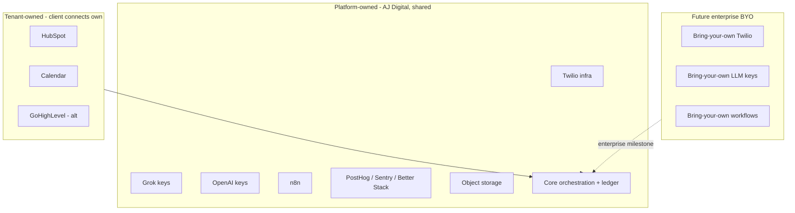
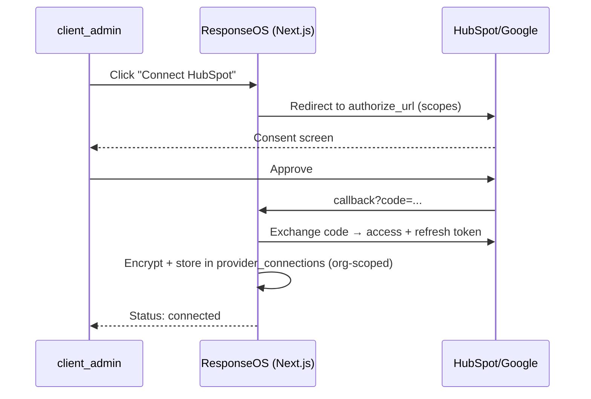

# ResponseOS — Integration Map

**Owner:** AJ Digital LLC / Audio Jones
**Status:** Canonical (go-forward).
**Read first:** [`RESPONSEOS_SYSTEM_ARCHITECTURE.md`](./RESPONSEOS_SYSTEM_ARCHITECTURE.md) · [`RESPONSEOS_DATA_MODEL.md`](./RESPONSEOS_DATA_MODEL.md) § 4.4 · [`../env-spec.md`](../env-spec.md)
**Anchored by:** ADR-0012/0015/0017 · ADR-0001 (mock-first) · ADR-0009 (signatures)

> Defines every external integration, who owns the credentials (platform vs tenant), the OAuth/connection strategy, and the future bring-your-own-provider model. The codebase is **shared**; tenants connect **their own** HubSpot, calendar, and (future) Twilio/LLM keys.

---

## 1. Integration inventory

| Integration | Category | Role | Ownership (MVP) | Direction | Webhook? |
|---|---|---|---|---|---|
| **Twilio** | Telephony | Carrier, numbers, SIP, Media Streams | **Platform** (tenant BYO future) | in + out | ✅ signed |
| **Grok Voice (xAI)** | Realtime voice | Primary voice agent | **Platform** (tenant BYO future) | realtime | ✅ signed |
| **OpenAI Realtime** | Realtime voice | Fallback voice agent | **Platform** (tenant BYO future) | realtime | ✅ signed |
| **HubSpot** | CRM | External CRM system of record | **Tenant** (OAuth) | bi-dir | ✅ signed |
| **Google Calendar / Cal.com** | Calendar | Availability + booking sync | **Tenant** (OAuth) | bi-dir | ⚠️ poll/push |
| **n8n** | Workflow | Async orchestration | **Platform** | event-driven | ✅ shared secret |
| **Resend** | Email | Transactional + report email | **Platform** | out | — |
| **Stripe** | Payments | Deposits/billing (v0.5) | **Platform** | bi-dir | ✅ signed |
| **PostHog** | Analytics | Product analytics | **Platform** | out | — |
| **Sentry** | Monitoring | Errors/release health | **Platform** | out | — |
| **Better Stack** | Monitoring | Uptime/logs/on-call | **Platform** | out | — |
| **Obsidian** | Internal knowledge | SOP/brand vault (Git-backed) | **Platform/internal** | — | — |
| **GitHub** | Source control | Canonical source; n8n defs upstream | **Platform** | — | — |
| **Object storage (R2/S3)** | Storage | Recordings, photos, exports | **Platform** | — | — |
| GoHighLevel | CRM (alt) | Alternative CRM connector | **Tenant** | bi-dir | ✅ signed |
| QuoteIQ | Quoting (ref) | Downstream connector, not SoR (ADR-0007) | **Tenant** | out (+ Zapier cal) | ⚠️ |

---

## 2. Platform-owned vs tenant-owned

| Tier | Platform owns | Tenant owns |
|---|---|---|
| **MVP / pilot** | Grok/OpenAI keys, Twilio infra, core orchestration, n8n, observability, storage | HubSpot, calendar, (workflows configured per tenant) |
| **Future / enterprise** | Core orchestration (always) | + bring-your-own Twilio, BYO LLM keys, BYO workflows |

The **core orchestration layer and the event ledger are always platform-owned** — that's the product. Telephony and LLM keys are platform-owned by default but can move to the tenant for enterprise (§5).

---

## 3. Credential ownership model

- **Platform credentials** (Grok, OpenAI, Twilio infra, Resend, observability, storage) live in the platform secret store (Vercel env / AWS Secrets Manager) — **never** in the repo (`../env-spec.md`). Mock fallback when absent (ADR-0001).
- **Tenant credentials** (HubSpot/Google OAuth tokens, alt-CRM keys, future BYO keys) live **encrypted at rest in the database** (`provider_connections`), decrypted at request time — **never** in `.env`, never in the repo.
- Tenant-specific keys are scoped to the tenant's `organization_id`; no cross-tenant credential access.
- Rotation: platform keys rotate quarterly / on provider config change; tenant OAuth refresh handled per provider; webhook signing secrets rotate with provider config.

---

## 4. OAuth / connection strategy

| Provider | Auth | Scopes (representative) | Refresh |
|---|---|---|---|
| HubSpot | OAuth 2.0 | contacts, deals, tickets, timeline, webhooks | refresh token (encrypted) |
| Google Calendar | OAuth 2.0 | calendar.events, freebusy | refresh token (encrypted) |
| Cal.com | API key / OAuth | availability, bookings | per scheme |
| GoHighLevel | OAuth / API key | contacts, calendars, conversations | per scheme |
| Twilio (platform) | account SID + auth token | subaccount per tenant (future) | rotate |
| Grok / OpenAI (platform) | API key | realtime/voice | rotate |

Webhook signature validation is mandatory before any business mutation for every inbound (Twilio, Grok, OpenAI, HubSpot, n8n, Stripe) — rules in [`RESPONSEOS_API_CONTRACTS.md`](./RESPONSEOS_API_CONTRACTS.md) §5 and [`../ops/RESPONSEOS_SECURITY_AND_COMPLIANCE.md`](../ops/RESPONSEOS_SECURITY_AND_COMPLIANCE.md).

---

## 5. Bring-your-own-provider (Future / enterprise)

Enterprise tenants may later bring their own infrastructure. The abstraction already supports it; the work is connection management + per-tenant routing.

| BYO option | What changes | What stays | Milestone |
|---|---|---|---|
| BYO Twilio | Tenant's subaccount/numbers in `provider_connections`; routing profile points at tenant numbers | Gateway, providers, ledger unchanged | Future |
| BYO LLM keys (Grok/OpenAI) | Tenant's keys loaded per session via `provider_connections` | Voice provider interface + failover unchanged (ADR-0012) | Future |
| BYO workflows | Tenant-supplied n8n flows / webhooks | Async boundary unchanged (ADR-0017) | Phase 2+ |

**Constraint:** BYO never introduces provider-specific business logic; it only changes *which* credentials/numbers a tenant uses behind the same adapters.

---

## 6. Per-tenant integration profiles

Each tenant's integration behavior is data, not code (see [`RESPONSEOS_DATA_MODEL.md`](./RESPONSEOS_DATA_MODEL.md) § 4.3):

- **Routing profile** → which Twilio number maps to which behavior/hours/transfer.
- **Prompt profile** → agent prompts/disclosure (provider-neutral).
- **Policy profile** → allowed tools, escalation, compliance lane.
- **Workflow profile** → which n8n flows + cadences are active.
- **provider_connections** → the tenant's HubSpot/calendar/(BYO) credentials.

Swapping a tenant's CRM (HubSpot → GHL) or calendar is a connection change + re-mirror from the ledger; no business logic changes (ADR-0015).

---

## 7. Integration failure handling

| Failure | Behavior |
|---|---|
| CRM/calendar rate-limited | Queue + backoff; surface `VENDOR_UNAVAILABLE`; never drop the lead |
| Voice provider degraded | Grok→OpenAI failover; else graceful degrade (Backend Spec §5) |
| OAuth token expired | Mark `expired`; prompt re-connect; queue dependent jobs |
| Webhook signature invalid | 401, no parse, no mutation, log to security stream (ADR-0009) |
| Provider outage | Circuit-break; mock/degrade per lane; alert on-call (Runbook) |

---

## 8. Assumptions & open questions

**Assumptions:** HubSpot OAuth + webhooks meet MVP needs; Google Calendar `freeBusy` suffices for availability; Twilio subaccount-per-tenant is viable for future BYO.

**Open questions:** (1) HubSpot-default vs GHL-default for first pilots (many ICP tenants are GHL-native); (2) which enterprise milestone unlocks BYO Twilio/LLM; (3) calendar webhook vs poll for near-real-time availability.

---

*ResponseOS Integration Map — AJ Digital LLC / Audio Jones. Documentation phase only.*
