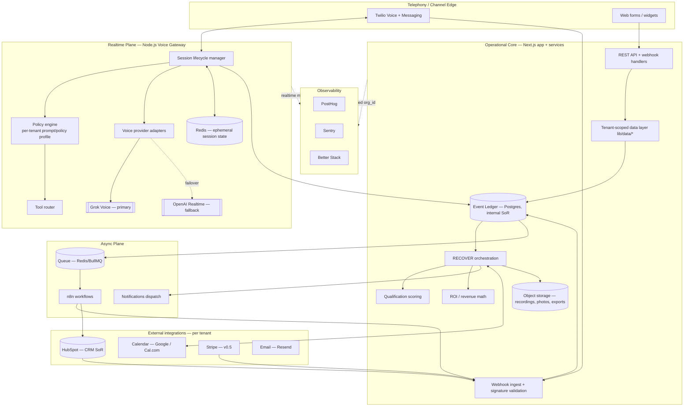
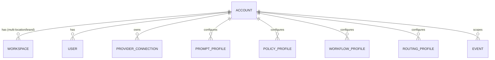
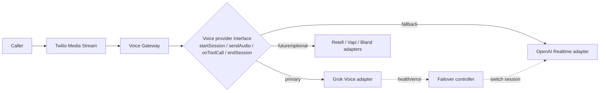
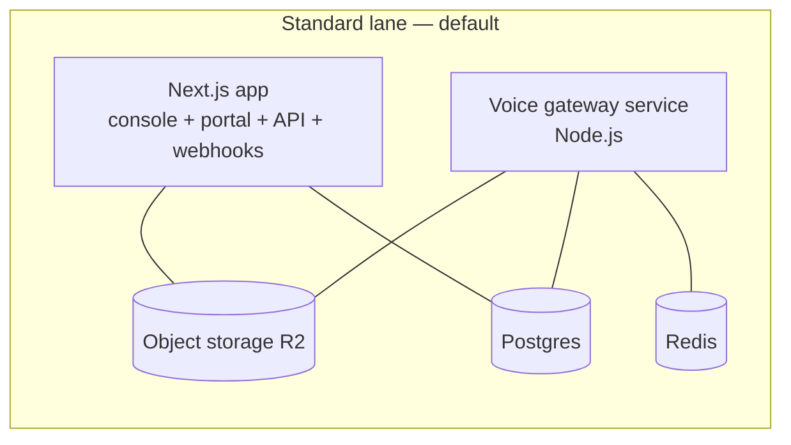

# ResponseOS — System Architecture

**Owner:** AJ Digital LLC / Audio Jones
**Status:** Canonical (go-forward).
**Read first:** [`../product/RESPONSEOS_BUILD_SOURCE.md`](../product/RESPONSEOS_BUILD_SOURCE.md) · [ADR-0011 → ADR-0018](../DECISIONS.md)
**Companion:** [`../architecture.md`](../architecture.md) (original; still authoritative where not restated here)

---

## 1. Architecture goals

| Goal | How it's met |
|---|---|
| Multi-tenant SaaS on one codebase | Tenant root + `organization_id` scoping on every entity; no repo/deploy per client |
| Separate realtime audio from async workflows | Dedicated Node.js voice gateway (realtime) vs n8n (async); they never share the audio loop (ADR-0013, ADR-0017) |
| Provider-agnostic | All providers behind adapters; Grok↔OpenAI failover transparent; no provider logic above the boundary (ADR-0012) |
| Auditable + replayable | Event-ledger-first; facts recompute from the ledger (ADR-0002) |
| Maintainable, not hype | Modular monolith + one sanctioned service split; typed contracts; mock-first |
| Enterprise-capable | Per-tenant isolation, RBAC, audit, three compliance lanes (ADR-0004), bring-your-own-provider path (Future) |

---

## 2. Logical components



### Component responsibilities

| Component | Owns | Does NOT own |
|---|---|---|
| **Telephony edge (Twilio)** | Carrier, numbers, SIP, Media Streams, inbound/outbound dial | Conversation logic, qualification |
| **Voice gateway (Node.js)** | Realtime session lifecycle, media socket, policy engine + tool router *during a call*, provider adapters + failover, emitting normalized events | Durable business state (writes to ledger), async workflows, UI |
| **Operational core (Next.js)** | REST/webhook API, tenant-scoped data layer, RECOVER orchestration, scoring, ROI math, report generation, UI surfaces | Realtime audio, carrier integration |
| **Event ledger (Postgres)** | Immutable canonical event log; internal system of record | Vendor-shaped payloads as truth |
| **Async plane (n8n + queue)** | Follow-up cadences, CRM fan-out, scheduled jobs, tenant-specific glue | Anything latency-critical / in the audio loop |
| **Redis** | Ephemeral realtime session state, queue backing, rate-limit counters | Durable business data |
| **Integrations** | HubSpot (CRM SoR), calendar, Stripe (v0.5), email — per tenant | Canonical truth (that's the ledger) |

---

## 3. Realtime plane vs async plane (the load-bearing separation)

This separation is the single most important structural decision (ADR-0013, ADR-0017).

| | Realtime plane | Async plane |
|---|---|---|
| Service | Node.js voice gateway | n8n + queue workers |
| Latency budget | Sub-second (barge-in, turn-taking) | Seconds → minutes |
| State | Redis (ephemeral, TTL) | Ledger + queue (durable) |
| Failure mode | Degrades the live call only | Retries; eventual consistency |
| Triggered by | Twilio media stream / call events | Ledger events, signed webhooks, schedules |
| Scaling signal | Concurrent calls | Queue depth |
| Deploy cadence | Independent, conservative | Independent |
| May call the other? | Gateway emits events to the ledger (async consumes) | n8n **never** participates in the audio loop |

**Hand-off contract:** the gateway's only durable output is normalized events written to the ledger. Everything downstream (CRM sync, follow-ups, notifications, reporting) is driven from the ledger by the async plane and the core — never by a synchronous call from inside a live conversation.

---

## 4. Multi-tenancy & isolation

### Tenant model



- **Account** = tenant root (the v0.2 rename of `organizations`). Every per-tenant row carries `organization_id` (mapped to `account_id` in the v0.2 model). **Workspace** = optional sub-tenant grouping for multi-location/multi-brand operators.
- **Isolation rule:** `organization_id` is **always** derived from the authenticated session, **never** trusted from client input. Enforced at the data-access layer (`lib/data/*`) so no surface can bypass it.
- **Roles:** `aj_admin` (full cross-tenant; AJ staff), `operator` (cross-tenant operational; AJ staff), `client_admin` (own workspace, full), `client_viewer` (own workspace, read-only). Cross-tenant access is staff-only; break-glass into a tenant is logged, time-boxed, and notified.
- **Storage isolation:** object-storage keys are prefixed with `organization_id`; Redis session keys are namespaced by `organization_id` + `session_id`.
- **Isolation tiers:** small tenants share the cluster with strict scoping; larger/regulated tenants can get their own DB and optionally VPC (ADR-0004, original `architecture.md`).

### Per-tenant configuration profiles

Provisioning a tenant requires **no code change** — only data. Each account configures:

| Profile | Holds | Examples |
|---|---|---|
| Routing profile | Number → behavior mapping, business hours, after-hours rules, spam thresholds, transfer targets | "After 6pm → AI + escalate high-value" |
| Prompt profile | Versioned agent prompts, greeting, disclosure script, persona | Per-state recording disclosure |
| Policy profile | Guardrails, escalation triggers, allowed tools, compliance lane | "Never quote price > $X without human" |
| Workflow profile | Which n8n flows + cadences are active, timing | Missed-call SMS delay 30s |
| Integration config | HubSpot/calendar/Twilio connection refs (encrypted) | Tenant's HubSpot OAuth tokens |

These are tenant-scoped rows; see [`RESPONSEOS_DATA_MODEL.md`](./RESPONSEOS_DATA_MODEL.md).

---

## 5. Provider abstraction & failover



- **Single interface.** `startSession`, `streamAudio`, `onPartialTranscript`, `onToolCall`, `onTurnComplete`, `endSession` — provider-neutral. The policy engine, tool router, and ledger only ever see this interface.
- **Failover controller.** Detects provider degradation (connection loss, latency breach, error rate) and switches Grok → OpenAI mid-session where feasible, or for the next call. Failover is recorded as a ledger event (`voice.provider_failover`) for observability and SLO tracking.
- **No provider-specific business logic** above the adapter. Adapter code translates provider payloads to the canonical event shapes in [`RESPONSEOS_EVENT_SCHEMA.md`](./RESPONSEOS_EVENT_SCHEMA.md).
- **Mock-first.** Adapters fall back to deterministic mock when keys are absent (ADR-0001); v0.3 wires live providers behind the readiness gate.

---

## 6. Policy engine & tool router

- **Policy engine** loads the tenant's policy profile at session start and enforces guardrails during the call: allowed tools, escalation triggers, price/quote ceilings, disclosure requirements, compliance-lane behavior (e.g., recording/retention mode). It is provider-neutral and reads from the ledger/data layer, not from a provider.
- **Tool router** maps the agent's tool calls (e.g., `check_availability`, `create_quote`, `escalate_to_human`, `lookup_contact`) to internal handlers. Tools execute against the core/data layer and integrations; results return to the agent. Every tool call is logged to the ledger (`tool.invoked` / `tool.result`) tenant-scoped.
- **Escalation** is a first-class tool: warm transfer (Twilio dial-out, bridge, hand off transcript + qualification snapshot) or async task + notification. See [`../automation-flows.md`](../automation-flows.md) flow 6.

---

## 7. Event bus & ledger

- **Event-ledger-first (ADR-0002).** Every inbound call, outbound call, SMS, quote, schedule change, approval, payment event, tool call, and webhook lands first in the canonical `events` ledger with a provider-stable dedupe key, **before** any business mutation.
- **Event bus.** The ledger doubles as the event backbone: ledger writes enqueue downstream work (queue → n8n/core consumers). This keeps "what happened" (immutable) separate from "what we did about it" (derived, replayable).
- **Replay.** Because business facts derive from the ledger, a buggy consumer can be fixed and the ledger replayed; a CRM swap recomputes facts without rewriting logic.
- Naming, payload shapes, and dedupe rules: [`RESPONSEOS_EVENT_SCHEMA.md`](./RESPONSEOS_EVENT_SCHEMA.md).

---

## 8. Queue strategy, retries, and idempotency

| Concern | Approach |
|---|---|
| Queue | Redis-backed (BullMQ-style) for async jobs; queue depth is a scaling/alert signal |
| Ordering | Per-tenant + per-entity ordering where it matters (e.g., a conversation's messages) |
| Retries | Exponential backoff with jitter; max attempts per job class; dead-letter queue for poison messages |
| Idempotency | Every mutation carries an idempotency key; webhook replays are no-ops via ledger dedupe key; n8n runs keyed by `workflowRunId` |
| Backpressure | If a downstream (HubSpot, calendar) rate-limits, jobs queue and surface a `VENDOR_UNAVAILABLE` signal rather than dropping |

Details in [`RESPONSEOS_BACKEND_SPEC.md`](./RESPONSEOS_BACKEND_SPEC.md) and [`RESPONSEOS_API_CONTRACTS.md`](./RESPONSEOS_API_CONTRACTS.md) § Idempotency.

---

## 9. Post-call normalization pipeline

```mermaid
sequenceDiagram
  participant GW as Voice Gateway
  participant L as Event Ledger
  participant N as Normalizer (core)
  participant CRM as HubSpot
  participant ROI as ROI math
  GW->>L: call.ended + raw transcript + tool results
  L->>N: enqueue normalization job
  N->>N: redact PII per tenant lane; extract entities
  N->>L: write Contact/LeadEvent/Qualification/Transcript (derived)
  N->>CRM: mirror contact/deal (tenant connector)
  N->>ROI: update period facts
  Note over N,CRM: All tenant-scoped; signature-validated upstream
```

The normalizer is the single place raw realtime output becomes durable business objects — applying tenant retention/redaction mode (Full / PII-scrubbed / Metadata-only) before persistence.

---

## 10. Deployment topology



- **Standard lane (MVP):** Next.js app + the **voice gateway as a separate deployable**, Postgres, Redis, object storage. The gateway scales on concurrent-call count; the app scales on request load.
- **Privacy-hardened / HIPAA-ready lanes:** per ADR-0004 — PII scrubbing + short retention, and (HIPAA) AWS-hosted primitives with BAAs. Voice providers (Grok/OpenAI) are **blocked on the HIPAA lane** until their compliance posture is verified (ADR-0012).
- No production deploys until v0.3 gates clear. Full topology, environments, and release process: [`../ops/RESPONSEOS_DEPLOYMENT_PLAN.md`](../ops/RESPONSEOS_DEPLOYMENT_PLAN.md).

---

## 11. Cross-cutting concerns

| Concern | Where |
|---|---|
| Security, PII, secrets, RBAC, retention, DR | [`../ops/RESPONSEOS_SECURITY_AND_COMPLIANCE.md`](../ops/RESPONSEOS_SECURITY_AND_COMPLIANCE.md) |
| Observability, telemetry, governance | [`../ops/RESPONSEOS_OBSERVABILITY_AND_GOVERNANCE.md`](../ops/RESPONSEOS_OBSERVABILITY_AND_GOVERNANCE.md) |
| Data model + retention | [`RESPONSEOS_DATA_MODEL.md`](./RESPONSEOS_DATA_MODEL.md) |
| Event schema | [`RESPONSEOS_EVENT_SCHEMA.md`](./RESPONSEOS_EVENT_SCHEMA.md) |
| API + webhook contracts | [`RESPONSEOS_API_CONTRACTS.md`](./RESPONSEOS_API_CONTRACTS.md) |
| Integrations + credential ownership | [`RESPONSEOS_INTEGRATION_MAP.md`](./RESPONSEOS_INTEGRATION_MAP.md) |
| Frontend surfaces | [`RESPONSEOS_FRONTEND_SPEC.md`](./RESPONSEOS_FRONTEND_SPEC.md) |
| Backend internals | [`RESPONSEOS_BACKEND_SPEC.md`](./RESPONSEOS_BACKEND_SPEC.md) |

---

## 12. Scaling posture

| Dimension | MVP | Scale path |
|---|---|---|
| Tenants | 1 internal + pilots | Shared cluster + strict scoping; dedicated DB/VPC for large/regulated tenants |
| Concurrent calls | Low (pilot) | Horizontal gateway autoscaling on concurrency; Redis cluster |
| Event volume | Modest | Ledger partitioning/archival by tenant + time (ADR-0002 cost note) |
| Async load | Low | Queue worker autoscaling on depth |
| Providers | Grok + OpenAI | Add adapters; no business-logic change (ADR-0012) |

**No premature microservices:** the voice gateway is the only sanctioned split. The core stays a modular monolith until a measured bottleneck justifies otherwise.

---

## 13. Assumptions & open questions

**Assumptions:** Grok/OpenAI realtime APIs support Twilio Media Streams-style streaming + tool calls; Redis is acceptable for ephemeral state on the Standard lane; the v0.2 data layer is the integration point for the gateway.

**Open questions:** (1) gateway co-located vs separate container platform on Standard lane; (2) whether the queue is Redis/BullMQ or a managed queue at scale; (3) provider-readiness gate criteria thresholds (latency, concurrency) — defined in [`RESPONSEOS_BACKEND_SPEC.md`](./RESPONSEOS_BACKEND_SPEC.md).

---

*ResponseOS System Architecture — AJ Digital LLC / Audio Jones. Documentation phase only.*
