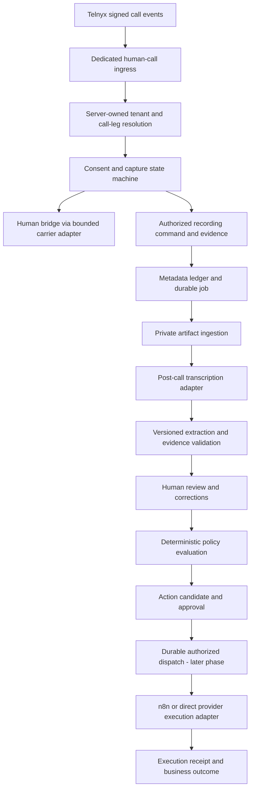

# Conversation Intelligence — architecture review

Status: **DOCUMENTED_ONLY / Proposed, not ratified**. Date: 2026-09-24.
Authoring agent: Codex. Independent review: pending; this report is not independent review of its own proposed changes.
Scope: human-handled commercial inbound calls. No runtime, migration, provider, credential, deployment, or client-data change is authorized by this packet.

## Decision and task specification

Recommend a bounded human-call capture capability within ResponseOS, followed by post-call evidence processing. Reuse the operational substrate and reconcile the open supervised-call work before implementation. Do not build a second receptionist, general CRM, or general workflow designer.

- **Problem:** human-handled calls lack a governed path from consented audio through reviewable commercial facts to authorized work.
- **Desired outcome:** tenant-scoped, versioned evidence that an operator can inspect and correct; later, deterministic action candidates linked to that evidence.
- **Success criteria:** A–Q below are specified; capture can fail closed independently of human conversation; each artifact has consent and provenance; no model output grants authority; Phase 1 is independently testable with synthetic inputs and zero network effects.
- **Scope now:** architecture, proposed ADRs, extraction schema, phase boundaries and exact implementation handoff.
- **Out of scope now:** production behavior, live calls, provider configuration, migrations, capture activation, STT/model requests, CRM writes, emails, SMS, binding quotes, realtime gateway, cross-tenant datasets and RAG.
- **Constraints:** existing recording prohibition; tenant isolation; independent review/human merge; FRL path non-interference; mock-first startup; existing ADRs win until expressly amended.
- **Existing assets:** code and schema listed in A; ADR-0013/0017/0030/0034/0047/0050/0051/0055/0056/0058; PR #177 is an unmerged dependency candidate.
- **Plan:** approve the scoped design and resolve dependencies; build Phase 1A contracts and synthetic persistence; separately authorize a provider proof for Phase 1B; only then activate bounded capture and advance phases.
- **Risks:** consent-to-media timing, mixed/unmapped channels, stale approvals, ambiguous external effects, sensitive-data retention, duplicate subsystems.
- **Open questions:** owner-approved recording amendment; human transfer exception; exact Phase 1 dependency baseline; approved retention/deletion policy; evidence sufficient to prove capture start/stop; operator fallback when consent is refused.

Facts below are tied to inspected commits. Proposed architecture is a recommendation, not a claim of availability. No live environment or provider account was inspected.

## A. Current architecture relevant to this capability

### Repository evidence

| Boundary | Verified state on 2026-09-24 |
|---|---|
| Original checkout | C:/dev/responseos, branch claude/supervised-frl-call-review-dc928d, clean at a9747cceb87a62864c65801126ef8bf99a6c047f; preserved |
| Review baseline | origin/master = 724a3e5bb221ccbb7ab9a6f8e64a29ed06174746 after fetch |
| Architecture branch | Existing remote architecture/conversation-intelligence pointed to that same baseline; no branch-specific commits or PR existed at inspection |
| Isolated worktree | C:/dev/responseos-conversation-intelligence, tracking the requested branch |
| Related implementation | Open [PR #177](https://github.com/AudioJones-Dev/responseos/pull/177), head c851940899e9758bfdc9b52758b1b80cc7407646; inspected as a reference, not merged state |
| Concurrent work | PRs #180/#181 concern lead qualification; #184 concerns commercial canon. No dependency is silently cherry-picked |
| Verification limit | Static repository review and public documentation; no execution, production readiness, current-head CI, or independent approval claimed |

### Existing substrate versus missing behavior

| Existing evidence | Implication |
|---|---|
| [Call, CallTranscript, CallSegment, WorkflowRun, WebhookEvent, AuditLog, CrmSyncOperation](../../prisma/schema.prisma) | Extend existing identities. CallTranscript is currently unique per call; CallSegment is unique per call/sequence, so neither is a revision ledger |
| [Session-scoped access](../../lib/data/session-helpers.ts), [call access](../../lib/data/calls.ts), [transcript access](../../lib/data/callTranscripts.ts) | Preserve server-derived tenant scope and existing redacted read projections |
| [Telnyx route](../../app/api/webhooks/telnyx/calls/route.ts), [signature parsing](../../lib/providers/telnyx/webhook.ts), [normalization](../../lib/providers/telnyx/normalize.ts) | Flag-gated, signed post-call ingress and persistence exist. Normalization writes transcript content; this baseline does not supply the new recording consent gate |
| Same Telnyx route + [CRM orchestration](../../lib/crm/syncFinalizedCall.ts) | The legacy, non-personalized finalized path calls CRM orchestration after normalization. New capture must never fall through this dispatch path |
| [CarrierProvider](../../lib/providers/carrier/types.ts) | Current interface exposes outbound dial, hangup and status; it does not define consented human bridge/recording lifecycle |
| [Execution policy](../../lib/agentExecution/policy.ts) | recordingEnabled is false at all tiers; transfer and CRM permissions are separate concerns. New capture cannot be enabled merely by selecting SUPERVISED_PILOT |
| [Capability contract](../../lib/capabilities/contract.ts) and validator | Git-defined, checksummed capability descriptors exist; they describe governance, not a runtime workflow executor |
| [n8n webhook](../../app/api/webhooks/n8n/route.ts) | Acknowledgement stub with unimplemented shared-secret verification; not an authenticated execution receipt boundary |
| PR #177: lib/callReview/consent.ts, contracts.ts, service.ts; lib/providers/telnyx/callControl.ts; Prisma capture/review models | Unmerged capture sessions, consent events, transcript revisions, analyses, review and effect fencing overlap substantially with this proposal. Reconcile instead of creating competing ledgers |
| ADR-0006/0026/0056 | R2 and Neon are architectural defaults; Langfuse is designated but gated. Their designation does not prove provisioned services or active integrations |

The canonical event envelope exists in [RESPONSEOS_EVENT_SCHEMA.md](./RESPONSEOS_EVENT_SCHEMA.md); there is no generic canonical Event table on the baseline. WebhookEvent is an ingress ledger, and mutable process status is not a substitute for append-only domain facts. Doctrine inventory counts and some prose are stale; the source findings above take precedence for current-state claims.

PR #177's ADR-0057 still forbids recording. Its later Call Control amendment documents a narrower provider start/stop evidence chain than earlier architecture notes: do not treat an old pending-support snapshot as current. That amendment concerns assistant/transcript capture and does **not** prove dual-channel recording boundaries.

## B. Proposed component architecture



Proposed modules:

1. **Voice capture:** isolated signed ingress, temporal number assignment, participant/leg correlation, affirmative consent, bridge, recording intent/acknowledgment, artifact admission.
2. **Conversation evidence:** immutable recording references, channel map, transcript revisions and extraction revisions. The existing Call remains the logical interaction.
3. **Action authorization:** deterministic business rules, current execution policy and capability permissions, revision-bound human approvals. No LLM tools or credentials in extraction.
4. **Dataset/evaluation:** permissioned snapshots of predictions, corrections and outcomes; no production content committed to Git.
5. **Future media gateway:** transport/session ownership only; no separate business-policy authority.

Build the evidence, policy and lineage code. Buy carrier, STT, model inference, storage and CRM services through narrow interfaces. Human-call intelligence is a distinct capability; it does not replace the existing AI receptionist's provider selection.

### Capture state and human continuity

Proposed capture lifecycle:

`received → disclosure_pending → awaiting_consent → granted → bridge_pending → recording_pending → capturing → stop_pending → closed`.

Terminal or suspended branches: `declined`, `expired`, `failed`, `withdrawn`, `reconciliation_required`. The human call lifecycle is separate: capture failure must not require dropping an otherwise safe human call.

Disclosure playback completion is not consent. Use a deterministic DTMF response for the caller, and explicit operator acknowledgment for the operator leg; do not start STT to detect the pre-consent "yes." Bind grants to participant, call, disclosure version, artifact class and capture generation. No response, unsupported digit or conflict is denial.

Bridge only to a server-allowlisted operator endpoint. A dialed operator leg is a provider outbound operation even though the commercial call is inbound; scope that exception explicitly. On refusal, support an unrecorded human continuation if the operator approves that design, otherwise a safe unrecorded termination path. No automatic voicemail recording or outbound callback.

Record after both relevant participants have granted and the bridge/leg mapping is verified. This leaves an intentional uncaptured initial interval; never reconstruct it from unauthorized buffers. Transfers, conference joins and operator changes stop admission until the participant map and consent are revalidated. Phase 1 supports only a verified two-party topology.

## C. Data model and lineage

Every new tenant object has account_id, id, created_at and a stable parent reference. Application authorization and composite tenant-parent constraints must both prevent cross-account linkage. Provider aliases are scoped by provider connection/application, environment, account and leg; caller-supplied account identifiers grant nothing.

| Requested concept | Proposed mapping and essential fields |
|---|---|
| Call | Reuse Call; add explicit capability/source discriminator and canonical-evidence pointer only when needed. One logical interaction, multiple provider legs; do not overload provider_call_id with every leg |
| CallParticipant | New; call_id, role (caller/operator/system/unknown), participant identity reference, provider leg, join/leave interval, channel-map version; phone presence is not verified identity |
| ConsentEvent | Reconcile to PR #177 CallConsentEvent; immutable grant/refusal/withdrawal, artifact and purpose, participant, disclosure_ref/version, source_channel, jurisdiction_basis, effective and received times, evidence_ref, actor and generation |
| Recording | New CallRecording; call/capture IDs, provider recording ID, channel count/map, capture interval, command/evidence refs, hash, private object ref, format, retention expiry, admission and deletion states |
| Transcript | Retain CallTranscript as compatibility projection; reuse/reconcile CallTranscriptRevision from #177 as authority. Add source recording IDs, channel-map version, STT/model/config version, completeness, language, hash and expiry |
| TranscriptSegment | New revision-bound segment identity; transcript_revision_id, sequence, participant_id or unknown, channel, offsets, text/redacted text, optional provider confidence. Existing CallSegment can remain a read projection |
| CallFact | Evidence-backed entries in immutable extraction JSON initially; field/value/status/confidence/segment references. A query projection may be added when a real query needs it |
| CallIntent | Versioned classification in the same extraction; explicit unknown/other/conflicted values, not forced false certainty |
| CallCommitment | Extraction entries: actor, action, due date when stated, evidence. Model text is not a business obligation or an executable instruction |
| CallActionCandidate | Later table: extraction/review revision, rule ID/version, normalized action type/payload hash, evidence references, policy result, approval requirement, superseded_by |
| WorkflowAction | Later table: candidate, destination and mapping version, frozen payload/hash, authorization snapshot, approval actor/time/expiry/revocation, stable effect key, state |
| WorkflowExecution | Extend WorkflowRun linkage for run summary; later per-action attempts with generation, lease, pre-effect intent, provider ID, receipt, reconciliation state. CrmSyncOperation remains owner of existing bounded CRM operations |
| HumanCorrection | New append-only correction: subject revision, field path, previous/new value refs, reason, reviewer, timestamp, evidence and adjudication state. Never overwrite the prediction |
| CallOutcome | New evidenced outcome assertions: disposition, verified source, linked execution, monetary amount/currency if evidenced, attribution class, occurred_at and correction chain |

Supporting concepts: CaptureSession (reconcile #177), ExtractionRevision (reconcile CallPostCallAnalysis), CallEvidenceEvent and durable processing job/outbox; later EvaluationDatasetVersion and EvaluationRun manifests. These are not fifteen mandatory Phase 1 tables.

```text
Call → CaptureSession → ConsentEvent(s)
                    → Recording(s) → TranscriptRevision → TranscriptSegment(s)
                                                       → ExtractionRevision
                                                       → HumanCorrection/Review
                                                       → ActionCandidate → WorkflowAction
                                                                         → WorkflowExecution
                                                                         → CallOutcome
```

Extraction provenance is server-owned: account/call/capture identity, all recording hashes, transcript revision/hash, model/provider version, prompt/schema/taxonomy hashes, request ID, processing time, policy version and review state. A new transcript or correction creates a new revision and invalidates unexecuted approvals. Completed effects retain their original lineage; corrections never imply an automatic compensating write.

## D. Call Intelligence JSON schema

The complete proposed payload schema is [conversation-intelligence.schema.json](./conversation-intelligence.schema.json). It is documentation, not a registered runtime contract.

The model produces a closed, typed observations object: caller details, classification, project intake, opportunity signals, commitments, missing fields and conflicts. All properties are required; unknown values are explicit nulls. A fact carries assertion status, nullable confidence and segment evidence. Confidence is a model estimate, not a calibrated probability.

The server wraps the payload in an authoritative envelope containing call/account identity, source revision and processing provenance. Neither accountId nor approval state nor executable actions come from the model. Carrier caller-ID is separately labeled transport metadata; it is not silently substituted for an extracted and verified caller identity.

Structured Outputs with strict JSON schema improves shape adherence, not factual accuracy. Refusal, incomplete response, missing output, schema failure and unsupported evidence all yield a failed/review-needed analysis, never dispatch. The chosen provider/model must support the schema subset before adoption. [OpenAI Structured Outputs](https://developers.openai.com/api/docs/guides/structured-outputs)

Application validation after parsing must enforce:

- referenced segments belong to this account, call and pinned transcript revision;
- offsets are nonnegative, ordered and within the source segment; null offsets mean unavailable, never invented word timing;
- asserted/inferred values have supporting evidence; unknown values use null; contradictory values remain conflicted;
- missingInformation is checked against the versioned intake requirements; a model omission cannot make intake complete;
- commitment dates are normalized against known call time/timezone, otherwise null;
- evidence text is untrusted data: embedded instructions cannot alter policy or invoke tools;
- phone/email/address format checks do not establish correctness or identity;
- personally sensitive facts are minimized before model context and before display.

Policy calculates evaluationRequired, SLA, owner assignment and candidate actions from validated facts and approved configuration. It does not accept model-generated recommendedActions as authorization. This deliberately separates a Call Intelligence observation from a workflow plan.

## E. Event model

Extend the existing canonical envelope rather than invent an incompatible bus. Proposed durable CallEvidenceEvent provides the first narrow persisted domain-event implementation, scoped to this capability; do not implement a general event platform.

Preserve id/type/account_id/occurred_at/received_at/source/dedupe_key/correlation_id/schema_version/actor/payload/raw_ref. Add causation reference and capture generation where required. signature_valid is meaningful for verified provider events, not a fabricated property of internal facts. Payloads contain minimized metadata and private references, not full transcript copies.

| Event group | Proposed canonical facts |
|---|---|
| Call/participants | call.received, call.answered, call.participant_joined, call.participant_left, call.ended |
| Consent/capture | call.disclosure_completed, call.consent_granted, call.consent_refused, call.consent_withdrawn, call.capture_started, call.capture_stopped, call.capture_failed |
| Recording | call.recording_available, call.recording_admitted, call.recording_rejected, call.recording_deleted |
| Interpretation | call.transcript_finalized, call.extraction_completed, call.extraction_rejected, call.review_completed, call.correction_recorded |
| Workflow | workflow.candidate_created, workflow.action_approved, workflow.action_revoked, workflow.run_started/completed/failed, workflow.reconciliation_required |
| Outcomes | call.outcome_recorded, call.outcome_corrected |

Telnyx call.recording.saved is provider evidence of availability, not proof of local artifact ingestion, channel identity, consent, or completed analysis. Verify signature/freshness and resolve tenant before admission; then translate it to call.recording_available. The documented callback exposes recording intervals and leg/session identifiers. [Telnyx callback](https://developers.telnyx.com/api-reference/callbacks/call-recording-saved)

Ingress dedupe remains provider/event-ID based with payload-conflict detection. Domain dedupe includes account, aggregate, generation, fact type and stable source identity. Commit the admitted event, state transition and job/outbox in one database transaction. An acknowledgment follows durable commit; no correctness dependency on Next.js after() staying alive.

Consumers use at-least-once delivery, leased claims, retry budgets and dead-letter/reconciliation states. They never order facts solely by receipt timestamp. Revocation wins ties; late or ambiguous events cannot reopen admission. Replay produces the same domain state and never re-dispatches approved external effects automatically.

## F. Workflow and policy boundary

ADR-0017 already places core RECOVER orchestration in code and n8n downstream. This proposal refines that boundary, not a replacement workflow platform.

`validated observations → deterministic candidate rules → review → revision-bound authorization → durable effect intent → adapter → verified receipt`.

For FRL, proposed rules first produce internal recommendations:

| Validated input | Candidate result |
|---|---|
| Sales inquiry about a VPL | Lead/evaluation intake recommendation with source evidence |
| Quote requested with missing approved intake fields | Quote-intake draft plus missing-field tasks; no final quote |
| Site evaluation requested | Evaluation recommendation, distinguished from quote request |
| Existing-customer service inquiry | Service-triage draft; unresolved customer matching requires operator review |
| Conflicted identity/service/consent or incomplete transcript | Review-needed; no dispatch candidate |

A WorkflowAction carries: action and effect ID, account, source revision/hash, rule version, evidence, risk class, calibrated eligibility if available, destination binding, payload hash, current policy decision, approval actor/state/time/expiry, idempotency key and immutable audit references.

Dispatch rechecks consent/processing eligibility, current tenant policy, destination, approval expiry/revocation and frozen content hash. A database generation fence prevents stale workers from updating newer attempts. Commit pre-effect intent before provider HTTP. Timeout after possible submission becomes outcome-unknown; reconcile, never blindly retry non-idempotent CREATEs.

n8n receives a narrowly authorized action envelope with an action ID and exact payload/destination, not the full transcript or a free-form instruction. Its callback must authenticate, correlate and be replay-safe. n8n credentials must not provide a route around ResponseOS authorization. WorkflowRun completion is a transport/execution result, not proof of business success or recovered revenue.

Phase 4 authorizes recommendations only. Human approval is represented and tested, but external execution begins only under a separate Phase 5 action-specific authorization. Existing CRM/FRL behavior remains separately governed.

## G. Realtime versus post-call boundary

Post-call is the **canonical processing path**, not automatic ground truth. A selected final transcript can still be wrong, incomplete, or awaiting human review. Canonical status means a versioned selected source; adjudicated human labels are a separate state.

Realtime state is provisional and cannot authorize effects. Future streams preserve leg, track, frame sequence, audio-relative offsets, gaps and transcript item IDs. Keep independent track buffers/STT sessions where needed to preserve role mapping. Merge by an explicit common time origin; never concatenate arrival order. Transfers and overlapping speech require explicit participant intervals.

Telnyx documents inbound/outbound/both-track media with stream and call identifiers. This proves transport labels, not the universal identity equation "inbound = customer." Require two-party fixture and provider qualification to establish the selected leg's mapping. Prompts, hold music, conferences and transfers may appear on an outbound track. [Telnyx media streaming](https://developers.telnyx.com/docs/voice/programmable-voice/media-streaming)

Current OpenAI Realtime transcription documentation describes incremental/final text and notes missing word timestamps, speaker labels and confidence for gpt-live-transcribe. File transcription supports speaker-labeled output with a compatible model. Pin model capability tests; never infer diarized speaker identity from a label alone. [Realtime transcription](https://developers.openai.com/api/docs/guides/realtime-transcription), [file transcription](https://developers.openai.com/api/docs/guides/speech-to-text)

For dual-channel files, validate and preserve the original stereo artifact; transcribe separate channels when the selected STT would otherwise downmix. Align outputs using audio offsets and retain silent channels. Post-call corrections explicitly supersede provisional UI state. If final audio is missing, label live-only evidence incomplete; do not silently promote it.

## H. Storage and hosting architecture

| Layer | Recommendation | Status/constraint |
|---|---|---|
| Telephony/recording | Telnyx Voice API and verified two-party recording topology | Existing carrier direction; recording needs new authorization and provider proof |
| Structured records | Prisma/Postgres; Neon is hosted default | Reuse ADR-0026; local/CI Postgres 16 |
| Evidence objects | Private R2 behind a narrow EvidenceStorage adapter | ADR-0006 direction; no bucket provisioning here |
| Async processing | Postgres durable job/outbox plus leased worker entrypoint | New bounded implementation needed; host decision deferred to provider phase |
| Web/admin review | Existing Next.js/Vercel application | No realtime gateway required for initial phases |
| Future live sessions | Evaluate Durable Objects against current Node/Redis gateway baseline | Proposed experiment; does not supersede ADR-0013/0014/0030 now |
| External operations | Existing direct adapter where sufficient; n8n for bounded async glue | No second execution authority or CRM chosen by this design |
| Observability | Redacted metadata and existing telemetry posture; Langfuse at owned model-call phase | ADR-0056; no transcript duplication in traces by default |

R2 stores original admitted audio, derived channel files if required, and authorized transcript/evaluation artifacts. Postgres holds private object keys/hashes, not public URLs. Never use Call.recording_url as a client-visible bearer access credential. Downloads require tenant authorization, audited short-lived access and retention checks.

Telnyx documents provider-hosted recordings and expiring download URLs, and custom S3/GCS storage. Direct Telnyx-to-R2 compatibility is not established by those docs. Prefer controlled backend retrieval after admission, hash/size verification and private R2 upload; confirm provider retention and deletion separately. A provider copy remains a separate deletion obligation. [Recording storage](https://developers.telnyx.com/docs/voice/programmable-voice/storing-call-recordings)

Vercel now documents WebSocket serving in beta, but connection lifetime is bounded by function duration and reconnects may reach another instance. Its support claim is valid; indefinite call-session durability does not follow. [Vercel WebSockets](https://vercel.com/docs/functions/websockets)

Durable Objects offer a useful per-call coordination candidate. Outbound WebSockets do not hibernate; a continuous STT connection means hibernation savings cannot be assumed. Benchmark duration, reconnect behavior, audio throughput, memory and cost before selecting the gateway. Key a future session by environment/account/capture-generation, not a bare provider call_control_id. [Cloudflare WebSockets](https://developers.cloudflare.com/durable-objects/best-practices/websockets/)

Audio transcoding and long file processing belong in a suitable worker, not automatically inside a Durable Object or short request handler. No DNS name, gateway service, infrastructure binding or secret is created by this design.

## I. Consent, privacy and deletion

Florida's statute includes an all-parties-prior-consent provision. The legal basis and actual disclosure/consent procedure need owner/legal approval; "may be recorded" alone is not evidence of an affirmative grant. Universal affirmative consent is the proposed product control, not a legal-compliance claim. [Florida statute 934.03(2)(d)](https://www.flsenate.gov/Laws/Statutes/2026/934.03)

Capture authorization must intersect:

1. approved tenant/capability policy and valid server-side assignment;
2. recording and transcript consent separately, for every current participant;
3. authorized purpose (service processing versus secondary evaluation use);
4. verified start/stop boundaries for the exact capture generation;
5. retention/processing policy and allowed provider destination.

No audio streaming, STT, recording, transcript retention or protected raw-webhook retention before permission for that artifact/process. In-memory inspection needed to verify an inbound payload is not permission to log or persist it. Metadata-only rejection must strip transcripts, recording URLs, arbitrary client_state and embedded text before ledger/error logging.

Withdrawal first closes admission transactionally and cancels queued processing; then issue stop commands and reconcile provider evidence. A database flag cannot stop a remote recorder. If stop cannot be confirmed, stop the media path or end the call under the approved fail-safe runbook; do not continue capture on an assumption. Uncertain intervals are rejected, with minimized metadata retained for incident handling. Never transcribe an unauthorized interval to determine whether it contains useful material.

Proposed policy configuration must specify raw audio TTL, transcript TTL, derived-fact TTL, review/dataset TTL, provider-copy TTL and backup expiration. These durations are unresolved owner decisions, not inherited automatically from prospect-demo TTLs. No live capture until they are set and deletion is tested.

Encryption: TLS/WSS, verified encryption at rest for DB/objects/backups, least-privilege service roles, key rotation and separation from provider credentials. No public objects; no secrets or real calls in fixtures. PII access is purpose-limited; raw access and exports are audited; default UI uses redacted evidence.

Deletion propagates through recording copies, channel derivatives, transcript/extraction/correction content, dataset snapshots, provider storage and processing caches. Maintain minimal tombstones and deletion receipts, cancel pending actions, block resurrection on replay and reapply tombstones after backup restore. Legal holds require explicit authority and visible status; do not promise immediate physical erasure from backups.

Payment handling must prevent capture, not merely redact after recording. Phase 1 excludes payment collection; use a separately approved secure payment channel. If payment-card speech begins unexpectedly, stop capture and quarantine the affected artifact under the incident policy. Medical/health details are minimized; no HIPAA claim or regulated workflow authorization follows.

## J. Dataset and evaluation architecture

An evaluation case references a permitted recording/transcript revision, immutable model prediction, schema/prompt/model versions, independent human labels, correction history, reviewer/adjudicator, scenario labels, permissions/expiry, and observed outcomes. A correction is a reviewer assertion until adjudicated; do not name every edit ground truth automatically.

Begin with synthetic audio/text and consenting internal test participants. Production calls require separate secondary-use permission and tenant-scoped storage. No cross-client training, fine-tuning or benchmarking by default; v0.4 knowledge and broader benchmark gates remain unchanged.

Split by customer/call family, not transcript segment; repeated calls and derived revisions must stay in one partition. Maintain a frozen holdout separate from prompt development. Sample both random calls and enriched failure cases, and report the sampling method. Include denial/withdrawal, noise, accents, interruptions, number/date spelling, unknown service, repeat callers, transfers, voicemail, conflicting facts and missing recordings.

| Evaluation | Report |
|---|---|
| Transcription | WER where human reference exists; separately exact accuracy of ZIP, phone, email, names, dates and lift measurements; missing/truncated speech rate |
| Classification | Per-class precision/recall and confusion matrix, abstention and out-of-taxonomy rate |
| Extraction | Field correctness, evidence-support precision, unsupported assertion rate, conflict detection and completeness |
| Policy | Candidate precision/recall, missed-action rate, prohibited-action rate; rules tested independently of STT |
| Safety | No pre-consent artifacts, no cross-tenant access, no stale-approval dispatch, no unauthorized external action in adversarial tests |
| Operations | End-to-ready latency, failed ingestion, deletion completion, review time, unknown-effect rate and cost per call |
| Outcomes | Actual follow-up completion and source-backed dispositions; estimated/influenced/collected revenue kept separate |

The proposed 25–50 discovery calls and 50–100 initial labels are planning heuristics, not automation acceptance gates. Taxonomy novelty should be measured by scenario, not only globally. Owner must approve thresholds and error costs before Phase 5. With zero errors in n independent observations, the rough 95% upper bound is about 3/n; 100 clean examples cannot establish a sub-percent unsafe-action rate. Correlated calls and rare scenarios further weaken that inference.

## K. Failure modes and recovery

| Failure | Required behavior |
|---|---|
| Invalid/stale signature; unknown or reused number assignment | Reject before mutation; no protected-content logging; ambiguous tenant cannot receive evidence |
| Duplicate/out-of-order webhook | Durable dedupe, generation check and monotonic state; conflicting duplicate quarantined as minimized metadata |
| Consent absent/refused/withdrawn; participant changes | Close admission; no STT or recording; safe human-only path if approved |
| Crash around bridge/record command | Persist command ID/intent first, correlate authenticated response and signed lifecycle evidence; unknown outcome reconciled rather than issuing another command |
| Operator busy/no answer/voicemail | No unauthorized voicemail capture; approved unrecorded fallback, mark human connection failed |
| Recording missing, mono or uncertain channel map | Mark incomplete/review-needed; do not assert two known speakers |
| Saved webhook arrives late or URL expired | Resolve against historical assignment/capture generation; authorized metadata lookup for renewed URL where supported; otherwise mark unavailable |
| Artifact download compromised | Allowlisted HTTPS sources, bounded redirects/size/duration, private-address denial and format validation; no arbitrary webhook-URL fetch |
| DB/object store unavailable | Durable retry/backpressure, no content admission without authority; avoid blocking already established human conversation when safe |
| Object upload succeeds but DB commit fails | Deterministic artifact key/hash and orphan reconciliation; no public exposure, bounded cleanup |
| STT/extraction refusal, malformed output or weak evidence | Bounded retry if safe, then operator review; never fabricate empty "successful" intelligence |
| Correction or withdrawal races dispatch | Transactional revision/policy check and generation fencing; supersede unexecuted approvals |
| Provider action times out after submission | Outcome-unknown, reconcile against frozen original intent; no claim of exactly-once effects |
| n8n callback forged/duplicated; provider acceptance only | Reject or dedupe callback; receipt does not prove customer receipt or business outcome |
| Retention expires during work | Jobs recheck tombstone and expiry before read/write; never resurrect deleted artifacts |
| Realtime disconnect/backpressure | Drop provisional processing with visible gaps; preserve human call if safe; canonical pipeline reports completeness honestly |

Durable job retries are allowed only within consent, retention and pinned revision bounds. Operational metrics use opaque IDs and reason codes. Reprocessing may create a new analysis revision; it cannot retroactively alter approved payloads.

## L. Required ADRs

Full draft decisions are in [conversation-intelligence-adrs.md](./conversation-intelligence-adrs.md), indexed from DECISIONS.md. Temporary CI-A through CI-D identifiers avoid colliding with ADR numbers on concurrent branches. All remain proposed.

- **CI-A:** isolated human-call capture and a narrow recording/bridge exception to ADR-0051 and relevant demo exclusions; no global recording toggle.
- **CI-B:** versioned recording/transcript/extraction/correction lineage and canonical selection; extend ADR-0034/0055 and reconcile #177.
- **CI-C:** candidate/approval/dispatch contract under ADR-0017/0050/0058, including uncertain effects and n8n receipts.
- **CI-D:** deferred realtime-host evaluation; selecting Durable Objects would amend ADR-0013/0014/0030, including Redis state ownership, not merely add a dependency.

No change to default AI voice provider, no RAG authorization and no general CRM/FSM engine.

## M. Implementation phases and exit gates

| Phase | Deliverable | Exit gate |
|---|---|---|
| 0 — this packet | A–Q review, schema and proposed ADRs | Owner design decision; independent review before merge; dependencies resolved |
| 1A — mock capture/persistence | Scoped capture state machine, consent/participant/recording metadata and synthetic signed ingress; mock bridge/record commands; durable jobs | Isolation, denial/withdrawal, ordering/replay, crash and no-dispatch tests; standard local/CI gates |
| 1B — provider qualification, separately authorized | Exact Telnyx bridge/dual-channel proof with consenting internal participants; start/stop/deletion evidence; private artifact ingest | Ratified exception, approved retention, provider/secret/environment authorization, independently reviewed exact head, controlled evidence |
| 2 — post-call intelligence | STT adapter, schema-backed extraction, immutable revisions and operator display | Representative accuracy/error/cost evaluation; no external effects; redaction and retention |
| 3 — dataset and evals | Corrections/adjudication, frozen holdout, model/prompt regression reports | Lawful-use scope, leakage tests, reviewed metric thresholds |
| 4 — recommendations | Deterministic candidate rules and frozen human approvals; simulated dispatch | Invalid/stale approvals rejected; false/missed action evaluation |
| 5 — bounded execution | Individually approved low-risk action classes and provider adapters | Action-specific risk thresholds, destination authorization, idempotency/reconciliation and rollback runbook |
| 6 — realtime copilot | Streaming admission, channel-aware provisional state, missing-fields/question UI | Hosting ADR and load/latency/cost evidence; provisional/canonical divergence evaluated; no live-state authority |

Phases do not silently grant each other permission. Phase 1A is the next recommended engineering slice after design approval; live Phase 1B is not implied by a mock-only implementation prompt.

## N. Exact files/modules proposed for later implementation

Paths below are a proposed plan, not files claimed to exist.

| Phase | Introduce | Modify/reconcile |
|---|---|---|
| 1A | lib/conversationIntelligence/capture/contracts.ts; state.ts; service.ts; events.ts; lib/conversationIntelligence/jobs.ts; lib/data/callRecordings.ts; callParticipants.ts; lib/providers/callCapture/types.ts; mock.ts; index.ts; app/api/webhooks/telnyx/human-calls/route.ts | prisma/schema.prisma + one next available migration including bounded event/job persistence; types/index.ts as appropriate; lib/providers/telnyx/webhook.ts only for shared verified parsing; prisma/seed.ts; reuse session helpers |
| 1A dependency | Reuse lib/callReview/consent.ts and capture/revision model names if #177 has landed | Otherwise stop for an approved shared-foundation extraction plan; never recreate competing CallConsentEvent/CallCaptureSession definitions |
| 1A tests | tests/unit/conversation-intelligence-capture.test.ts; tests/integration/conversation-intelligence-capture.integration.test.ts; tests/factories/callRecordings.ts; callParticipants.ts | Existing tenant-matrix and seed-parity tests; regression test proving human-call events cannot reach legacy CRM orchestration |
| 1B | lib/providers/callCapture/telnyx.ts; lib/providers/evidenceStorage/types.ts; mock.ts; r2.ts; lib/conversationIntelligence/artifacts.ts; scripts/process-conversation-intelligence.ts | Extend Phase 1A jobs for authorized artifact ingestion; dependency/runtime/config files only in separately approved provider task; retention runner |
| 2 | lib/conversationIntelligence/extraction/contracts.ts; service.ts; evidence.ts; lib/providers/transcription/types.ts; mock.ts; openai.ts; app/(admin)/admin/conversation-intelligence/page.tsx; app/api/conversation-intelligence/[callId]/route.ts | Reconcile #177 transcript revisions and post-call analysis; schema JSON promoted from docs only after compatibility validation; transcript accessors and redacted review DTOs |
| 3 | lib/conversationIntelligence/evaluation/contracts.ts; service.ts; corrections.ts; tests/evals/conversation-intelligence/ with synthetic fixtures only | QaLog linkage where sufficient; evaluation manifest storage, correction review API |
| 4–5 | lib/conversationIntelligence/policy.ts; actions.ts; dispatch.ts; lib/providers/workflowExecution/types.ts; mock.ts; n8n.ts | WorkflowRun linkage; CrmSyncOperation adapter boundary; capability descriptor record union only for implemented records; authenticated n8n callback |
| 6 | services/voice-intelligence-gateway/ entrypoint and tests after host ADR | Deployment layout chosen then; no speculative gateway scaffold now |
| Each phase | Scope-specific docs and tests | docs/data-schema.md; api-spec.md; SECURITY.md; architecture/RESPONSEOS_EVENT_SCHEMA.md; ROADMAP.md; dashboard/dashboard-data.json; CHANGELOG.md when merged |

CallCaptureProvider is a narrow new sub-interface for consented answer/disclosure/bridge/record/stop operations, sharing carrier identity, not a second carrier selection system. Its mock is the default. A real inbound request with missing configuration must report disabled/failure, never fabricate a successful recording from mock output.

Migration sequence numbers must be selected from the then-current master; do not reserve 0014–0016 that overlap #177. No existing Call transcript fields are dropped in Phase 1. A later migration introduces revision authority with backward-compatible read projections and provenance-aware legacy labels; no fabricated consent backfill.

## O. Risks, blockers, conflicts and technical debt

**High risk / blocked for live work:** recording is explicitly forbidden by current accepted policy; provider-specific start/stop and all-participant consent proof is absent for the proposed topology; retention/deletion decisions are unset; the bridge-to-cell operation needs a narrowly authorized outbound-leg exception.

**Safe now:** documentation review, synthetic examples and local schema checks. Architecture approval does not authorize implementation, provider work, merge, deployment or external actions.

**Design blockers before Phase 1:** choose the #177 dependency baseline; ratify the proposed capture semantics or revise them; approve the exact mock-only slice. #177 references and schemas are unmerged; a PR number or green check would not itself authorize reuse or merge.

**Conflicts to avoid:**

- Reusing the current Telnyx route risks automatic legacy CRM orchestration and raw payload retention before the new consent boundary.
- CallTranscript/CallSegment cannot serve as immutable revision stores under their current uniqueness constraints.
- A standalone fifteen-table ontology duplicates #177 and ADR-0058's capability work.
- A general workflow designer violates the product boundary; n8n remains an adapter.
- Durable Objects is not the existing ratified Node gateway choice.
- New intelligence does not ratify "proprietary moat," HIPAA, verified recovered revenue or production-ready claims.
- Human-call capture is a strategy expansion alongside the receptionist wedge, not permission to rewrite public positioning.

**Tradeoff:** post-call-first delays live suggestions but reduces simultaneous telephony, streaming and inference failure modes. Reusing #177 reduces duplicate safety machinery but requires dependency coordination. A minimal ledger/outbox adds durable recovery work now; it avoids relying on request lifetimes for evidence processing.

**Opportunity cost:** this work competes with validating the existing pilot end to end. Keep Phase 1 bounded; no realtime host purchase or broad CRM/FSM expansion until captured evidence demonstrates a useful operator workflow.

## Doctrine §21 — fifteen answers

1. **Layer:** Communications, Business Memory capture, Operational Models and Trust; verified outcomes only when separately evidenced.
2. **Build/integrate/defer:** build evidence/policy; integrate commodity telephony/STT; defer realtime and autonomous effects.
3. **Pilot benefit:** plausible improvement for human-handled intake, not yet measured; preserve the existing FRL pilot.
4. **Evidence:** immutable source hashes, consent intervals, revisions and effect receipts.
5. **Verified outcomes:** explicit outcome evidence/attribution; a call summary cannot verify revenue.
6. **Learning:** permissioned adjudicated corrections may improve extraction; no current moat claim.
7. **Commodity:** buy recording, STT, model inference, storage and CRM.
8. **Duplication:** reuse Call, transcript projections, WorkflowRun, CRM sync and #177 contracts; no native CRM/FSM or workflow builder.
9. **Lock-in:** provider IDs stay at adapters; portability remains unproven without tested alternatives.
10. **Tenant isolation:** server-derived account, temporal routing, composite relations, scoped objects/jobs and cross-tenant tests.
11. **Attribution:** identity uncertainty and estimated/influenced/collected states remain explicit.
12. **Claims:** DOCUMENTED_ONLY throughout; no production/integration/compliance claim.
13. **Approval:** artifact-specific consent, revision-bound operator authorization and separate provider activation.
14. **Compliance:** recording and secondary dataset use increase exposure; enforce minimization/retention/deletion before capture.
15. **Required now:** review and bounded foundation are justified by the request; realtime and general automation are not necessary now.

## P. Branch and review recommendation

Use **architecture/conversation-intelligence** in the isolated worktree, based on 724a3e5. The remote branch already existed empty of unique commits; this review does not reset or rewrite it.

Recommended later implementation branch: **feat/conversation-intelligence-capture-persistence**, created from then-current master after the approved foundation dependency is available.

This packet is Codex-authored and requires Claude or CodeRabbit independent review of the final changes before human merge. If another authoring harness contributes, apply the existing eligibility matrix; mixed Codex/Claude authorship requires CodeRabbit. Review outcome, exact head and evidence link remain pending, not inferred from checks. No agent merge or auto-merge.

## Q. Exact next Phase 1 implementation prompt

Paste into a **new Codex implementation task in C:/dev/responseos** only after the owner approves this design and mock-only implementation scope:

```text
Review/Diagnosis owner: Codex
Actionable AI Assistant Task owner: Codex
Execution location/tool: isolated ResponseOS Git worktree
Human/operator role: approve scope; independently review through eligible reviewer; perform merge
Copy/paste destination: new Codex repo implementation task

Implement Phase 1A only of the approved Conversation Intelligence architecture.
Read AGENTS.md, doctrine, PRD, ROADMAP, DECISIONS, SECURITY, data-schema, api-spec,
docs/architecture/conversation-intelligence-review.md and its proposed ADRs.
Confirm which decisions were actually ratified; this prompt is not ratification.

Verify remote, latest master, exact SHA, clean ownership and related PR state.
Create feat/conversation-intelligence-capture-persistence in an isolated worktree.
If PR #177's consent/capture foundation is not merged or an approved replacement
foundation plan is missing, stop dependent implementation and report the precise
dependency; do not cherry-pick or duplicate its models.

Implement a mock-only human-call capture capability:
- reuse Call and the approved shared capture/consent identities;
- add only participant/leg mapping, recording metadata, bounded domain-event
  and durable processing-intent persistence required for this slice;
- build a deterministic disclosure/affirmative-consent/bridge/record/stop state
  machine, with artifact-specific permission, generation fencing and withdrawal;
- use a narrow mock CallCaptureProvider; no Telnyx HTTP, STT, R2, LLM or n8n calls;
- add an isolated signed human-call ingress boundary disabled by default,
  with synthetic fixtures and server-owned tenant/assignment resolution;
- persist metadata only before authorization; deny content on uncertain bounds;
- keep human-call events out of existing legacy normalization/CRM dispatch;
- preserve every current FRL policy and recordingEnabled=false runtime setting;
- record no real audio and introduce no external side effects.

Prove tenant isolation, all-participant consent, denial/timeout/withdrawal,
duplicate/out-of-order delivery, ambiguous leg mapping, stale generations,
crash recovery and zero CRM/email/SMS/quote effects with meaningful tests.
Use deterministic synthetic fixtures, no secrets and no real client records.
Read relevant installed Next.js guides before changing routes.
Add the next available migration only; preserve existing consumers and mock parity.
Update phase docs, canonical event catalog and dashboard in the same change.

Run lint, typecheck, unit tests, build and Postgres 16 integration checks.
Report exact commands/results and any unavailable validation honestly.
Open a draft PR when the scoped change is ready; do not mark merge-ready without
required checks and eligible independent review on the current head.
No merge, live provider activation, secrets/configuration work, production deploy,
real-call capture or outbound customer action. Phase 1B requires separate authority.
```

## Review sources and verification limits

Primary public documentation was checked on 2026-09-24 and linked beside the relevant claims. The provider proof still needed includes exact recording command settings, channel-to-leg mapping, bridge behavior, start/stop effective bounds, transfer handling, retention and deletion for the actual account/configuration. Public API documentation alone cannot certify those facts.

This packet contains an architectural self-check, not an independent implementation review or deployment readiness assessment.

### Local packet validation

On 2026-09-24: JSON Schema Draft 2020-12 meta-validation passed; synthetic
unknown-value and evidence-bearing payloads validated; five malformed payloads
(extra authority field, out-of-range confidence, missing required field, invalid
intent, and string instead of boolean) were rejected. Local review links and
A–Q section coverage passed. Dashboard JSON parsed, task IDs/phases were valid,
existing tasks were preserved, and generatedAt/liveIssues were unchanged.
git diff --check passed.

These checks validate the documentation artifacts only. No runtime files or
migrations changed; lint, typecheck, application tests, build, integration tests,
provider schema acceptance and live capture were not run. The isolated worktree
has no installed node_modules. Standard local/CI gates and eligible independent
review remain required before a merge recommendation.
