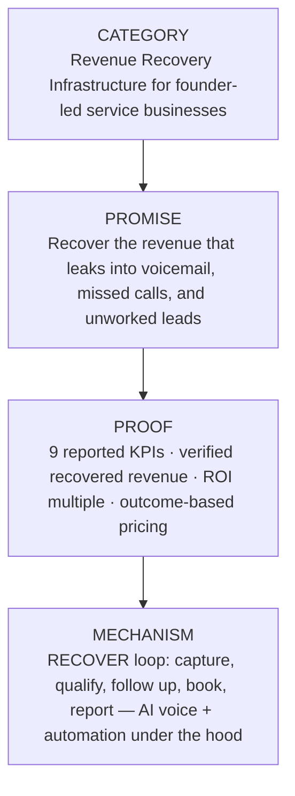

# RESPONSEOS_POSITIONING.md — Market Positioning & Category

**Product:** ResponseOS
**Owner:** AJ Digital LLC / Audio Jones
**Status:** Canonical brand doc. Source of truth for positioning, category, and differentiation. Update via PR.
**Companion docs:** [`./RESPONSEOS_BRAND_VOICE.md`](./RESPONSEOS_BRAND_VOICE.md) · [`./RESPONSEOS_SALES_NARRATIVE.md`](./RESPONSEOS_SALES_NARRATIVE.md) · [`./RESPONSEOS_WEBSITE_COPY_SPEC.md`](./RESPONSEOS_WEBSITE_COPY_SPEC.md) · [`../PRD.md`](../PRD.md) · [`../product-spec.md`](../product-spec.md) · [`../client-facing-offer.md`](../client-facing-offer.md) · [`../pricing-and-onboarding.md`](../pricing-and-onboarding.md)

---

## Purpose

This document defines how ResponseOS is positioned in the market: the category we are creating, who we are for, what we refuse to be, and how we differentiate against every alternative a founder-led service business might consider. Everything else in marketing, sales, and product copy inherits from this file.

---

## 1. The category: Revenue Recovery Infrastructure

> **ResponseOS is Revenue Recovery Infrastructure for founder-led service businesses.**

Most software for service businesses is built to *answer*, *store*, or *automate*. None of it is accountable for the revenue that leaks when a demand signal goes unworked. ResponseOS occupies a different category:

- It is **infrastructure**, not a feature — it sits underneath every demand signal (phone, SMS, web form, AI-answered call, outbound campaign), not bolted onto one channel.
- It is about **recovery**, not answering — capturing a call is one input; the product is what happens after, and whether the revenue is proven.
- It is **accountable** — the system reports recovered revenue and ROI every month, and a portion of the commercial model can be tied to verified outcomes.

We are not entering the "AI receptionist" market or the "contact center" market. We are naming and owning a category those products do not serve: the layer that makes sure demand a business already paid to generate does not walk into voicemail.

---

## 2. The core positioning statement

> **ResponseOS helps service businesses recover missed revenue by capturing calls, qualifying leads, automating follow-up, booking opportunities, and reporting ROI.**

This is the canonical one-liner. It appears verbatim across the PRD, product spec, and marketing site. Do not paraphrase it in ways that drop "recover," "missed revenue," or "reporting ROI" — those three are the load-bearing words.

The category line and the positioning statement work together:

- **Category:** *Revenue Recovery Infrastructure for founder-led service businesses.* (What it is.)
- **Positioning statement:** *Capture · qualify · follow up · book · report ROI.* (What it does.)

---

## 3. Who it is for

### Ideal Customer Profile (ICP)

The owner/operator or office manager of a **founder-led service business with phone-driven demand**. They feel missed calls as lost money but do not want to hire and manage a 24/7 receptionist, and they already own tools that do not talk to each other.

Typical shape:

| Attribute | Typical value |
|---|---|
| Average job value | ~$300+ |
| Missed calls / month | ~20+ |
| Existing CRM | Often GoHighLevel or HubSpot |
| Tooling reality | CRM + a VoIP + a calendar + a quoting doc + a follow-up spreadsheet, disconnected |
| Decision-maker | Owner/operator or office manager (one or two people, not a committee) |
| Demand pattern | Phone-driven, with after-hours and overflow leakage |

### Vertical segments

| Segment | Status | Notes |
|---|---|---|
| **Home services** — HVAC, roofing, plumbing, electrical, landscaping, contractors | **Primary (MVP)** | Highest missed-call pain, lowest compliance burden, fastest to ROI |
| **Med spas** | Phase 2+ (gated) | Requires privacy-hardened mode and vetted disclosure scripts |
| **Auto repair** | Future (gated) | Service-write-up + parts/labor quoting |
| **Real estate** | Future (gated) | Multi-agent lead routing |
| **Legal / medical** | Future (gated, HIPAA-ready lane) | Only after independent compliance review; **ResponseOS is not HIPAA-certified out of the box** |

See [`../product-spec.md`](../product-spec.md) "Vertical roadmap" for the gating rules behind each later vertical.

---

## 4. Value pillars, mapped to RECOVER

ResponseOS delivers value through one framework, expressed two ways. The **operator mapping** drives product decisions; the **buyer-facing translation** drives marketing and sales copy. They are the same seven stages.

| RECOVER stage | Operator mapping | Buyer-facing translation | Value to the owner |
|---|---|---|---|
| **R**espond | Answer every inbound call or text immediately | Revenue Leak Detection | Fewer missed opportunities |
| **E**valuate | Qualify service type, geography, urgency, budget, intent | Engagement Automation | Better lead quality |
| **C**apture | Normalize customer, job, transcript, attribution data | Call Capture System | Reliable CRM and reporting |
| **O**ffer | Present estimate, financing, self-scheduling, callback path | Outcome-Based Booking | Faster conversion |
| **V**erify | Confirm appointment, consent, payment intent, routing | Verification + Qualification | Lower no-shows, fewer errors |
| **E**scalate | Hand off edge cases, high-value jobs, compliance-sensitive calls | Economic ROI Tracking* | Better customer trust |
| **R**eport | Prove recovered leads, booked jobs, revenue by tenant and source | Reporting + Retention | Outcome-based pricing |

\* The buyer-facing list intentionally orders the seven economic benefits for sales clarity; the operator stages remain the canonical seven actions. Always drive product behavior from the operator column.

The governing philosophy behind the delivery framework is **OFFER**: Outcomes First · Front the Work · Framework Driven · Earn on Outcomes · ROI-Aligned Partnerships.

---

## 5. Positioning against the alternatives

A founder evaluating ResponseOS is really choosing between six options. We position against each.

### Differentiation table

| Alternative | What it does | Where it leaks | How ResponseOS is different |
|---|---|---|---|
| **Do nothing / voicemail** | Calls roll to voicemail after hours or during jobs | Most callers never leave a message; they call the next contractor | ResponseOS responds in under 60 seconds and works the lead, then proves what it recovered |
| **Hire a receptionist** | A person answers and books during shifts | Cost, turnover, no after-hours coverage, no reporting, no ROI proof | ResponseOS covers every hour, scales with volume, and reports recovered revenue monthly |
| **Generic AI receptionist app** | An AI answers and maybe books | Answering ≠ recovery — no qualification scoring, no quote-to-schedule state machine, no ROI attribution, no outcome accountability | ResponseOS is the orchestration + accountability layer; the receptionist is one input |
| **CRM / FSM tool** (GoHighLevel, HubSpot, ServiceTitan, etc.) | Stores contacts, pipelines, jobs | Passive — it records demand that already reached a human; it does not capture or recover missed demand | ResponseOS feeds the CRM with recovered, qualified demand and reports against it; it integrates rather than replaces |
| **Point missed-call-text tool** | Sends an auto-text after a missed call | One-channel, one-shot — no qualification, no booking, no quoting, no verified ROI | ResponseOS treats missed-call text as one Respond tactic inside the full RECOVER loop |
| **General automation tool** (Zapier, raw n8n) | Wires apps together | Requires the owner to design, maintain, and prove the workflow themselves | ResponseOS ships the opinionated recovery workflow and the reporting, maintained for them |

### "Why not just an AI receptionist?"

This is the most common comparison, so it gets its own treatment.

A receptionist — human or AI — **answers calls**. ResponseOS **recovers revenue**. The difference is everything that happens around the call:

- **Qualification scoring** — not every caller is a lead; ResponseOS evaluates service type, geography, urgency, budget, and intent.
- **Quote-to-schedule state machine** — the system moves a captured lead through offer → booking → quote → won/lost, not just "call answered."
- **ROI attribution** — recovered revenue is tied back to the specific call, message, or workflow event that produced it.
- **Monthly reporting** — the nine KPIs land in the client portal, the PDF export, and (where applicable) the outcome-fee invoice.
- **Outcome accountability** — a portion of the commercial model can be tied to *verified* booked appointments or *verified* recovered revenue.

None of that exists in a calling-only product. An AI receptionist is a capability; ResponseOS is the system that makes that capability accountable for money.

---

## 6. Anti-positioning — what we refuse to be

We say "no" loudly, because the category is crowded with products we are deliberately not.

ResponseOS is **NOT**:

- A generic AI chatbot.
- A hype "AI wrapper."
- An "AI OS" marketing-fluff product.
- An AI-receptionist clone.
- A contact-center / call-center SaaS.
- A general automation tool.

The AI is the **mechanism**, never the product. The product is **recovered revenue**. Any copy, demo, or deck that leads with the AI over the business outcome is off-brand. See [`./RESPONSEOS_BRAND_VOICE.md`](./RESPONSEOS_BRAND_VOICE.md) for the lexicon that enforces this.

---

## 7. Messaging hierarchy

Every message ladders from category down to mechanism. Lead with the category and promise; reach for the mechanism last, and only when it serves the outcome.

- **Category** — what kind of thing this is. (Lead here.)
- **Promise** — the outcome the owner buys.
- **Proof** — why they should believe it (the KPIs and the outcome-aligned commercial model).
- **Mechanism** — how it works. Last, and in service of the outcome.

---

## 8. The proof model

We do not prove the product with logos or testimonials we do not have. We prove it with **measurement and commercial alignment**. The proof *is* the nine KPIs and the outcome-based pricing.

The 9 KPIs reported monthly, per workspace:

1. **Recovered Revenue (estimated)** — qualified recovered leads × avg job value × estimated close rate.
2. **Recovered Revenue (verified)** — closed-won jobs traceable to ResponseOS-handled events.
3. **ROI Multiple** — recovered revenue ÷ monthly system cost.
4. **Missed Calls Recovered** — captured + followed up vs total missed.
5. **Qualified Leads Captured** — lead events scored qualified within the period.
6. **Appointments Booked** — confirmed bookings tied to recovered leads.
7. **Quote Requests Created (and Sent)** — quoting volume + delivery rate.
8. **Average Response Time** — first reply to inbound demand (target: under 60s).
9. **Admin Hours Saved** — vs the manual-follow-up baseline set at onboarding.

The commercial model reinforces the proof: every engagement carries a base setup and monthly fee, and outcome fees apply only to **verified** results above a baseline. **There is no performance-only pricing.** See [`../client-facing-offer.md`](../client-facing-offer.md) and [`../pricing-and-onboarding.md`](../pricing-and-onboarding.md).

---

## 9. The pitch, three lengths

**One line.**
ResponseOS is Revenue Recovery Infrastructure for founder-led service businesses — it captures missed calls, qualifies leads, books the work, and proves the recovered revenue every month.

**Elevator (≈30 seconds).**
If you run a service business, you are paying for marketing that walks straight into voicemail. ResponseOS sits on top of every demand signal — phone, text, web form, after-hours overflow — and makes sure none of it leaks. It responds in under a minute, qualifies the lead, books the appointment or sends the quote, and reports recovered revenue and ROI every month. It is not an AI receptionist; the receptionist is one input. ResponseOS is the recovery and accountability layer on top.

**Paragraph.**
Founder-led service businesses lose real money to missed demand: calls during jobs, after-hours inquiries, web forms nobody works, leads that go cold. That revenue was already paid for in marketing — and it leaks silently because no single tool is accountable for recovering it. ResponseOS is the operating layer that closes that gap. It captures every demand signal, qualifies and routes leads, automates follow-up, books opportunities and sends quotes, and reports recovered revenue and ROI monthly. The AI voice agent and automation are the mechanism; the product is the recovered revenue. We prove it with nine KPIs and a commercial model that ties a portion of fees to verified outcomes — never performance-only, always accountable.

---

## Assumptions

- Phone-driven demand is the dominant leak for the home-services ICP. Web-form and outbound-campaign leakage are secondary but in-category.
- The ICP already runs a CRM, so ResponseOS positions as an integration/orchestration layer, not a CRM replacement.
- "Founder-led" is a positioning qualifier, not a hard technical gate; the qualification gates in [`../pricing-and-onboarding.md`](../pricing-and-onboarding.md) are the real fit test.

## Open questions

- Does "Revenue Recovery Infrastructure" carry on its own in cold outbound, or does it need the explicit "for service businesses" qualifier every time? (Test in ad copy.)
- How hard do we lean on outbound campaigns in positioning while they remain a v0.3 capability? (Today: name them as in-category, do not headline them.)
- When the white-label/partner motion matures, do partners inherit this category language or get a partner-specific frame? (Revisit at v1.0.)
