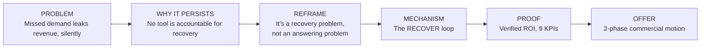

# RESPONSEOS_SALES_NARRATIVE.md — Sales Story, Discovery & Objection Handling

**Product:** ResponseOS
**Owner:** AJ Digital LLC / Audio Jones
**Status:** Canonical brand doc. Source of truth for the sales narrative arc, discovery, qualification, and objection handling. Update via PR.
**Companion docs:** [`./RESPONSEOS_POSITIONING.md`](./RESPONSEOS_POSITIONING.md) · [`./RESPONSEOS_BRAND_VOICE.md`](./RESPONSEOS_BRAND_VOICE.md) · [`./RESPONSEOS_WEBSITE_COPY_SPEC.md`](./RESPONSEOS_WEBSITE_COPY_SPEC.md) · [`../pricing-and-onboarding.md`](../pricing-and-onboarding.md) · [`../client-facing-offer.md`](../client-facing-offer.md)

---

## Purpose

This is the story we tell to sell ResponseOS, and the tools to run a sales conversation: the narrative arc, discovery questions, qualification gates, objection handling, a sample one-pager, an ROI math example, and the verbatim assessment paragraph. All of it is written in the [brand voice](./RESPONSEOS_BRAND_VOICE.md): a senior revenue analyst briefing an owner, never a startup pitching AI.

---

## 1. The narrative arc

### The problem — missed demand leaks revenue, silently

A founder-led service business spends real money to make the phone ring. Then the phone rings during a job, or after hours, or while the office manager is on another line — and it rolls to voicemail. Most callers don't leave one; they call the next contractor. A web form comes in over the weekend and nobody works it until Tuesday. A quote goes out and the follow-up never happens. None of this shows up as a line item. The owner sees a slow month, not a leak.

### Why it persists

Because no single tool is accountable for recovery. The CRM stores demand that already reached a human. The VoIP routes calls. The calendar holds appointments. The auto-text tool fires once. Each does its job. None is responsible for the revenue that falls between them — and none reports on it. The leak is invisible precisely because it's everyone's job and no one's number.

### The reframe — it's a recovery problem, not an answering problem

Owners think they have an answering problem, so they consider an AI receptionist or another hire. That's solving one channel. The real problem is that demand the business already paid for is leaking across every channel, unworked and unmeasured. The fix isn't a better way to answer — it's a system that's accountable for recovering and proving the revenue.

### The mechanism — the RECOVER loop

ResponseOS runs every demand signal through one loop: **Respond · Evaluate · Capture · Offer · Verify · Escalate · Report.** Respond in under 60 seconds, evaluate and qualify the lead, capture clean data, offer a booking or quote, verify the outcome, escalate edge cases to a human, and report the result. The AI voice agent and automation are the mechanism; the loop is the product.

### The proof — verified ROI

Every month, per business: recovered revenue (estimated and verified), ROI multiple, missed calls recovered, qualified leads, appointments booked, quotes sent, response time, and admin hours saved. Nine KPIs, with the evidence behind them. The commercial model reinforces it — a portion of fees can be tied to *verified* outcomes. **No performance-only pricing.**

### The offer — the 2-phase commercial motion

We don't install before we prove the leak. Phase 1 is a paid Readiness & Revenue Leak Assessment that returns a fit/no-fit answer. Phase 2 is implementation plus a monthly recovery retainer, in one of three tiers, with optional outcome fees on top. See [`../pricing-and-onboarding.md`](../pricing-and-onboarding.md).

---

## 2. Discovery questions

Run these to size the leak and test readiness. Map each to the qualification gate it informs.

| Question | What it sizes |
|---|---|
| How many calls a month go to voicemail or unanswered? | Missed-call volume |
| What happens to a call that comes in after hours? | After-hours leak |
| What's your average job value? | Revenue per recovered lead |
| Of the leads you do reach, roughly what share become jobs? | Close rate (for ROI math) |
| When a new lead comes in, how fast does someone respond? | Current response time |
| Where do your leads come from — phone, web, referrals, ads? | Lead sources / attribution |
| What CRM or system do you track customers in? | CRM readiness / integration |
| Walk me through how a customer gets booked today. | Booking workflow |
| How do quotes go out, and who follows up? | Quote + follow-up process |
| Who handles a tricky or high-value call? | Escalation path |
| Any recording, consent, or industry rules we need to respect? | Compliance risk |

---

## 3. Qualification gates

Implementation proceeds only when the business clears these (checked during the assessment, recorded in the AI Fit/No-Fit Diagnosis):

- Average job value preferably **$300+**.
- Meaningful missed-call volume — ideally **20+ missed calls/month**.
- Clear booking or quote process.
- Owner / staff buy-in.
- CRM / calendar access available.
- Compliance risk low for first clients.
- Measurable ROI path exists.

**Off the menu for first pilots:** medical, legal, HIPAA-regulated, and other sensitive workflows — unless the compliance lane is explicitly hardened and reviewed. **ResponseOS is not HIPAA-certified out of the box.** See [`../pricing-and-onboarding.md`](../pricing-and-onboarding.md) and [`../SECURITY.md`](../SECURITY.md).

---

## 4. Objection handling

| Objection | Response (analyst register) |
|---|---|
| **"I already have a CRM."** | Good — keep it. ResponseOS isn't a CRM. Your CRM stores demand that already reached you; it doesn't capture the calls that rolled to voicemail or the leads nobody worked. We feed your CRM recovered, qualified demand and report the revenue tied to it. We integrate, we don't replace. |
| **"We don't miss that many calls."** | That's exactly what the assessment measures. Most owners are surprised — missed calls during jobs and after hours rarely leave voicemails, so they're invisible. We'll size it with your real numbers before recommending anything. If the leak is small, the assessment says so and we don't install. |
| **"Isn't this just an AI receptionist?"** | A receptionist answers calls. ResponseOS recovers revenue. Answering is one input. The product is the qualification, booking, quoting, ROI attribution, and monthly reporting around the call — none of which a calling-only tool does. The receptionist doesn't tell you how much revenue it recovered; we do. |
| **"What about compliance / recording rules?"** | We assess compliance risk before we install, and we configure disclosure language by jurisdiction. For regulated work we have a hardened lane that only opens after independent review. To be clear: ResponseOS is not HIPAA-certified out of the box, and we won't represent it as compliant where it isn't. |
| **"Why outcome fees?"** | Because we're confident in the result and we want our incentives aligned with yours. Outcome fees apply only to *verified* booked appointments or *verified* recovered revenue above your baseline — upside, not the whole deal. Every engagement still carries a base setup and monthly fee. We don't do performance-only pricing; that's how vendors over-promise. |
| **"It's expensive."** | Compare it to the leak, not to zero. The assessment estimates recovered revenue and an ROI multiple before you commit to implementation. If the math doesn't clear, we tell you. The $1,000 assessment fee can credit toward implementation if you sign within 14–30 days. |
| **"Can't I just use a missed-call text tool?"** | You can, and we use missed-call text as one Respond tactic. But it's one channel and one shot — no qualification, no booking, no quoting, no verified ROI. The leak is across every channel; a single-channel tool plugs one hole. |

---

## 5. Sample one-pager pitch

> ### Stop paying for marketing that walks into voicemail.
>
> **The problem.** You spend money to make the phone ring. Calls during jobs, after-hours inquiries, and unworked web leads leak revenue you already paid for — silently, because no tool is accountable for recovering it.
>
> **What ResponseOS does.** It sits on top of every demand signal — phone, text, web form, after-hours overflow — and runs one loop: respond in under 60 seconds, qualify the lead, book the appointment or send the quote, escalate edge cases to your team, and report the recovered revenue. Your CRM stays; we feed it.
>
> **The proof.** Nine KPIs every month, per business: recovered revenue (estimated and verified), ROI multiple, missed calls recovered, qualified leads, appointments booked, quotes sent, response time, and admin hours saved.
>
> **How we work.** Phase 1 is a paid Readiness & Revenue Leak Assessment — we size your leak and give you a straight fit/no-fit answer before any install. Phase 2 is implementation plus a monthly recovery retainer (Recovery Core / Pro / Performance), with optional outcome fees on verified results. No performance-only pricing.
>
> **Start here.** Book the Readiness Assessment. If the numbers don't justify it, we'll tell you — and you'll still leave with a workflow map and a leak estimate.

---

## 6. ROI math — worked example

> All figures below are **illustrative examples**, not real client results. The assessment uses the business's own numbers.

A simple way to size the leak:

**Recovered revenue ≈ Missed calls recovered × Avg job value × Close rate**

Illustrative inputs:

| Input | Example value |
|---|---|
| Missed calls / month | 30 |
| Share recovered & worked by ResponseOS | 60% → 18 recovered |
| Average job value | $400 |
| Close rate on recovered, qualified leads | 25% |

Illustrative result:

- Recovered jobs / month: 18 × 25% = **4.5 jobs**
- Recovered revenue / month: 4.5 × $400 = **$1,800 (estimated)**
- Against a Recovery Pro retainer (illustrative $1,500/mo): **ROI multiple ≈ 1.2×** in month one, before factoring quotes, after-hours capture, or compounding.

The point of the example is the *method*, not the numbers: response speed × job value × close rate is where the leak hides. The assessment replaces every cell above with the client's real data and reports estimated vs verified separately.

---

## 7. The verbatim assessment paragraph

Use this in sales conversations and proposals, verbatim or near-verbatim:

> "Before I recommend AI automation, I run a ResponseOS Readiness Assessment. The goal is to determine whether your business is actually ready for AI response automation and whether the ROI is strong enough to justify implementation. If the numbers make sense, we install ResponseOS to capture missed demand, qualify leads, trigger follow-up, route booking or quote requests, and report recovered revenue monthly."

---

## Assumptions

- The seller is AJ Digital staff (or a trained partner) running a consultative motion, not a self-serve checkout.
- The assessment is always the first paid step; we do not skip to implementation pricing in discovery.
- Outcome-fee mechanics referenced here are commercial strategy; the billing/ledger code is roadmapped for v0.5 (see [`../pricing-and-onboarding.md`](../pricing-and-onboarding.md)).

## Open questions

- Should the one-pager carry a recommended default quote (Assessment + Recovery Pro), or stay quote-free to keep the assessment as the only ask? (Default today: quote-free; the default quote lives in the proposal.)
- Do we want a short "no-fit" letter template for businesses that fail the gates, to preserve goodwill and referrals? (Likely yes — add when the first cohort completes.)
