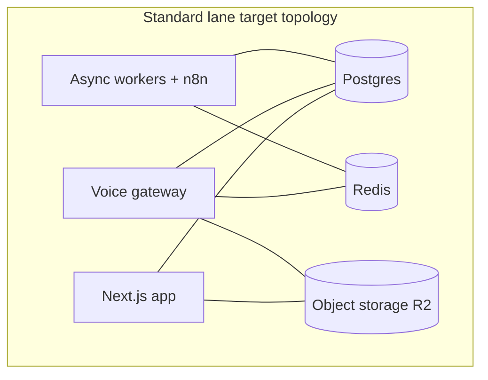

# ResponseOS — Deployment Plan

**Owner:** AJ Digital LLC / Audio Jones
**Status:** Canonical (go-forward). Extends [`../DEPLOYMENT.md`](../DEPLOYMENT.md) (three lanes, IaC, CI/CD, SLOs, rollback) with the go-forward topology. **Readiness gates are defined in** [`RESPONSEOS_V0_3_READINESS_GATES.md`](./RESPONSEOS_V0_3_READINESS_GATES.md) (Gate Set A = mock-safe demo; Gate Set B = live pilot). **Planning baseline (ADR-0031/0032/0033/0036/0037):** Telnyx / Vapi / HubSpot / Calendly on Neon + Vercel; **Node voice gateway + Redis are deferred** for the first founding-pilot slice (they remain documented as optional later topology, not a go-live hard dependency).
**Anchored by:** ADR-0001 · ADR-0019 · ADR-0036 (gateway + Redis **deferred** for first live slice) · ADR-0031–0037 · ADR-0046 · ADR-0004 (lanes) · ADR-0013/0014 (gateway/Redis retained as deferred design)

> **Hard rule:** do **not** promote Gate Set B (live providers) until those gates clear and live v0.3 is explicitly authorized. Gate Set A mock-safe demo deploys follow ADR-0046 + [`RESPONSEOS_DEMO_DEPLOY_RUNBOOK.md`](./RESPONSEOS_DEMO_DEPLOY_RUNBOOK.md). Current state: GitHub remote live (`audiojones-dev/responseos`); CI runs `validate` + `integration` on every push/PR; **staging-only** manual deploy scaffolding lives in `.github/workflows/deploy-staging.yml` (Environment `staging` + human approval); `master` auto-deploy disabled in `vercel.json`. Operator runbook: [`RESPONSEOS_STAGING_HOSTING_RUNBOOK.md`](./RESPONSEOS_STAGING_HOSTING_RUNBOOK.md).

---

## 1. Services to deploy (go-forward)

| Service | Runtime | Scales on | Notes |
|---|---|---|---|
| **Next.js app** | App Router (console + portal + marketing + API + webhooks) | request load | **first-slice deployable** (founding pilot) |
| **Voice gateway** | Node.js service | concurrent calls | **Deferred** (ADR-0036); not required for first founding-pilot slice |
| **Async workers** | Node.js workers + n8n | queue depth | n8n out of the audio loop (ADR-0017) |
| Postgres | Neon (Standard) / RDS (HIPAA) | data | event ledger = recoverable truth |
| Redis | managed | sessions/queue | **Deferred** with gateway (ADR-0036); ephemeral if later introduced (ADR-0014) |
| Object storage | R2 (Standard) / S3+KMS (HIPAA) | — | tenant-prefixed keys |

---

## 2. Three compliance lanes (per tenant, ADR-0004)

| Lane | Stack | Voice / comms providers |
|---|---|---|
| **Standard** (default, founding pilot) | App + Neon Postgres + R2 (Vercel/managed); gateway/Redis deferred | Telnyx primary / Twilio failover; Vapi primary (OpenAI preferred in-Vapi) / Retell secondary; HubSpot; Calendly |
| **Privacy-hardened** | Same + PII scrubbing + short retention + raw-transcript hiding | Permitted with scrubbing; review per provider |
| **HIPAA-ready** (pattern only) | AWS-hosted (CloudFront + Route 53 + ECS/Fargate + RDS + S3 + KMS + Secrets Manager) | **Blocked** until provider BAA/retention verified (ADR-0012); out of founding-pilot scope |

If/when the deferred gateway is introduced, it deploys per lane alongside the app; on the HIPAA lane it would run on AWS primitives with BAA-eligible services only.

---

## 3. Environments

| Env | Purpose | Providers |
|---|---|---|
| `dev` | local + preview per PR | mock adapters (zero keys) |
| `staging` | Path A host first (Clerk + Neon + portal); then provider-readiness gate + golden calls | mock until each live stage is authorized — Telnyx + Vapi first; HubSpot, Calendly, Twilio failover deferred-live (scope §1.1). See [`RESPONSEOS_STAGING_HOSTING_RUNBOOK.md`](./RESPONSEOS_STAGING_HOSTING_RUNBOOK.md) |
| `prod` | Standard / Privacy-hardened | live |
| `prod-hipaa` | HIPAA-ready (future) | per BAA; voice blocked until verified |

Mock-first everywhere keys are absent (ADR-0001).

---

## 4. CI/CD

Current CI: `validate` + `integration`. Staging Path A: manual `Deploy Staging` workflow (see runbook). Target deploy pipeline (v0.3+ prod still gated):

| Stage | Gate | Env |
|---|---|---|
| Lint + typecheck | required | all |
| Unit tests | required | all |
| Integration tests (Postgres) | required | all |
| Contract tests (gateway↔core, provider mocks) | required | all |
| DB migration validation (`prisma migrate diff/deploy`) | required | all |
| Staging host deploy (Path A, mock providers) | manual + Environment `staging` approval | staging |
| Golden-call regression | required before prompt/voice release | staging |
| Provider-readiness gate | required before live voice | staging |
| Security scan + dependency audit | required | all |
| E2E (Playwright/Cypress) | required (target) | preview/staging |
| Manual human approval | required | prod / prod-hipaa |
| Blue/green or canary | required | prod / prod-hipaa |

- **GitHub Actions with OIDC federation** to the cloud (no long-lived cloud secrets), per `../DEPLOYMENT.md`.
- n8n workflow definitions are versioned in Git (Git upstream of n8n).
- When the deferred voice gateway exists, it and the app deploy **independently** (separate pipelines), so one can roll back without the other. First founding-pilot slice: **app-only**.

---

## 5. Release process

1. Feature branch → draft PR → CI green → human approval → merge (Governance B1/B2).
2. Schema change = Prisma migration; applied via `prisma migrate deploy` in the pipeline.
3. Profile changes (prompt/policy/routing/workflow) are **data + versioned**, not deploys — they roll forward/back instantly via version.
4. Voice/provider release: golden-call pack + provider-readiness gate must pass.
5. Production deploy: manual approval + canary/blue-green; watch realtime + ingest SLOs post-deploy.
6. CHANGELOG line on merge.

---

## 6. SLOs (v0.3 targets)

| SLO | Target |
|---|---|
| Signed webhook validation success | > 99.9% |
| Missed-call text-back latency | < 60s |
| Inbound call → agent handoff | < 3s avg |
| Voice provider failover completes call | > 99% |
| Calendar-slot response latency | < 1.5s p95 |
| Appointment success after slot selection | > 98% |
| Monthly report generation | > 99% |
| Client portal uptime | 99.5% |
| Voice gateway availability | N/A until gateway is un-deferred; target defined at that gate |

---

## 7. Rollback (per `../SECURITY.md` + gateway)

Revert profile version → disable a tenant feature → fail over voice provider / route to human backup → roll back the offending **service** deploy (app or gateway independently) → replay the ledger into corrected state → publish incident timeline. Details: [`RESPONSEOS_RUNBOOK.md`](./RESPONSEOS_RUNBOOK.md) § 7.

---

## 8. Multi-tenant deployment model

One multi-tenant control plane; the white-label client-facing version reuses the same APIs + worker fleet + gateway, varying only at domain, branding, RBAC, templates, and connector level. Small tenants share the cluster with strict scoping; larger/regulated tenants get their own DB and optionally VPC/app stack (inherited from `../DEPLOYMENT.md`). **No deploy-per-customer; no repo-per-customer.**

---

## 9. Infrastructure as code

Future-target Terraform layout (per `../DEPLOYMENT.md`): `infra/terraform/{modules,envs/{dev,staging,prod,prod-hipaa}}`, state in S3 with locking + versioning, everything via plan/apply in CI (no console hand-edits). The voice gateway gets its own module (service + autoscaling on concurrency + Redis).

---

## 10. Pre-deploy checklist (v0.3 go-live)

- [ ] Provider-readiness gate passed (Telnyx + Vapi; Twilio failover; HubSpot; Calendly) per [`../product/responseos-v0.3-provider-readiness.md`](../product/responseos-v0.3-provider-readiness.md) §7.
- [ ] Founding-pilot acceptance gates met ([`../product/responseos-v0.3-founding-pilot-scope.md`](../product/responseos-v0.3-founding-pilot-scope.md) §4).
- [ ] Golden-call regression green.
- [ ] Tenant-isolation + signature-validation tests green.
- [ ] Secrets in the secret store (none in repo); tenant creds DB-encrypted (production key posture ADR before live traffic).
- [ ] Rollback paths verified (profile + app deploy + ledger replay; gateway N/A until un-deferred).
- [ ] Observability + alerting wired (PostHog/Sentry/Better Stack), tagged `account_id`.
- [ ] Standard lane only; regulated lanes deferred; voice blocked on HIPAA lane; GTM vault/RAG stays v0.4.
- [ ] Human approval recorded (staged auths in founding-pilot scope §5).

---

## 11. Assumptions & open questions

**Assumptions:** founding-pilot first slice is app-only on Vercel + Neon; managed Postgres available per lane; OIDC federation usable for deploys when jobs are authorized.
**Open questions:** (1) whether readiness testing forces un-deferring gateway/Redis; (2) gateway hosting target if un-deferred; (3) canary strategy for realtime; (4) RTO/RPO targets per lane.

---

*ResponseOS Deployment Plan — AJ Digital LLC / Audio Jones. Documentation phase only. No production deploys until v0.3 gates clear.*
