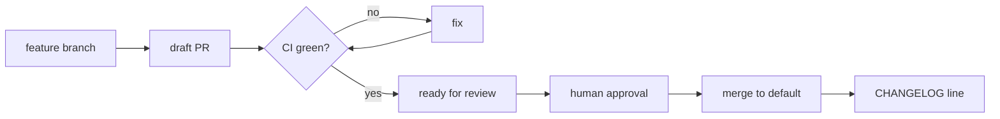

# ResponseOS — Observability & Governance

**Owner:** AJ Digital LLC / Audio Jones
**Status:** Canonical (go-forward).
**Anchored by:** ADR-0018 (PostHog + Sentry + Better Stack on OpenTelemetry) · ADR-0011 (doc governance)
**Read first:** [`../product/RESPONSEOS_BUILD_SOURCE.md`](../product/RESPONSEOS_BUILD_SOURCE.md) · [`../DEPLOYMENT.md`](../DEPLOYMENT.md)

---

## Part A — Observability

### A1. Stack

| Tool | Purpose | Scope |
|---|---|---|
| **OpenTelemetry** | Instrumentation spine (traces, metrics, logs) across Next.js app, voice gateway, async workers | platform |
| **PostHog** | Product analytics (funnels, activation, feature usage) | tenant-scoped by `account_id` |
| **Sentry** | Error tracking + release health + source-mapped traces | app + gateway |
| **Better Stack** | Uptime monitoring, log management, incident/on-call alerting | platform |

> Mock-first: in dev/test, telemetry emits to local/no-op sinks when keys are absent (ADR-0001).

### A2. Tenant-scoped, PII-free telemetry

- Every signal is tagged with `account_id` — **never** raw PII (no names, phone numbers, transcript text in analytics/monitoring).
- Transcripts/recordings stay in tenant storage under retention policy; only IDs/metrics flow to observability.
- Per-tenant dashboards (volume, recovery rate, response time, failover rate) for operator analytics; client portal shows outcome KPIs only.

### A3. Golden signals

| Domain | Signals |
|---|---|
| Voice gateway (realtime) | Concurrent sessions; barge-in/turn latency; **provider-failover rate** (Grok→OpenAI); tool-call latency; session error rate; abandoned sessions |
| Ingest | Webhook signature-validation success (> 99.9%); dedupe hit rate; ingest lag |
| Async | Queue depth; job retry/dead-letter rate; `workflow_runs` failure rate; normalization lag |
| Core/API | Request latency p50/p95; error rate; tenant-scope-denied count |
| Integrations | HubSpot/calendar sync success; rate-limit/backoff events; OAuth expiry |
| Business | Missed-call recovery rate; response time; bookings; ROI report completion |

### A4. SLOs (v0.3 targets)

| SLO | Target |
|---|---|
| Signed webhook validation success | > 99.9% |
| Missed-call text-back latency | < 60s |
| Inbound call → agent handoff | < 3s avg |
| Voice provider failover completes call | > 99% of failovers |
| Calendar-slot response latency | < 1.5s p95 |
| Appointment success after slot selection | > 98% |
| Monthly report generation completion | > 99% |
| Client portal uptime | 99.5% |

### A5. Alerting

- **Page (P0/P1):** data exposure; signature-validation failures across tenants; gateway down / mass call failures; provider double-outage (Grok **and** OpenAI). Routed via Better Stack to on-call.
- **Ticket (P2/P3):** single-tenant degradation; elevated failover rate; queue backlog; OAuth expiries.
- Alerts carry `account_id` context where tenant-specific, never PII.

### A6. Dashboards

- **Operator portfolio:** cross-tenant health, clients needing attention, provider/integration status.
- **Realtime/voice:** live sessions, failover rate, latency.
- **Ingest/async:** validation rate, queue depth, DLQ.
- **Per-tenant:** the 9 KPIs + operational health.

---

## Part B — Governance

### B1. Git workflow

Per [`../../AGENTS.md`](../../AGENTS.md):

- Develop on a feature branch off the latest default-branch commit.
- Conventional, scoped commits: `feat:`, `fix:`, `docs:`, `test:`, `ci:`, `chore:`.
- Open PRs as **draft** until CI is green; then mark ready for human merge.
- Never push to `master` directly; never force-push a shared branch without explicit approval.

### B2. PR approval gates

| Gate | Requirement |
|---|---|
| CI `validate` | lint + typecheck + unit test + build green |
| CI `integration` | Postgres 16; `prisma migrate diff` + `deploy` + seed; integration tests; DB-backed build green |
| Tenant isolation | new tenant-scoped paths covered by isolation tests |
| Security | signature-validation tests for new webhooks; no secrets in diff; no Firebase |
| Docs | ADR for new decisions; roadmap for scope changes; CHANGELOG line |
| Human approval | required before merge; required for any deploy (prod/prod-hipaa) |
| Scope | change matches the task; no unrequested refactors/abstractions |

### B3. Documentation governance (ADR-0011)

- The `RESPONSEOS_*` set is the go-forward source of truth; original `docs/*.md` stays authoritative where not restated.
- **New architectural decision → ADR** in [`../DECISIONS.md`](../DECISIONS.md); a reversal marks the old ADR **Superseded by ADR-XXX** (never deleted).
- **New milestone / scope change →** update [`RESPONSEOS_ROADMAP.md`](../product/RESPONSEOS_ROADMAP.md) (+ original `../ROADMAP.md` where relevant).
- **Every merged PR →** a line in [`../CHANGELOG.md`](../CHANGELOG.md) (newest first).
- **File renames/moves →** update cross-references in non-archived docs in the same PR.
- **Shipped implementation briefs →** move to `../archive/`.
- Avoid silent design decisions; surface contradictions in the PR description.

### B4. Architecture review cadence

| Cadence | Activity |
|---|---|
| Per PR | Reviewer checks alignment with ADRs + the critical system rules (Build Source § 6) |
| Per milestone (phase exit) | Architecture review against the phase exit gates; confirm no drift |
| Quarterly | Review ADRs for staleness; review provider posture (esp. Grok/OpenAI compliance, ADR-0012) |
| On provider change | Re-run the provider-readiness gate; file an ADR if the stack changes |

### B5. Release & versioning policy

- **Internal milestone versioning** (v0.1, v0.2 A–D, v0.3, …), not semver, per [`../CHANGELOG.md`](../CHANGELOG.md).
- Public REST is path-versioned (`/v1`) when breaking changes land.
- The gateway↔core internal contract versions in lockstep with the gateway deploy.
- No production deploys until v0.3 readiness gates clear (ADR-0001/roadmap).

### B6. Change management

- **Schema changes:** always a Prisma migration; no drift; reviewed; forward-compatible where possible.
- **Profile changes** (prompt/policy/routing/workflow): create a new **version** with an audit reason; the prior version stays for replay/audit.
- **Provider/stack changes:** ADR + readiness gate + ops sign-off.
- **Risky/irreversible actions** (deletes, force-push, destructive migrations) require explicit human approval — never taken autonomously.

---

## Assumptions & open questions

**Assumptions:** OTel can instrument the Next.js app + Node gateway + workers uniformly; PostHog/Sentry/Better Stack data-processing terms are acceptable on the Standard lane.
**Open questions:** (1) whether to add a metrics backend (e.g., managed Prometheus) alongside Better Stack at scale; (2) retention windows for logs vs the ≥1-year audit evidence requirement; (3) on-call rotation size for early pilots.

---

*ResponseOS Observability & Governance — AJ Digital LLC / Audio Jones. Documentation phase only.*
