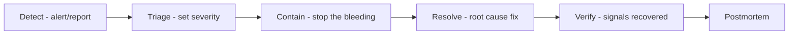

# ResponseOS — Runbook

**Owner:** AJ Digital LLC / Audio Jones
**Status:** Canonical (go-forward). Operational procedures for incidents, on-call, and common failures.
**Read first:** [`RESPONSEOS_SECURITY_AND_COMPLIANCE.md`](./RESPONSEOS_SECURITY_AND_COMPLIANCE.md) · [`RESPONSEOS_OBSERVABILITY_AND_GOVERNANCE.md`](./RESPONSEOS_OBSERVABILITY_AND_GOVERNANCE.md)

> Source content for runbooks is authored in the Obsidian SOP vault (ADR-0016) and mirrored here as canonical. Procedures avoid destructive shortcuts: diagnose root cause; never bypass safety checks (`--no-verify`), never take irreversible actions without explicit human approval.

---

## 1. Severity matrix & first response

| Sev | Definition | First response | Comms |
|---|---|---|---|
| **P0** | Data breach / unauthorized access / regulated-data exposure | Page on-call immediately; freeze writes if needed | Internal incident channel; customer per contract/jurisdiction |
| **P1** | Customer-impacting outage; signature-validation failures across tenants; gateway down / mass call failures; **both voice providers down** | Page on-call; status update ≤ 15 min | Status updates to affected tenants |
| **P2** | Single-tenant impact; degraded automation; elevated failover | Ticket + working-hours response | Tenant notified if material |
| **P3** | Cosmetic / non-blocking | Backlog | — |

Evidence (events, logs, decisions) retained ≥ 1 year.

---

## 2. On-call

- Better Stack routes P0/P1 pages to the on-call engineer.
- On-call acknowledges, declares severity, opens an incident, and owns comms until resolved or handed off.
- Escalate to a second responder if not progressing within the SLO update window.

---

## 3. Incident lifecycle

**Contain options (least-destructive first):** fail over voice provider; revert a profile version; disable a tool/self-schedule for one tenant; route calls to human backup; roll back the offending service deploy; freeze writes (P0 only). Replay the ledger to correct derived state once contained.

---

## 4. Common failures & procedures

### 4.1 Voice provider degraded (Grok)
**Symptoms:** rising turn latency, session errors, failover-rate spike.
**Procedure:**
1. Confirm via realtime dashboard (failover rate, latency).
2. Failover controller should auto-switch Grok→OpenAI; verify failovers are completing calls (> 99% SLO).
3. If OpenAI also degraded → **P1**: enable graceful degrade (SMS recap + self-schedule + human callback task) so no lead is dropped; route high-value inbound to human backup via transfer rule.
4. Check the provider status page; open incident; notify affected tenants.
5. Root cause: provider outage vs our adapter/keys; do not change business logic — the abstraction is the fix point.

### 4.2 Both voice providers down (P1)
1. Switch all inbound to human-backup transfer rules per tenant routing profile.
2. Missed calls still get the <60s text-back (async, provider-independent).
3. Communicate ETA; resume AI answering when a provider recovers (circuit-breaker closes).

### 4.3 Webhook signature-validation failures
1. If across tenants → **P1** (possible secret rotation mismatch or upstream change).
2. Verify the signing secret matches the provider config; check for a provider signature-scheme change.
3. **Never disable validation to "unblock."** Fix the secret/scheme; replays are safe (dedupe keys).
4. Backfill: once fixed, replays land in the ledger and dedupe; no data loss.

### 4.4 HubSpot sync failure / rate-limit
1. `VENDOR_UNAVAILABLE` + queue backoff is expected; confirm jobs are queued, not dropped.
2. If OAuth `expired` → prompt tenant re-connect; dependent jobs stay queued.
3. On conflict (`sync_state=conflict`) → operator reviews; ledger is canonical, re-mirror from ledger.

### 4.5 Queue backlog / DLQ growth
1. Check queue depth + worker health; scale workers on depth.
2. Inspect dead-letter for poison jobs; fix root cause; re-drive.
3. Confirm n8n is not in any realtime path (it must not be).

### 4.6 Booking collision / oversubscription
1. Verify the 10-concurrent-holds/tenant limit is enforced.
2. Re-read calendar `freeBusy`; reconcile from ledger; notify affected customers; offer next slot.

### 4.7 Hallucinated pricing / out-of-policy answer
1. Identify the prompt/policy profile version on the affected `call_session`.
2. Revert to last-known-good profile version (instant; immutable history).
3. Run the golden-call regression pack before re-releasing the corrected profile (QA plan).
4. QA-tag affected calls; sample at higher rate.

### 4.8 Suspected cross-tenant exposure (P0)
1. Freeze writes if active; page on-call; open P0.
2. Identify scope via audit logs + ledger (`account_id` on every row).
3. Contain; preserve evidence; notify per contract/jurisdiction (HIPAA 60d / GDPR 72h where applicable).
4. Postmortem with corrective isolation-test additions.

---

## 5. Break-glass procedure (raw transcript/recording access)

1. `aj_admin` initiates with a **reason** (required).
2. Access is **time-boxed**; the tenant `client_admin` is **notified**.
3. All actions during break-glass are marked in the audit log.
4. Access auto-expires; no standing raw access exists.

---

## 6. Provider failover drill (planned)

Quarterly: force a Grok degradation in staging, confirm Grok→OpenAI mid-session resume carries Redis context, and verify graceful degrade when both are unavailable. Record results against the readiness-gate criteria.

---

## 7. Rollback quick reference

| Situation | Action |
|---|---|
| Bad prompt/policy | Revert profile version |
| Bad deploy (app) | Roll back Next.js deploy |
| Bad deploy (gateway) | Roll back gateway deploy (independent) |
| Corrupted derived state | Replay ledger range |
| Tenant-specific issue | Disable feature for that tenant only |

---

## 8. Daily / weekly ops (inherited from `../SECURITY.md`)

- **Daily:** review failed webhooks, booking conflicts, payment failures (v0.5), low QA scores, failover-rate trend.
- **Weekly:** audit 20–30 sampled calls/tenant; compare QA drift by profile version; verify ROI report integrity.
- **Before each prompt/profile release:** run the golden-call regression pack.

---

## 9. Postmortem standard

Blameless. Within 5 business days of a P0/P1: timeline, root cause, contributing factors, what worked, corrective actions (with owners + dates), and any new tests/alerts/ADRs. Filed in the Obsidian vault and linked from the incident; corrective actions tracked to closure.

---

## 10. Assumptions & open questions

**Assumptions:** Better Stack on-call routing is configured; staging supports forced provider degradation for drills; profile versioning enables instant rollback.
**Open questions:** (1) human-backup transfer capacity for early pilots; (2) on-call rotation size; (3) exact graceful-degrade script wording per tenant.

---

*ResponseOS Runbook — AJ Digital LLC / Audio Jones. Documentation phase only.*
