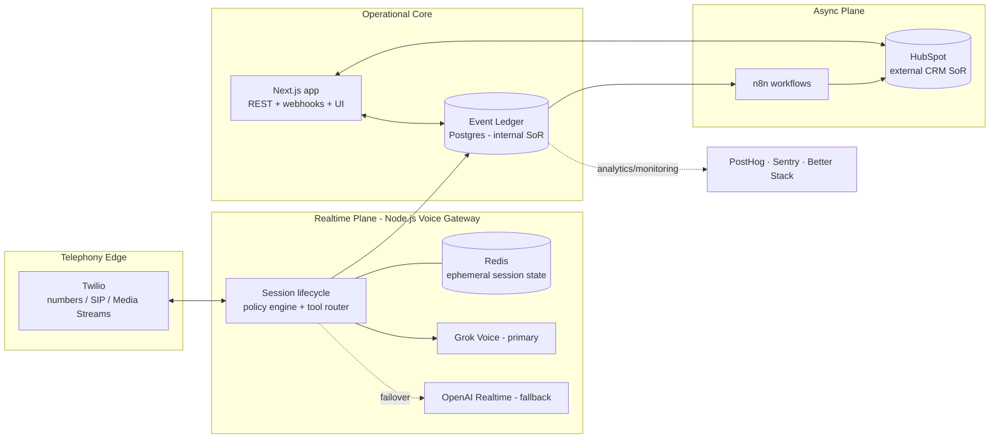

# ResponseOS — Build Source (Canonical Index)

**Product:** ResponseOS — Revenue Recovery Infrastructure for founder-led service businesses
**Owner:** AJ Digital LLC / Audio Jones
**Status:** Canonical. This is the entry point and source-of-truth index for the `RESPONSEOS_*` documentation set.
**Last updated:** 2026-05-27
**Governing ADRs:** [ADR-0011 → ADR-0018](../DECISIONS.md)

> This document is the **build source**: the single place a new contributor (human or agent) starts, the map of every other canonical doc, and the statement of the load-bearing decisions that constrain implementation. It is documentation only — no production code ships from this phase.

---

## 1. What ResponseOS is

ResponseOS is an **AI-powered revenue response and customer communication operating layer for founder-led service businesses**. It sits on top of every demand signal a service business receives — inbound phone, missed call, SMS, web form, AI-answered call, outbound campaign — and makes sure none of it leaks.

**Core positioning:** *Revenue Recovery Infrastructure for founder-led service businesses.*

**Canonical one-liner:** *ResponseOS helps service businesses recover missed revenue by capturing calls, qualifying leads, automating follow-up, booking opportunities, and reporting ROI.*

It combines: AI voice agents · phone/receptionist automation · missed-call recovery · lead qualification · appointment booking · customer service routing · quote/service-request intake · follow-up orchestration · CRM memory · operational analytics · workflow automation · AI-assisted response infrastructure.

### What it is NOT

- Not a generic AI chatbot.
- Not a hype "AI wrapper" or "AI OS" marketing-fluff product.
- Not an AI-receptionist clone. (The receptionist is **one input**; ResponseOS is the recovery + accountability layer above all inputs.)
- Not over-engineered agent chaos, and not experimental toy infrastructure.

### How it should feel

Operational · measurable · audit-friendly · enterprise-capable · founder-readable · reliable · maintainable. The product is **recovered revenue**; AI is the mechanism, not the headline.

---

## 2. The canonical stack (go-forward)

This is the authoritative technology direction. It is reconciled against the earlier ADRs in [§7](#7-reconciliation-with-the-original-docs) and ratified by [ADR-0012 → ADR-0018](../DECISIONS.md).

| Layer | Technology | Role | Reference |
|---|---|---|---|
| Telephony edge | **Twilio** | Carrier, numbers, SIP, Media Streams | ADR-0012 |
| Realtime orchestration | **Node.js voice gateway** (dedicated service) | Owns the realtime audio loop; isolated from async + UI | ADR-0013 |
| Primary realtime voice | **Grok Voice Agent API (xAI)** | Primary live voice agent, behind provider abstraction | ADR-0012 |
| Secondary / fallback voice | **OpenAI Realtime API** | Transparent failover target | ADR-0012 |
| Async orchestration | **n8n** | Tenant-specific workflows, follow-up cadences — **never in the realtime loop** | ADR-0017 |
| CRM system of record (external) | **HubSpot** (default; pluggable) | Canonical customer-facing contact/deal/ticket store | ADR-0015 |
| Internal system of record | **Postgres event ledger** | Replayable, auditable canonical truth | ADR-0002 |
| Realtime session state | **Redis** (ephemeral, TTL'd) | Live-call working memory; never durable truth | ADR-0014 |
| Product analytics | **PostHog** | Funnel, activation, feature usage (tenant-scoped) | ADR-0018 |
| Monitoring / observability | **Sentry + Better Stack** on an **OpenTelemetry** spine | Errors, release health, uptime, on-call | ADR-0018 |
| Internal SOP / brand knowledge | **Obsidian** (Git-backed Markdown vault) | Operator-side SOPs, playbooks, prompt/policy source — **not** per-tenant RAG | ADR-0016 |
| Source control / canonical source | **GitHub** | Versioned source of truth for code, docs, and n8n definitions | — |
| App framework | **Next.js (App Router)** + **TypeScript** + **Prisma/Postgres** | Operator console, tenant portal, marketing, REST/webhooks | `architecture.md` |

---

## 3. Multi-tenant from day one

ResponseOS is a **multi-tenant SaaS platform** built on **one shared codebase** serving **many client tenants** — never a repo-per-client or a deploy-per-customer. The MVP may launch with one internal tenant and one pilot client, but the architecture supports many tenants without cloning the app.

Every major entity is tenant-aware (scoped by `organization_id`, derived from the authenticated session, never from client input): calls, transcripts, contacts, deals, tickets, workflows, tool calls, audit logs, notifications, booking requests, integrations, API credentials, provider configs.

The platform supports: per-tenant Twilio numbers · per-tenant prompts/policies · per-tenant workflows · per-tenant CRM integrations · per-tenant calendars · per-tenant reporting · future white-labeling · future SaaS billing. See [`RESPONSEOS_SYSTEM_ARCHITECTURE.md`](../architecture/RESPONSEOS_SYSTEM_ARCHITECTURE.md) § Tenancy and [`RESPONSEOS_DATA_MODEL.md`](../architecture/RESPONSEOS_DATA_MODEL.md).

### Ownership model (platform-owned vs tenant-owned)

| Asset | MVP / pilot owner | Enterprise option (Future) |
|---|---|---|
| Grok / OpenAI voice keys | Platform (AJ Digital) | Bring-your-own provider keys |
| Twilio infrastructure | Platform | Bring-your-own Twilio subaccount/numbers |
| Core orchestration layer | Platform (shared) | Shared (always platform-owned) |
| HubSpot / CRM | **Tenant** (client connects own) | Tenant |
| Calendar | **Tenant** (client connects own) | Tenant |
| Workflows / integrations | Tenant-configurable | Tenant + bring-your-own |

Full credential ownership and bring-your-own-provider sequencing is in [`RESPONSEOS_INTEGRATION_MAP.md`](../architecture/RESPONSEOS_INTEGRATION_MAP.md).

---

## 4. Frameworks (OFFER + RECOVER)

**OFFER (philosophy):** Outcomes First · Front the Work · Framework Driven · Earn on Outcomes · ROI-Aligned Partnerships.

**RECOVER (delivery)** — canonical operator mapping:

| Stage | Operator meaning | Business outcome |
|---|---|---|
| **Respond** | Answer every inbound call/text immediately | Fewer missed opportunities |
| **Evaluate** | Qualify service type, geography, urgency, budget, intent | Better lead quality |
| **Capture** | Normalize customer, job, transcript, attribution | Reliable CRM + reporting |
| **Offer** | Present estimate, financing, self-schedule, callback | Faster conversion |
| **Verify** | Confirm appointment, consent, payment intent, routing | Lower no-shows, fewer errors |
| **Escalate** | Hand off edge cases, high-value, compliance-sensitive | Better customer trust |
| **Report** | Prove recovered leads, booked jobs, revenue by tenant + source | Outcome-based pricing |

The **buyer-facing translation** is the *same framework in marketing language*, presented as a parallel list — not a strict per-stage rename: Revenue Leak Detection · Engagement Automation · Call Capture System · Outcome-Based Booking · Verification + Qualification · Economic ROI Tracking · Reporting + Retention. Internally, always drive product decisions from the operator mapping above.

RECOVER is the defensible IP. The voice/telephony/CRM primitives are bought; the orchestration, QA, ROI attribution, and white-label OS are built.

---

## 5. Documentation map

The canonical `RESPONSEOS_*` set, by directory:

### `docs/product/`
| Doc | Purpose |
|---|---|
| [`RESPONSEOS_BUILD_SOURCE.md`](./RESPONSEOS_BUILD_SOURCE.md) | **This file.** Index, canonical stack, build philosophy, reconciliation. |
| [`RESPONSEOS_PRD.md`](./RESPONSEOS_PRD.md) | Product requirements: vision, ICPs, journeys, use cases, MVP/out-of-scope, KPIs, risks, open questions. |
| [`RESPONSEOS_ROADMAP.md`](./RESPONSEOS_ROADMAP.md) | Version sequencing (MVP → Phase 2 → Future → Deferred). |
| [`RESPONSEOS_PHASE_PLAN.md`](./RESPONSEOS_PHASE_PLAN.md) | Phase-by-phase implementation plan with entry/exit gates. |
| [`RESPONSEOS_BACKLOG.md`](./RESPONSEOS_BACKLOG.md) | Epics → stories → tasks, with acceptance criteria. |

### `docs/architecture/`
| Doc | Purpose |
|---|---|
| [`RESPONSEOS_SYSTEM_ARCHITECTURE.md`](../architecture/RESPONSEOS_SYSTEM_ARCHITECTURE.md) | End-to-end system design, tenancy, realtime/async separation, provider abstraction, topology. |
| [`RESPONSEOS_FRONTEND_SPEC.md`](../architecture/RESPONSEOS_FRONTEND_SPEC.md) | Operator console, tenant portal, onboarding, transcript review, analytics, permissions, white-label. |
| [`RESPONSEOS_BACKEND_SPEC.md`](../architecture/RESPONSEOS_BACKEND_SPEC.md) | Voice gateway, realtime session lifecycle, provider adapters/failover, policy engine, tool router, event bus, queues, retries, post-call normalization. |
| [`RESPONSEOS_DATA_MODEL.md`](../architecture/RESPONSEOS_DATA_MODEL.md) | Canonical IDs, tenant-scoped entities, relationships, retention, CRM mapping. |
| [`RESPONSEOS_API_CONTRACTS.md`](../architecture/RESPONSEOS_API_CONTRACTS.md) | REST + webhook contracts, envelope, idempotency, internal gateway APIs. |
| [`RESPONSEOS_EVENT_SCHEMA.md`](../architecture/RESPONSEOS_EVENT_SCHEMA.md) | Event naming, payload shapes, ledger discipline, workflow events, replay. |
| [`RESPONSEOS_INTEGRATION_MAP.md`](../architecture/RESPONSEOS_INTEGRATION_MAP.md) | Every integration, credential ownership, OAuth, bring-your-own-provider. |

### `docs/ops/`
| Doc | Purpose |
|---|---|
| [`RESPONSEOS_OBSERVABILITY_AND_GOVERNANCE.md`](../ops/RESPONSEOS_OBSERVABILITY_AND_GOVERNANCE.md) | Telemetry standards, tenant-scoped analytics/observability, Git workflow, PR gates, doc + architecture governance. |
| [`RESPONSEOS_SECURITY_AND_COMPLIANCE.md`](../ops/RESPONSEOS_SECURITY_AND_COMPLIANCE.md) | PII, retention, recordings, OAuth, secrets, RBAC, audit, compliance, rollback, DR. |
| [`RESPONSEOS_RUNBOOK.md`](../ops/RESPONSEOS_RUNBOOK.md) | Incident response, on-call, common failures, provider failover procedures. |
| [`RESPONSEOS_QA_VALIDATION_PLAN.md`](../ops/RESPONSEOS_QA_VALIDATION_PLAN.md) | QA standards, validation gates, golden-call regression, test strategy. |
| [`RESPONSEOS_DEPLOYMENT_PLAN.md`](../ops/RESPONSEOS_DEPLOYMENT_PLAN.md) | Deploy strategy, environments, release process, topology per service. |

### `docs/brand/`
[`RESPONSEOS_POSITIONING.md`](../brand/RESPONSEOS_POSITIONING.md) · [`RESPONSEOS_BRAND_VOICE.md`](../brand/RESPONSEOS_BRAND_VOICE.md) · [`RESPONSEOS_SALES_NARRATIVE.md`](../brand/RESPONSEOS_SALES_NARRATIVE.md) · [`RESPONSEOS_WEBSITE_COPY_SPEC.md`](../brand/RESPONSEOS_WEBSITE_COPY_SPEC.md)

### `docs/research/`
[`RESPONSEOS_MARKET_RESEARCH.md`](../research/RESPONSEOS_MARKET_RESEARCH.md) · [`RESPONSEOS_NAMING_RISK_RESEARCH.md`](../research/RESPONSEOS_NAMING_RISK_RESEARCH.md) · [`RESPONSEOS_COMPETITOR_RESEARCH.md`](../research/RESPONSEOS_COMPETITOR_RESEARCH.md)

### Pre-existing canonical docs (still authoritative where not restated)
[`../PRD.md`](../PRD.md) · [`../ROADMAP.md`](../ROADMAP.md) · [`../DECISIONS.md`](../DECISIONS.md) · [`../architecture.md`](../architecture.md) · [`../data-schema.md`](../data-schema.md) · [`../api-spec.md`](../api-spec.md) · [`../SECURITY.md`](../SECURITY.md) · [`../DEPLOYMENT.md`](../DEPLOYMENT.md) · [`../DESIGN.md`](../DESIGN.md) · [`../automation-flows.md`](../automation-flows.md)

---

## 6. Critical system rules (non-negotiable)

These constrain every implementation phase:

1. **Separate realtime audio from async workflows.** The voice gateway owns realtime; n8n is async-only and never in the audio loop. (ADR-0013, ADR-0017)
2. **Keep the event ledger as the internal system of record;** HubSpot is the external CRM system of record. (ADR-0002, ADR-0015)
3. **No provider-specific business logic.** All provider behavior sits behind adapters; Grok↔OpenAI failover is transparent. (ADR-0012)
4. **Support provider swapping and future multi-provider expansion** via the abstraction layer.
5. **Tenant isolation is mandatory** — every read/write scoped by session-derived `organization_id`. (`SECURITY.md`)
6. **Typed contracts** everywhere (TypeScript + Prisma + Zod at boundaries).
7. **Auditability + replayable workflows** — facts recompute from the ledger; n8n runs are logged.
8. **Webhook signature validation is mandatory before any business mutation.** (ADR-0009)
9. **No hardcoded secrets.** `.env.example` is placeholders only; tenant credentials live encrypted in the DB.
10. **No Firebase. Ever.**
11. **No premature microservices.** The voice gateway is the *only* sanctioned service split; everything else stays a modular monolith until scale demands otherwise.
12. **Mock-first; no live provider integrations until v0.3 is authorized;** adapters fall back to mock when env vars are missing. (ADR-0001)
13. **No production deploys until v0.3 readiness gates clear.**
14. **ResponseOS is not HIPAA-certified.** Never represent it as compliant; HIPAA-readiness is a per-deployment lane, not a product property. (ADR-0004)
15. **Favor maintainability over hype architecture.**

---

## 7. Reconciliation with the original docs

The original `docs/*.md` set assumed Twilio + Retell/Vapi/Bland as the primary voice runtime (ADR-0008) and treated CRM as fully interchangeable. The go-forward direction changes the realtime/voice stack and names HubSpot as the default CRM SoR. This was **not** done silently:

| Change | Supersedes | New ADR |
|---|---|---|
| Grok Voice primary, OpenAI Realtime fallback (Twilio edge retained) | ADR-0008 | ADR-0012 |
| Dedicated Node.js voice gateway; realtime isolated | — (new) | ADR-0013 |
| Redis ephemeral realtime session state | — (new) | ADR-0014 |
| HubSpot default external CRM SoR; ledger internal SoR | extends ADR-0002/0007 | ADR-0015 |
| Obsidian internal SOP/brand-knowledge layer | `architecture.md` Obsidian-out note (partial) | ADR-0016 |
| n8n async-only, out of realtime loop | formalizes hybrid posture | ADR-0017 |
| PostHog + Sentry + Better Stack on OTel | extends `DEPLOYMENT.md` | ADR-0018 |

**Retained disciplines (unchanged):** mock-first (ADR-0001), event-ledger-first (ADR-0002), Postgres/Prisma (ADR-0003), three compliance lanes (ADR-0004), object storage with tenant-prefixed keys (ADR-0006), QuoteIQ as connector not SoR (ADR-0007), mandatory webhook signature validation (ADR-0009), billing in v0.5 (ADR-0010).

---

## 8. Build philosophy

The documentation must be complete enough that an implementer (human or Codex) can build phases without guessing, architecture drift is minimized, and the SaaS model is structurally clear before coding begins. Concretely:

- **Phases are gated.** No phase starts before its predecessor's exit gates pass (see [`RESPONSEOS_PHASE_PLAN.md`](./RESPONSEOS_PHASE_PLAN.md)).
- **Contracts before code.** Event schema, API contracts, and data model are authored before the surfaces that consume them.
- **Buy commodity, build the orchestration.** Telephony, voice models, payments, CRM are bought; the canonical model, RECOVER orchestration, QA, ROI attribution, and white-label OS are built.
- **Scope discipline.** No features, refactors, or abstractions beyond what the task requires. Three similar lines beat a premature abstraction.

---

## 9. Assumptions

- The realtime providers (Grok Voice / OpenAI Realtime) expose telephony-compatible streaming, tool-calling, and webhook/event semantics sufficient for production answering. **This must be verified at the v0.3 provider-readiness gate** (see [`RESPONSEOS_BACKEND_SPEC.md`](../architecture/RESPONSEOS_BACKEND_SPEC.md) § Provider readiness).
- HubSpot's API and webhook surface support the contact/deal/ticket mirroring and per-tenant OAuth ResponseOS needs.
- The MVP runs on the Standard compliance lane (non-PHI home services). Regulated verticals wait for the Privacy-hardened / HIPAA-ready lanes.
- The existing v0.1/v0.2 codebase (Next.js 16, Prisma 6, Postgres 16, tenant-aware data layer) is the foundation; the voice gateway is a *new* service added at v0.3.

## 10. Open questions

1. **Grok Voice / OpenAI Realtime production telephony path** — concurrency limits, barge-in quality, webhook reliability, retention, and BAA/training-data posture all need verification before live traffic (ADR-0012). Tracked in the v0.3 readiness gate.
2. **Voice gateway hosting target** — does it run on the Standard-lane host alongside Next.js, or a separate container platform from day one? (See [`RESPONSEOS_DEPLOYMENT_PLAN.md`](../ops/RESPONSEOS_DEPLOYMENT_PLAN.md).)
3. **HubSpot as default vs GoHighLevel** — many ICP tenants are on GHL today; confirm HubSpot-default does not slow pilot onboarding (ADR-0015).
4. **Bring-your-own-provider timing** — which enterprise milestone unlocks BYO Twilio / BYO LLM keys (Future)?

---

*ResponseOS — Revenue Recovery Infrastructure. AJ Digital LLC / Audio Jones. Documentation phase only; no production implementation yet.*
