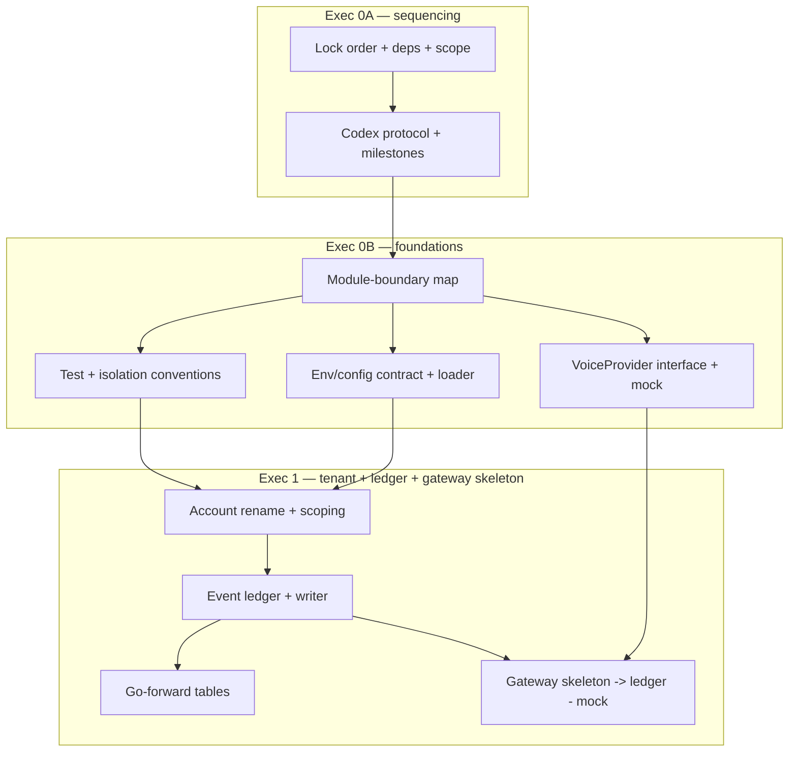

# ResponseOS — Implementation Plan (Execution Phases 0A → 1)

**Owner:** AJ Digital LLC / Audio Jones
**Status:** Canonical (planning). Fine-grained execution decomposition of the front of [`RESPONSEOS_PHASE_PLAN.md`](./RESPONSEOS_PHASE_PLAN.md). **Planning only — no production implementation is authorized by this document.**
**Read first:** [`RESPONSEOS_BUILD_SOURCE.md`](./RESPONSEOS_BUILD_SOURCE.md) · [`RESPONSEOS_PHASE_PLAN.md`](./RESPONSEOS_PHASE_PLAN.md) · [`RESPONSEOS_BACKLOG.md`](./RESPONSEOS_BACKLOG.md) · [`../DECISIONS.md`](../DECISIONS.md)
**Governing ADRs:** ADR-0001, ADR-0002, ADR-0009, ADR-0011 → ADR-0018.

> This plan defines **what to build next and in what order** so an implementer (human or Codex) can pick up work without guessing. It does **not** scaffold services, add live integrations, write realtime/production code, add deployment infra or billing, or rewrite any canonical doc. It decomposes work; it does not perform it. Every task below ships behind the mock-first discipline (ADR-0001) and the validation gates in §9.

---

## 1. Where this fits

The canonical [`RESPONSEOS_PHASE_PLAN.md`](./RESPONSEOS_PHASE_PLAN.md) sequences the product at the milestone level (Phase 0 → Phase 7 / v0.1 → v1.0). This document zooms into the **immediate execution arc** — everything that can proceed **before v0.3 live integrations are authorized** — and splits it into three execution phases:

| Execution phase | Theme | Maps to canonical | Maps to backlog | Live work? |
|---|---|---|---|---|
| **Exec 0A** | Implementation sequencing | Pre-work for Phase 1 | E8 (process), DoD | No code |
| **Exec 0B** | Foundational architecture setup | Phase 1 foundation | E1 (partial), E8-S1/S3 | Mock-only |
| **Exec 1** | Tenant model + event schema + gateway skeleton | Phase 1 + mock-only front of Phase 2 | E1-S1/S4/S5, E2-S1, E2-S2 | Mock-only |

Everything that touches **live providers, realtime audio, Redis runtime, failover, Twilio Media Streams, HubSpot/calendar connectors, n8n playbooks, deployment, or billing** is **out of this arc** and stays gated to **v0.3 authorization** (canonical Phase 2+). This plan stops at a **mock, deterministic, zero-key** state.

---

## 2. MVP scope lock

The MVP target is unchanged from the roadmap: **the live v0.3 milestone on the v0.1/v0.2 foundation.** This plan locks the scope of the *pre-v0.3* execution arc so it does not drift toward live work.

### In scope (this arc, Exec 0A → 1)
- Implementation ordering, dependency map, Codex execution protocol, milestone setup.
- Module-boundary definition and the **provider-abstraction skeleton** (TypeScript interfaces + deterministic **mock** adapters only).
- `Organization` → `Account` rename and tenant-scoping hardening at the data layer.
- Canonical **event ledger** table + **event schema** implementation (per [`../architecture/RESPONSEOS_EVENT_SCHEMA.md`](../architecture/RESPONSEOS_EVENT_SCHEMA.md), [`../architecture/RESPONSEOS_DATA_MODEL.md`](../architecture/RESPONSEOS_DATA_MODEL.md)).
- Forward-compatible go-forward tables: `call_sessions`, `tool_calls`, profile tables, `crm_mappings` (data-only, seeded, isolation-tested).
- **Voice gateway *skeleton*** — a separately runnable Node.js entrypoint that boots with **zero keys**, exposes a health endpoint, and wires the `VoiceProvider` interface to a **mock** adapter. No realtime audio, no live provider, no Redis runtime, no Twilio Media Streams.

### Out of scope (deferred to v0.3 authorization / later)
- Grok / OpenAI Realtime adapters; provider-readiness gate; transparent failover.
- Twilio Media Streams handling; live numbers; live signature validation against real traffic.
- Redis as a running session store; live session lifecycle.
- HubSpot / calendar connectors; n8n live playbooks; notifications; Resend email.
- Tenant provisioning UI, reporting, white-label, billing, knowledge grounding.
- Any deployment infrastructure or production topology.

> **Scope guard:** if a task in this arc seems to require a live key, a real socket, or a vendor account, it is mis-scoped — stop and re-file it under canonical Phase 2+ (v0.3).

---

## 3. Execution constraints (invariants — enforced every task)

These are the load-bearing constraints from [`RESPONSEOS_BUILD_SOURCE.md`](./RESPONSEOS_BUILD_SOURCE.md) §6 and the ADRs. Every task is checked against them.

| Invariant | Source | How it is enforced in this arc |
|---|---|---|
| **Provider abstraction boundaries** | ADR-0012 | All provider behavior behind `lib/providers/*` adapters and the gateway's `VoiceProvider` interface; no provider-specific logic above the boundary; only mock adapters exist in this arc. |
| **Realtime vs async separation** | ADR-0013, ADR-0017 | Gateway entrypoint is a *separate* runnable surface from the Next.js app; n8n is not touched in this arc; nothing async is wired into the (not-yet-built) audio loop. |
| **Multi-tenant architecture** | SECURITY.md, ADR-0011 | Every new table is tenant-scoped by `account_id`/`organization_id` derived from session; isolation tests required per table. |
| **Event-ledger discipline** | ADR-0002 | The ledger lands first; business state derives from it; every write path carries a provider-stable dedupe key. |
| **Mock-first policy** | ADR-0001 | App + gateway boot and pass tests with **zero** secrets; adapters fall back to mock when env vars are missing. |
| **No hardcoded secrets** | BUILD_SOURCE §6.9 | `.env.example` placeholders only; tenant credentials encrypted in DB; secret-scan in the validation workflow. |
| **No Firebase** | BUILD_SOURCE §6.10 | No Firebase dependency, import, or config — ever. |
| **Maintainability over premature complexity** | BUILD_SOURCE §6.15 | Modular monolith; the gateway is the *only* sanctioned service split; no abstractions beyond the task's need. |

---

## 4. Exec Phase 0A — Implementation sequencing

**Objective:** lock the order of work, the Codex execution loop, and the milestone/issue structure **before** any code is written. Output is process + planning artifacts, not application code.

**Entry gate:** PR #17 merged (canonical docs landed). ✅ Met.

**Work items**
1. **Lock the execution order** (this document §8) and the dependency map (§7).
2. **Confirm the validation workflow** (§9) against the actual `package.json` scripts and CI jobs (`validate`, `integration`).
3. **Define the Codex execution protocol** (§10): branch naming, one-PR-per-story, draft→ready, task pickup rules, guardrails.
4. **Recommend milestones + issue decomposition** (§11, §12) so work is trackable.
5. **Confirm the scope lock** (§2) and circulate for human sign-off.

**Exit gates**
- [ ] Execution order, dependency map, and scope lock reviewed and accepted by the human owner.
- [ ] Milestones + issue set agreed (created in GitHub or accepted as the markdown backlog in §12).
- [ ] No application code changed in this phase.

---

## 5. Exec Phase 0B — Foundational architecture setup

**Objective:** establish the **boundaries and skeletons** the implementation will fill — module responsibilities, the provider-abstraction shape (mock-only), the config/env contract, and the test conventions — without building features. This is the "set the table" phase.

**Entry gate:** Exec 0A exit met.

**Work items (each is a planned task, decomposed in §12)**
1. **Module-boundary map.** Document and (where missing) stub the responsibility of each `lib/*` area: `providers/` (adapters), `data/` (tenant-scoped accessors), `db/` (Prisma client), `auth/` (session → `account_id` + role), `config/` (env contract), `validation/` (Zod boundaries), plus a new home for the event ledger writer. No business logic — boundaries only.
2. **Provider-abstraction skeleton.** Define the `VoiceProvider` TypeScript interface (per [`../architecture/RESPONSEOS_BACKEND_SPEC.md`](../architecture/RESPONSEOS_BACKEND_SPEC.md) §4) and a **deterministic mock** implementation under `lib/providers/voice/`. No Grok/OpenAI adapters. Confirm every existing provider stub (`twilio`, `hubspot`, `n8n`, `retell`, `vapi`, `bland`, `ghl`, `stripe`, `resend`) has a mock fallback documented.
3. **Config/env contract.** Extend `.env.example` with **placeholders only** for the go-forward stack (gateway port, mock flags, Redis URL placeholder, provider key placeholders) and a typed config loader in `lib/config/` that defaults to mock when a var is absent.
4. **Test + isolation conventions.** Document the unit vs integration split (`vitest` vs `vitest.integration.config.ts`), the tenant-isolation test pattern, and the deterministic-seed contract (`prisma/seed.ts` ↔ `lib/mock/*`).

**Exit gates**
- [ ] Module-boundary map documented; each `lib/*` area has a one-line responsibility and a mock fallback where it integrates a provider.
- [ ] `VoiceProvider` interface + mock adapter compile and are unit-tested; **no live adapter exists**.
- [ ] `.env.example` carries placeholders only; config loader defaults to mock; `npm run build` succeeds with zero secrets.
- [ ] Test conventions documented; CI `validate` green.

---

## 6. Exec Phase 1 — Tenant model + event schema + gateway skeleton

**Objective:** deliver the **foundational data + ledger + mock gateway** that everything in v0.3 will build on. Three independent-ish tracks (T1 tenant model, T2 event schema, T3 gateway skeleton) that converge on an isolation- and ledger-tested foundation. **All mock, zero keys, no realtime audio.**

**Entry gate:** Exec 0B exit met.

### Track T1 — Tenant model
- `Organization` → `Account` rename: Prisma migration + regenerated client + `lib/data/*` + `lib/auth/*` updates; no stale `Organization` references.
- Tenant-scoping hardening: every accessor takes session-derived `account_id`; client-supplied tenant input rejected with `403 TENANT_SCOPE_DENIED`.

### Track T2 — Event schema + ledger
- Implement the canonical **event ledger** table and the event envelope per [`../architecture/RESPONSEOS_EVENT_SCHEMA.md`](../architecture/RESPONSEOS_EVENT_SCHEMA.md): event name, tenant scope, provider-stable dedupe key, payload, occurred-at/recorded-at.
- A single ledger-writer module (idempotent on dedupe key) that all future write paths must use.
- Forward-compatible go-forward tables — `call_sessions`, `tool_calls`, profile tables (`routing_/prompt_/policy_/workflow_profiles`), `crm_mappings` — added data-only per [`../architecture/RESPONSEOS_DATA_MODEL.md`](../architecture/RESPONSEOS_DATA_MODEL.md) §4, seeded, isolation-tested.

### Track T3 — Voice gateway skeleton (mock-only)
- A separately runnable Node.js entrypoint (its own start script) that **boots with zero keys**, exposes a **health endpoint**, and resolves the `VoiceProvider` to the **mock** adapter from Exec 0B.
- Emits a normalized mock "session" event into the ledger via the T2 ledger-writer to prove the gateway→ledger contract — **using fixtures, no audio, no socket, no live provider.**

**Exit gates**
- [ ] Rename complete; no stale `Organization` refs in code/docs that should be `Account`.
- [ ] Ledger table migrated + seeded; ledger-writer idempotent on dedupe key; replay test passes.
- [ ] Go-forward tables migrated + seeded; **isolation test per table** asserts no cross-tenant read/write.
- [ ] Gateway skeleton boots with zero keys, health endpoint returns ok, mock session event lands in the ledger.
- [ ] No live provider, no Redis runtime, no Twilio Media Streams, no realtime audio introduced.
- [ ] CI `validate` + `integration` green. No deploy. Mock-first preserved.

---

## 7. Dependency map



**Critical path:** `A1 → A2 → B1 → B3/B4 → T1 → T2a → T3`. The `Account` rename (T1) is the single biggest unblocker — it touches the data layer everything else depends on, so it lands first within Exec 1. `B2` (interface + mock) and `T2b` (go-forward tables) can proceed in parallel once their parents clear.

| Task | Depends on | Unblocks |
|---|---|---|
| A1 lock order | PR #17 merged | A2 |
| A2 protocol + milestones | A1 | B1 |
| B1 module map | A2 | B2, B3, B4 |
| B2 interface + mock | B1 | T3 |
| B3 env/config | B1 | T1 |
| B4 test conventions | B1 | T1 |
| T1 Account rename + scoping | B3, B4 | T2a, T2b |
| T2a ledger + writer | T1 | T2b, T3 |
| T2b go-forward tables | T2a | (Phase 2) |
| T3 gateway skeleton | B2, T2a | (Phase 2) |

---

## 8. Implementation ordering (one-line view)

`lock sequencing + protocol` → `module boundaries` → `provider-interface mock + env/config + test conventions` → `Account rename + scoping` → `event ledger + writer` → `go-forward tables` → `mock gateway skeleton → ledger`.

**Ordering rationale**
- **Process before code** (0A): a wrong order is more expensive than a slow start.
- **Boundaries before features** (0B): contracts and mocks first so feature work has a target (BUILD_SOURCE §8 "contracts before code").
- **Tenant model before ledger** (T1→T2): the ledger is tenant-scoped; the rename must settle first or every ledger query churns.
- **Ledger before gateway** (T2→T3): the gateway's only job in this arc is to prove the gateway→ledger contract, so the ledger must exist.

---

## 9. Validation workflow

Every task must pass the canonical gates **locally and in CI** before its PR is marked ready (per [`RESPONSEOS_QA_VALIDATION_PLAN.md`](../ops/RESPONSEOS_QA_VALIDATION_PLAN.md) and `AGENTS.md`).

```bash
npm run lint          # eslint
npm run typecheck     # tsc --noEmit
npm test              # vitest run (unit)
npm run build         # next build (boots with zero secrets)
npm run test:integration   # vitest integration (Postgres 16)
```

**CI jobs (both must be green):**
- `validate` — lint + typecheck + unit test + build.
- `integration` — Postgres 16 service container, `prisma migrate diff`, `prisma migrate deploy`, `prisma db seed`, integration tests, DB-backed build.

**Per-task verification checklist (in addition to the gates above):**
- [ ] **Mock-first:** app/gateway boots and tests pass with **zero** env vars set.
- [ ] **Tenant isolation:** any new tenant-scoped table/route has a test asserting no cross-tenant read/write.
- [ ] **Ledger discipline:** any new write path lands in the ledger first with a dedupe key; idempotency/replay tested.
- [ ] **No secrets:** secret-scan clean; `.env.example` placeholders only; no Firebase.
- [ ] **Docs hygiene:** ADR if a decision changed; CHANGELOG line on merge.

---

## 10. Repo execution plan for Codex

**Branching**
- One branch per story, named `claude/<story-id>-<slug>` (e.g. `claude/ex1-t1-account-rename`), off the latest default-branch commit.
- One PR per story (or per tightly-coupled story pair). Open as **draft**; mark ready only when both CI jobs are green.

**Task pickup loop**
1. Pick the next unblocked task from §12 honoring the dependency map (§7).
2. Confirm entry gates for the parent execution phase are met.
3. Implement to the task's acceptance criteria — **mock-first, no live keys, no out-of-scope work**.
4. Run the full validation workflow (§9) locally.
5. Open a draft PR referencing the task ID; let CI run; fix to green.
6. Update CHANGELOG; add an ADR only if a decision actually changed (do not relitigate ADR-0011→0018).
7. Mark ready for human merge. Never push to `master`; never force-push a shared branch.

**Guardrails (hard stops — escalate to the human instead of proceeding)**
- A task appears to need a real secret, a live socket, or a vendor account → it is v0.3 work; stop.
- A change would introduce Firebase, a second service split beyond the gateway, or provider-specific logic above the adapter boundary → stop.
- A canonical doc (`RESPONSEOS_*`, ADRs) needs a substantive change → propose it explicitly via ADR/PR; never edit silently.
- Scope creep beyond the task's acceptance criteria → stop; re-file as a new task.

---

## 11. Milestone recommendations

Recommended GitHub milestones (or markdown tracking sections) for this arc, all under the **v0.2 closeout** umbrella from the roadmap:

| Milestone | Contains | Exit |
|---|---|---|
| **Exec 0A — Sequencing** | A1, A2 | Order + protocol + scope accepted; this doc signed off |
| **Exec 0B — Foundations** | B1–B4 | Boundaries + mock interface + env contract + test conventions in place; CI green |
| **Exec 1 — Tenant + Ledger + Gateway skeleton** | T1, T2a, T2b, T3 | Rename done; ledger + go-forward tables migrated/seeded/isolation-tested; mock gateway boots and writes to ledger; CI `validate` + `integration` green |

These three milestones complete the **canonical Phase 1 (v0.2 closeout)** plus the **mock-only front of Phase 2**. The **v0.3 milestone is NOT opened by this plan** — it requires explicit authorization per ADR-0001 / ROADMAP.

---

## 12. Issue / task decomposition (issue-ready backlog)

Each entry is ready to file as a GitHub issue or tracked as a markdown backlog item. IDs are stable references. Every issue inherits the Definition of Done in [`RESPONSEOS_BACKLOG.md`](./RESPONSEOS_BACKLOG.md) §"Definition of Done" and the per-task checklist in §9.

> Cross-reference: these `EX-*` IDs are a finer-grained decomposition of the canonical backlog epics — they do not replace `E1`/`E2`. Mapping noted per task.

### Exec 0A
| ID | Title | Labels | Acceptance criteria | Deps |
|---|---|---|---|---|
| EX0A-1 | Lock implementation order, dependency map, scope lock | `planning`,`phase:0A` | §7/§8/§2 reviewed; human sign-off recorded | — |
| EX0A-2 | Define Codex execution protocol + milestones + issue set | `planning`,`phase:0A` | §10/§11 accepted; milestones created or markdown backlog accepted | EX0A-1 |

### Exec 0B
| ID | Title | Labels | Acceptance criteria | Deps | Maps to |
|---|---|---|---|---|---|
| EX0B-1 | Document module-boundary map for `lib/*` | `planning`,`phase:0B` | Each `lib/*` area has a one-line responsibility + provider mock-fallback noted; no business logic added | EX0A-2 | E8 |
| EX0B-2 | `VoiceProvider` interface + deterministic mock adapter | `arch`,`mock-only`,`phase:0B` | Interface per Backend Spec §4 under `lib/providers/voice/`; mock returns deterministic fixtures; unit-tested; **no live adapter** | EX0B-1 | E2-S2 |
| EX0B-3 | Env/config contract + typed loader (mock defaults) | `arch`,`phase:0B` | `.env.example` placeholders only (gateway port, mock flags, Redis/provider placeholders); loader defaults to mock when var absent; `npm run build` passes with zero secrets | EX0B-1 | E8-S3 |
| EX0B-4 | Test + isolation conventions documented | `qa`,`phase:0B` | Unit/integration split, tenant-isolation pattern, seed↔mock contract documented; example isolation test green | EX0B-1 | E8-S1 |

### Exec 1
| ID | Title | Labels | Acceptance criteria | Deps | Maps to |
|---|---|---|---|---|---|
| EX1-T1 | `Organization` → `Account` rename + tenant-scoping hardening | `data`,`phase:1` | Migration + client regen + `lib/data`/`lib/auth` updated; no stale `Organization` refs; client-supplied tenant input → `403 TENANT_SCOPE_DENIED`; isolation tests green | EX0B-3, EX0B-4 | E1-S1, E1-S2 |
| EX1-T2a | Canonical event ledger table + idempotent writer | `data`,`ledger`,`phase:1` | Ledger table + envelope per Event Schema; writer idempotent on provider-stable dedupe key; replay test passes; all future writes routed through it | EX1-T1 | E1-S4, E2 (ledger) |
| EX1-T2b | Forward-compatible go-forward tables | `data`,`phase:1` | `call_sessions`, `tool_calls`, profile tables, `crm_mappings` migrated (data-only) per Data Model §4; seeded; isolation test per table | EX1-T2a | E1-S5 |
| EX1-T3 | Voice gateway skeleton (mock-only) → ledger | `arch`,`mock-only`,`phase:1` | Separate runnable entrypoint boots with zero keys; health endpoint ok; resolves mock `VoiceProvider`; emits one mock session event into the ledger via the T2a writer; **no audio, socket, Redis runtime, or live provider** | EX0B-2, EX1-T2a | E2-S1 (skeleton subset) |

---

## 13. Risks, blockers, open questions

**Risks**
- **R1 — Rename blast radius.** `Organization`→`Account` touches schema, generated client, data layer, and seed; a partial rename leaves the build red. *Mitigation:* land T1 as a single atomic PR with migration + client regen + tests; no feature work piggybacks on it.
- **R2 — Ledger-writer becoming a god module.** *Mitigation:* keep it to write + dedupe + emit; no business logic, no provider shapes (ADR-0002, ADR-0012).
- **R3 — Gateway skeleton drifting into real realtime code.** *Mitigation:* the §2 scope guard and the T3 acceptance criteria explicitly forbid audio/socket/Redis-runtime/live-provider; reviewers reject any such addition.
- **R4 — Premature service split.** The gateway is the *only* sanctioned split (ADR-0013); resist adding others. *Mitigation:* guardrail in §10.

**Blockers**
- **B1 — v0.3 authorization.** Nothing in this arc is blocked by it, but everything *after* T3 (live adapters, Redis runtime, Twilio Media Streams, HubSpot/calendar, playbooks) is. This plan deliberately stops at the mock boundary.

**Open questions (carried from canonical docs; do not resolve here)**
- **Q1** — Voice-gateway hosting target (same Standard-lane host vs separate container). Decide before Phase 2, not now. (BUILD_SOURCE OQ-2.)
- **Q2** — HubSpot-default vs GoHighLevel-default for first pilots. Affects connector priority in v0.3, not this arc. (ADR-0015.)
- **Q3** — Whether `call_sessions`/`tool_calls` land in T2b now or defer to the start of Phase 2. *Recommendation:* land data-only now (forward-compatible, cheap, isolation-tested) so Phase 2 starts on a complete schema.

---

*ResponseOS Implementation Plan — AJ Digital LLC / Audio Jones. Planning phase only; no production implementation authorized by this document.*
