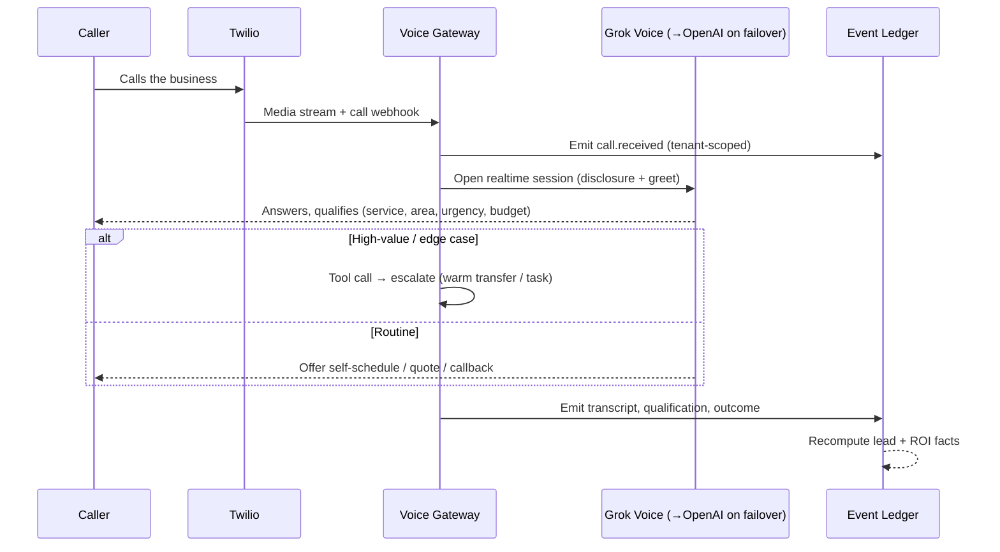

# ResponseOS — Product Requirements Document (PRD)

**Owner:** AJ Digital LLC / Audio Jones
**Status:** Canonical (go-forward). Companion to the short [`../PRD.md`](../PRD.md); this is the expanded product definition for the `RESPONSEOS_*` set.
**Last updated:** 2026-05-27
**Read first:** [`RESPONSEOS_BUILD_SOURCE.md`](./RESPONSEOS_BUILD_SOURCE.md)

---

## 1. Executive summary

Founder-led service businesses lose real revenue every week to demand they never respond to: missed calls, after-hours inquiries, web forms that sit unanswered, and follow-ups that never happen. The owner is on a roof or under a sink; the phone rings; the homeowner calls the next contractor on the list. That leak is invisible because nothing in their stack measures it.

**ResponseOS is the operating layer that captures that demand, responds instantly, qualifies and routes it, books or quotes it, and proves the recovered revenue every month.** It is built as a multi-tenant SaaS platform from day one — one shared codebase, many tenants — with AI voice agents at the edge (Grok Voice primary, OpenAI Realtime fallback, Twilio telephony), a dedicated realtime voice gateway, an event-ledger core, and HubSpot as the CRM system of record.

The product is sold outcome-first: a paid Readiness & Revenue Leak Assessment, then an implementation + monthly retainer with optional outcome fees tied to **verified** results. The defensible IP is the RECOVER orchestration, the canonical event ledger, ROI attribution, and the white-label OS — not the bought voice/telephony primitives.

---

## 2. Product vision

> In three years, a founder-led service business runs its entire front office — answering, qualifying, booking, quoting, following up, and reporting — on ResponseOS, and can prove to the dollar how much revenue it recovered that would otherwise have leaked.

Vision pillars:

1. **Recovery, not answering.** Answering a call is table stakes; recovering the revenue behind it is the product.
2. **Measurable by default.** Every recovered dollar is traceable to a captured event. Outcome-based pricing is only honest if the measurement is sound.
3. **Multi-tenant and white-label-ready.** The same platform powers AJ Digital's book of clients and, later, partner-branded deployments.
4. **Provider-agnostic.** Voice models, CRMs, and calendars are swappable behind adapters; the orchestration and the ledger are the constant.
5. **Audit-friendly and reliable.** Regulated-adjacent verticals are reachable because isolation, retention, consent, and audit are first-class.

---

## 3. Ideal customer profiles (ICPs)

### Primary ICP — Home-services operator (MVP)

| Attribute | Detail |
|---|---|
| Business | HVAC, roofing, plumbing, electrical, landscaping, general contracting |
| Size | Founder-led / SMB; 1–25 employees; often owner + small office |
| Demand | Phone-driven; ~20+ missed calls/month; meaningful after-hours demand |
| Economics | ~$300+ average job value; clear close rate |
| Tooling | Already on a CRM (often GoHighLevel or HubSpot) + disconnected VoIP, calendar, quoting doc, follow-up spreadsheet |
| Buyer | Owner/operator or office manager who feels missed-call pain but won't hire a 24/7 receptionist |
| Compliance | Low (non-PHI) — fits the Standard lane |

### Secondary ICPs (Phase 2 / Future, compliance-gated)

| ICP | Lane required | Gate |
|---|---|---|
| Med spas | Privacy-hardened (min) | Vetted disclosure scripts; jurisdictional consent |
| Auto repair | Standard | Service-write-up + parts/labor quote templates |
| Real estate | Standard | Team lead-routing; MLS connector evaluation |
| Legal / medical | HIPAA-ready | Full BAA chain; **out of MVP/Phase-2 scope** |

### Anti-ICP (explicitly not targeted now)

- Businesses with no phone-driven demand.
- Sub-$300 job value with no follow-up economics.
- Regulated verticals before their compliance lane is production-verified.
- Buyers seeking a pure "AI receptionist" with no interest in recovery measurement.

---

## 4. Founder pain points

| Pain | Today | With ResponseOS |
|---|---|---|
| Missed calls = lost jobs | Voicemail; homeowner calls the next contractor | Instant AI answer or <60s missed-call text-back |
| No after-hours coverage | Calls die at 5pm | 24/7 AI answering + qualification |
| Can't afford a receptionist | $40k+/yr hire, still single-shift | Per-tenant AI voice agent at a fraction of cost |
| Leads slip through cracks | Sticky notes, spreadsheets | Every signal becomes a tracked lead event |
| Slow/inconsistent follow-up | Owner forgets; no cadence | Automated, consented follow-up sequences |
| No idea what marketing is worth | "I think it's working?" | Monthly recovered-revenue + ROI proof |
| Double-booking / no-shows | Manual calendar juggling | Slot computation, confirmation + reminders |
| Quotes delayed | Owner quotes at night | Quote intake + delivery + reminder cadence |

---

## 5. Service-business workflows

ResponseOS digitizes the front-office workflows of a service business and maps them onto RECOVER. The seven canonical playbooks (see [`../automation-flows.md`](../automation-flows.md) for the full step lists) are:

| # | Workflow | RECOVER stages |
|---|---|---|
| 1 | Missed Call Recovery | Respond + Capture |
| 2 | AI Inbound Answering | Respond + Evaluate |
| 3 | Quote Request | Capture + Offer |
| 4 | Booking | Verify |
| 5 | Outbound Recovery Campaign | Escalate + Report |
| 6 | Human Escalation | Escalate |
| 7 | Monthly ROI Reporting | Report |

These remain the workflow contract; the go-forward stack changes *how* they run (Grok Voice via the gateway instead of Retell), not *what* they do.

---

## 6. User journeys

### 6.1 Caller (end customer of the tenant)

### 6.2 Founder/operator (tenant admin) — onboarding to value

1. Buys Phase 1 Readiness Assessment → receives leak estimate + fit diagnosis.
2. Signs Pricing Proposal → onboarding (10 inputs: hours, service area, services + pricing, escalation contacts, booking rules, payment policy, disclosure language, brand voice, CRM/calendar connect, baseline metrics).
3. Tenant provisioned: Twilio number(s), prompt/policy profile, workflow profile, HubSpot + calendar connected.
4. Goes live (Standard lane) → calls answered, leads captured, follow-ups firing.
5. Reviews the tenant portal: recovered revenue, qualified leads, bookings, ROI multiple.
6. Receives monthly ROI report (and outcome-fee invoice if applicable, from v0.5).

### 6.3 AJ Digital operator (platform staff)

Cross-tenant console: portfolio health, clients needing attention, transcript/QA review, provider/integration health, escalations, report generation. Break-glass into a tenant workspace is logged, time-boxed, and notified.

---

## 7. Use cases (representative)

| ID | As a… | I want to… | So that… | RECOVER |
|---|---|---|---|---|
| UC-01 | Homeowner | Reach a real, helpful answer when I call after hours | I don't have to call three contractors | Respond |
| UC-02 | Operator | Have missed calls texted back in <60s | The lead doesn't go cold | Respond |
| UC-03 | AI agent | Qualify service type, area, urgency, budget | Only good leads reach the owner | Evaluate |
| UC-04 | Operator | See a normalized transcript + lead record per call | I can trust the CRM and reporting | Capture |
| UC-05 | Customer | Self-schedule a visit from a link | I don't play phone tag | Offer/Verify |
| UC-06 | Customer | Get a quote by SMS/email with a clear next step | I can say yes quickly | Offer |
| UC-07 | Operator | Be warm-transferred high-value/edge-case calls | No big job sits in an AI loop | Escalate |
| UC-08 | Owner | Get a monthly report of recovered revenue + ROI | I know the system pays for itself | Report |
| UC-09 | Owner | Reactivate stale leads via a consented outbound campaign | Dormant demand converts | Escalate/Report |
| UC-10 | Platform admin | Provision a new tenant without code changes | We scale clients on one codebase | (platform) |

---

## 8. Pricing hypotheses

Pricing is commercial strategy (documented in [`../pricing-and-onboarding.md`](../pricing-and-onboarding.md)); the **billing engine ships in v0.5** (ADR-0010). Hypotheses the product must support:

| Hypothesis | Implication for the product |
|---|---|
| Buyers pay for a paid diagnostic before implementation | Onboarding/assessment surface must produce a Readiness Score + Leak Estimate |
| Three tiers (Core/Pro/Performance) fit the market | Feature gating must be tenant-configurable, not hardcoded |
| Outcome fees on **verified** results are accepted | ROI attribution + evidence links must be audit-grade |
| Usage (voice minutes/SMS) is real cost to manage | Usage metering must be tenant-scoped (v0.5) |
| No performance-only pricing | Every tenant carries base + monthly; outcome is upside |

Tiers (buyer-facing summary): **Recovery Core** ($2,500–$4,000 / $750–$1,250 mo), **Recovery Pro** ($5,000–$8,500 / $1,500–$2,500 mo, default), **Recovery Performance** ($8,500–$15,000+ / $2,500–$5,000+ mo). Phase 1 assessment $1,000 ($750–$1,500).

---

## 9. Success criteria & KPIs

### 9.1 The 9 reported KPIs (per workspace, per month)

1. Recovered Revenue (estimated) — qualified recovered leads × avg job value × estimated close rate.
2. Recovered Revenue (verified) — closed-won jobs traceable to ResponseOS-handled events.
3. ROI Multiple — recovered revenue ÷ monthly system cost.
4. Missed Calls Recovered — captured + followed up vs total missed.
5. Qualified Leads Captured.
6. Appointments Booked.
7. Quote Requests Created (and Sent).
8. Average Response Time (target **< 60s**).
9. Admin Hours Saved (vs onboarding baseline).

### 9.2 Internal product/platform KPIs

| KPI | Target |
|---|---|
| Lead-event ingest → first qualified outbound contact | < 60s |
| Webhook signature validation success | > 99.9% |
| Inbound call → agent handoff | < 3s avg |
| Voice-provider failover success (Grok→OpenAI) | > 99% of failover attempts complete the call |
| Calendar-slot response latency | < 1.5s p95 |
| Booking success after slot selection | > 98% |
| Monthly report generation completion | > 99% |
| Tenant provisioning time (no code change) | < 1 business day |

### 9.3 Business success criteria (MVP)

- 1 internal tenant + ≥1 pilot client live on the Standard lane.
- Pilot produces a defensible monthly recovered-revenue report.
- Zero cross-tenant data exposure incidents.
- Pilot renews / converts to a paid retainer.

---

## 10. MVP definition

**MVP = the existing v0.1/v0.2 foundation + the v0.3 live-integration milestone that introduces the voice gateway and the go-forward stack.**

In scope for MVP:

- Multi-tenant data layer (tenant-scoped, `account_id` from session) — **shipped (v0.2)**.
- Operator console + read-only tenant portal — **shipped (v0.2), rebuilt against DESIGN.md in closeout**.
- Event ledger + signed webhook ingest foundation — **shipped (v0.2 foundation)**.
- Node.js voice gateway with Grok Voice (primary) + OpenAI Realtime (fallback) behind the provider abstraction — **v0.3**.
- Twilio telephony edge, live, with signature validation + persistence — **v0.3**.
- Redis ephemeral session state — **v0.3**.
- HubSpot CRM connector (default) + calendar connector — **v0.3**.
- The seven RECOVER playbooks running against live providers — **v0.3**.
- Tenant onboarding/provisioning flow (no code change per tenant) — **v0.3**.
- Monthly ROI reporting — **v0.3** (outcome-fee preview only).

See [`RESPONSEOS_ROADMAP.md`](./RESPONSEOS_ROADMAP.md) and [`RESPONSEOS_PHASE_PLAN.md`](./RESPONSEOS_PHASE_PLAN.md) for sequencing.

---

## 11. Out of scope

### Out of scope for MVP (deferred to a named version)

| Item | Target |
|---|---|
| Billing engine, Stripe billing, outcome-fee ledger, invoices | v0.5 (ADR-0010) |
| Per-tenant client knowledge ingestion / agent grounding (RAG) | v0.4, gated on isolation/audit/retention |
| Full white-label (custom domains, theming, partner branding) | v0.3 (basic) → v1.0 (full) |
| Bring-your-own Twilio / BYO LLM provider keys | Future / enterprise |
| Mobile app | Future |
| Bidirectional QuoteIQ writes | Deferred until private API confirmed (ADR-0007) |

### Out of scope entirely (anti-scope)

- Firebase (forbidden).
- Provider-specific business logic above the adapter boundary.
- n8n in the realtime audio loop.
- Representing ResponseOS as HIPAA-certified.
- Repo-per-client or deploy-per-customer architectures.
- A generic "second brain" / personal-knowledge product.

---

## 12. Roadmap sequencing (summary)

MVP (v0.2 done → v0.3) → Phase 2 (v0.4 knowledge grounding, v0.5 billing) → Future (v1.0 white-label-ready, BYO-provider, more verticals) → Deferred/speculative (mobile, bidirectional QuoteIQ, HIPAA lane productionization). Full table in [`RESPONSEOS_ROADMAP.md`](./RESPONSEOS_ROADMAP.md).

---

## 13. Risk register

| ID | Risk | Likelihood | Impact | Mitigation |
|---|---|---|---|---|
| R-01 | Grok Voice / OpenAI Realtime not production-ready for telephony (concurrency, barge-in, webhooks) | Med | High | v0.3 provider-readiness gate before live traffic; transparent failover; abstraction allows re-swap (ADR-0012) |
| R-02 | Cross-tenant data leak | Low | Critical | `account_id` from session on every path; integration tests assert isolation; break-glass logging |
| R-03 | Voice-provider compliance posture (retention/training data) unverified for regulated tenants | Med | High | Block Grok/OpenAI on HIPAA lane until BAA/retention verified; Standard lane only for MVP |
| R-04 | Voice gateway is a new operational surface (latency, scaling) | Med | Med | Isolated service + own SLOs; Redis-backed session continuity; load test before go-live |
| R-05 | HubSpot-default friction for GHL-native tenants | Med | Med | Keep CRM pluggable; GHL connector retained (ADR-0015) |
| R-06 | Outcome-fee disputes over attribution | Med | Med | Evidence-linked, ledger-backed ROI; 30-day audit window |
| R-07 | TCPA / call-recording consent violations | Low | High | Disclosure + consent as tenant policy objects; jurisdiction-aware (v0.3) |
| R-08 | Provider/vendor lock-in or pricing shock | Med | Med | Adapter abstraction; multi-provider; BYO-provider path (Future) |
| R-09 | Scope creep into agent-chaos / over-engineering | Med | Med | Scope discipline rule; only the voice gateway is a sanctioned service split |
| R-10 | Naming/trademark risk on "ResponseOS" | Med | Med | See [`../research/RESPONSEOS_NAMING_RISK_RESEARCH.md`](../research/RESPONSEOS_NAMING_RISK_RESEARCH.md) |

---

## 14. Open questions

1. Production telephony viability + compliance posture of Grok Voice and OpenAI Realtime (R-01, R-03) — owner: backend/voice; due: v0.3 readiness gate.
2. Voice gateway hosting/topology on the Standard lane (co-located vs separate container platform) — owner: infra.
3. HubSpot-default vs GHL-default for first pilots (R-05) — owner: product/GTM.
4. Which milestone unlocks bring-your-own-provider for enterprise tenants — owner: product.
5. Outcome-fee attribution rules edge cases (multi-touch, recurring customers) — owner: product/finance.

---

## 15. Assumptions

- The Standard compliance lane is sufficient for all MVP/pilot tenants (non-PHI home services).
- The v0.2 tenant-aware data layer is sound and is the foundation the voice gateway integrates with.
- Pilots can be sourced from AJ Digital's existing book; first vertical is home services.
- Voice usage costs are manageable under the included-minutes + overage model (commercial doc).

---

*ResponseOS PRD — AJ Digital LLC / Audio Jones. Documentation phase only.*
