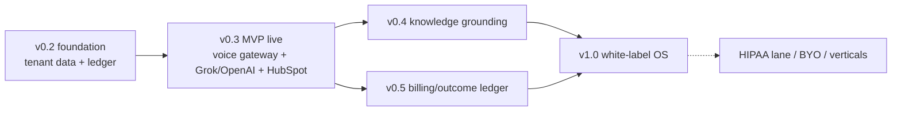

# ResponseOS — Roadmap

**Owner:** AJ Digital LLC / Audio Jones
**Status:** Canonical (go-forward). Aligns with the existing [`../ROADMAP.md`](../ROADMAP.md) version table; this view restates sequencing for the go-forward stack and the MVP / Phase 2 / Future / Deferred classification.
**Read first:** [`RESPONSEOS_BUILD_SOURCE.md`](./RESPONSEOS_BUILD_SOURCE.md) · [`RESPONSEOS_PHASE_PLAN.md`](./RESPONSEOS_PHASE_PLAN.md)

---

## 1. Version table

| Version | Theme | Classification | Status |
|---|---|---|---|
| **v0.1** | Operator console scaffold; mock adapters; 11 typed models; webhook-ready stubs; canonical envelopes | MVP foundation | ✅ Shipped |
| **v0.2 A–D** | Postgres schema + seed; auth + tenant-aware data layer; consumers routed through data layer; integration tests + CI | MVP foundation | ✅ Shipped |
| **v0.2 closeout** | `Organization`→`Account` rename; real auth wiring; UI rebuild vs `../DESIGN.md`; remaining model expansion (provider_connections, conversations, call_segments/transcripts, workflow_runs, qa_logs, audit_logs) | MVP foundation | 🟡 In flight |
| **v0.3** | **Go-forward live stack:** Node.js voice gateway; Grok Voice (primary) + OpenAI Realtime (fallback); live Twilio; Redis session state; HubSpot CRM connector; calendar connector; signature validation + persistence; the 7 RECOVER playbooks live; tenant provisioning; monthly ROI report; outcome-fee invoicing **preview**; basic white-label | **MVP (live)** | ⏳ Planned |
| **v0.4** | Per-tenant client knowledge + agent grounding layer (RAG), gated on isolation/audit/retention | **Phase 2** | ⏳ Planned |
| **v0.5** | Billing/outcome-fee ledger production: pricing engine, Stripe billing, outcome-fee ledger, invoices, in-app tier selectors | **Phase 2** | ⏳ Planned |
| **v1.0** | Client-ready Revenue Recovery OS — polished, onboarding complete, **full white-label**, BYO-provider groundwork | **Future** | ⏳ Planned |
| **HIPAA-ready lane** | Per-tenant AWS-hosted, BAA-backed lane; voice providers only after compliance verification | **Deferred (pattern)** | ⏳ Pattern only |

> **MVP** = the live v0.3 milestone on the existing v0.1/v0.2 foundation. **Phase 2** = v0.4 (knowledge) + v0.5 (billing). **Future** = v1.0 (white-label, BYO groundwork). **Deferred/speculative** = HIPAA-lane productionization, bidirectional QuoteIQ, mobile app, additional regulated verticals.

---

## 2. What changes from the original roadmap

The original `../ROADMAP.md` v0.3 named Twilio/Retell/Vapi as the live voice stack. The go-forward v0.3 (ADR-0012/0013/0014) introduces the **Node.js voice gateway** with **Grok Voice primary / OpenAI Realtime fallback** and **Redis** session state, and makes **HubSpot** the default CRM connector. The *milestone shape* (live integrations at v0.3) is unchanged; the *providers* change. Retell/Vapi/Bland become optional/future behind the abstraction.

---

## 3. Sequencing rationale

- **Data + ledger before live providers.** The ledger discipline (ADR-0002) must exist before live traffic so ROI/audit/replay hold from day one.
- **Live providers before knowledge + billing.** v0.4 grounding and v0.5 outcome-fee billing both depend on real call/event data proving out.
- **Billing after at least one production pilot.** Don't build the outcome-fee ledger on an unproven data model (ADR-0010).
- **White-label after the single-tenant experience is solid.** v1.0 generalizes a proven product.

---

## 4. Per-version scope detail

### v0.3 (MVP, live) — in scope
- Voice gateway service (realtime session lifecycle, Redis state).
- Grok Voice + OpenAI Realtime adapters behind the provider interface; transparent failover.
- **Provider-readiness gate** passes before live traffic (Backend Spec §12).
- Live Twilio (numbers, Media Streams, signature validation, persistence).
- HubSpot connector (CRM SoR) + Google/Cal.com calendar.
- The 7 RECOVER playbooks running live.
- Tenant provisioning (data-only) + profile editors.
- Monthly ROI reporting; outcome-fee invoicing **preview** only.
- Basic white-label (theme vars, wildcard subdomain).

### v0.3 — explicitly out
- Production billing engine (v0.5).
- Per-tenant knowledge ingestion / RAG (v0.4).
- Full white-label / custom domains (v1.0).
- HIPAA lane production; regulated-vertical go-live.
- Grok/OpenAI on regulated lanes (blocked until compliance verified, ADR-0012).

### Phase 2
- **v0.4** knowledge grounding — gated on tenant isolation, source ownership, audit, retention, PII minimization, deletion/export, approved-source controls, human review (per `../ROADMAP.md` gates). No vector store committed until v0.4 picks a strategy.
- **v0.5** billing — pricing engine, Stripe billing, outcome-fee ledger, invoices, tier selectors (ADR-0010).

### Future (v1.0)
- Full white-label / partner branding; custom domains; tenant RBAC for branding.
- Onboarding flow complete and production-grade.
- Bring-your-own-provider groundwork (BYO Twilio / LLM keys).

### Deferred / speculative
- HIPAA-ready lane production (AWS, BAA chain) — pattern only until independent review per tenant.
- Bidirectional QuoteIQ writes (until private API confirmed, ADR-0007).
- Mobile app.
- Additional regulated verticals (legal/medical) — compliance-gated.

---

## 5. Hard constraints across all versions (unchanged)

- No Firebase. No real secrets in the repo. Adapters fall back to mock when env vars missing.
- No live provider integrations until v0.3 authorized; no production deploys until v0.3 gates clear.
- Tenant isolation, signature validation, event-ledger discipline at every version.
- ResponseOS is **not** HIPAA-certified; HIPAA-readiness is a per-deployment lane.

---

## 6. Milestone exit criteria (summary)

| Milestone | Exit gate |
|---|---|
| v0.2 closeout | Model expansion complete; real auth wired; UI on `../DESIGN.md` tokens; CI green |
| v0.3 | Provider-readiness gate passed; ≥1 pilot live on Standard lane; zero cross-tenant incidents; defensible monthly ROI report produced |
| v0.4 | Knowledge gates in force for the ingesting tenant's lane; grounded answers auditable |
| v0.5 | Outcome-fee invoices reconcile to ledger evidence; Stripe webhooks signature-validated |
| v1.0 | White-label tenant onboarded end-to-end; all surfaces production-grade |

Detailed gates: [`RESPONSEOS_PHASE_PLAN.md`](./RESPONSEOS_PHASE_PLAN.md).

---

## 7. Open questions

1. v0.3 timing depends on the provider-readiness gate outcome for Grok/OpenAI (PRD R-01).
2. HubSpot-default vs GHL-default may shift the connector priority within v0.3.
3. v0.4 vs v0.5 ordering could swap if a pilot demands billing before knowledge grounding.

---

*ResponseOS Roadmap — AJ Digital LLC / Audio Jones. Documentation phase only.*
