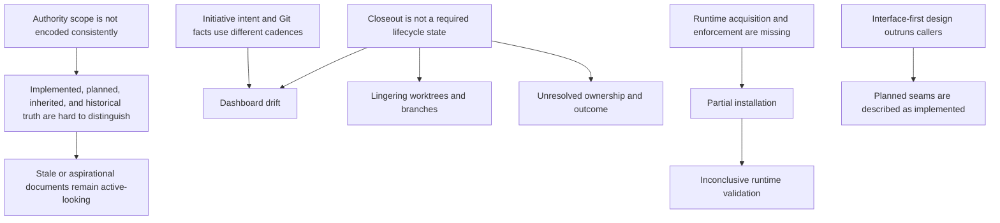
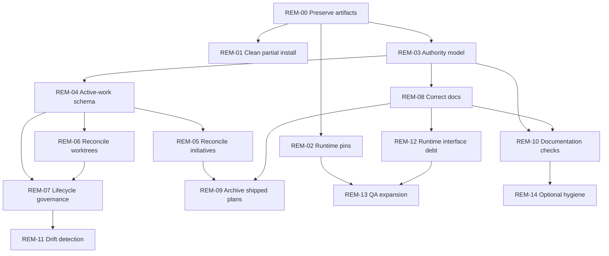

# ResponseOS Repository Remediation Plan

**Status:** Approved implementation plan; remediation not yet started

**Evidence baseline:** 2026-08-11

**Planning branch:** `codex/repository-governance-remediation`
**Baseline:** `origin/master` at `2175d60a96de528550b02e8f23b9aad1be099603`

## 1. Executive Summary

The Phase 1 assessment identified real repository-operability problems, but several conclusions needed qualification. Documentation precedence already exists; the failure is overloaded authority language and weak separation of implemented, planned, inherited, current-work, and historical truth. Runtime declarations are consistent; reproducible acquisition and enforcement are missing. Git and PR rules exist; mandatory post-merge closeout does not.

Five root causes remain:

1. Authority scope is not encoded consistently.
2. Initiative intent, GitHub delivery facts, roadmap state, and dashboard state update at different cadences.
3. Merge is not followed by a required closeout transition.
4. Exact runtime acquisition and enforcement are missing.
5. Some design documents describe planned seams as implemented behavior.

No P0 repository-integrity, secret-safety, production-safety, or recoverability defect is proven. The validated backlog contains 9 P1, 5 P2, and 1 P3 items.

Locked decisions:

- `dashboard/dashboard-data.json.tasks` is the canonical active-initiative ledger.
- GitHub is authoritative only for issue, PR, merge, and branch facts.
- The rendered dashboard is derived.
- Volta pins in `package.json` will be the executable runtime authority; `.nvmrc` remains a checked mirror.
- Core remediation uses one dedicated worktree from the latest `origin/master`.
- The assessment worktree remains protected until its planning artifacts land safely.

## 2. Assessment Revalidation

Thirty-four material findings were reviewed against current repository and Git evidence.

### Confirmed — 20

1. The assessment checkout was one commit ahead and six behind `origin/master`.
2. Its HEAD was also the head of draft PR #114, creating polluted ancestry for remediation.
3. PRs #107, #114, #115, and #116 were open at revalidation.
4. Sixteen worktrees were registered before REM-00.
5. None of those sixteen was reported as prunable.
6. Dashboard records were stale against merged and closed GitHub facts.
7. Dashboard, roadmap, changelog, and GitHub state update at different cadences.
8. A prior governance remediation plan remained active-looking after related work shipped.
9. Repository pins require Node 24.18.0 and npm 11.16.0.
10. The inspected host provided Node 26.5.0 and npm 11.17.0.
11. Several architecture documents describe planned capabilities as current behavior.
12. Non-Clerk webhook scaffolds lack signature-to-ledger runtime paths.
13. `VoiceProvider` remains a hypothetical or test-only seam.
14. Revenue helpers remain dormant outside tests.
15. Health documentation reports version 0.1 while package/runtime report 0.2.
16. Roadmap route-wiring claims exceed code evidence.
17. Transcript-retention metadata is documented but not enforced.
18. E2E, coverage-threshold, and route-level validation gaps remain.
19. The root layout is comparatively clean and contains no exact non-empty duplicate files.
20. Post-merge closeout is distributed and incomplete.

### Partially confirmed — 7

1. Documentation-authority conflict exists, but precedence already appears in the PRD and documentation indexes.
2. `RESPONSEOS_BUILD_SOURCE.md` has scoped primacy but defers to established authorities and ADRs.
3. Detailed documents using “canonical” do not all conflict; several explicitly extend root documents.
4. Branch, PR, and validation governance exists, but complete post-merge closeout does not.
5. Broken-link evidence is material, but the exact count must be rerun before remediation.
6. Archive use is inconsistent, but not every old-looking document is obsolete.
7. Runtime reproducibility is defective, but its declarations are consistent.

### Disputed — 3

1. The assessment’s proposed hierarchy is incomplete because it omits the inherited runtime/dashboard standard snapshot.
2. Dashboard synchronization does distinguish merged PRs from closed-unmerged PRs; it does not mark every closed PR complete.
3. Runtime declarations are not intrinsically weak or contradictory; acquisition and enforcement are the demonstrated gaps.

### Obsolete — 1

The “one dirty worktree” count became obsolete. Before REM-00, the assessment worktree and detached `7d63` worktree were dirty.

### Insufficient evidence — 3

1. An alleged conflict with the external Obsidian source cannot be resolved without inspecting that external canonical source.
2. Unreferenced assets cannot be classified as safe to delete from reference searches alone.
3. Phase 1’s zero-vulnerability audit is historical evidence, not confirmation of the current dependency state.

Repository evidence overrides Phase 1 wording wherever they disagree.

## 3. Confirmed Findings

The confirmed findings consolidate into five remediation groups:

| Group | Confirmed condition | Operational effect |
|---|---|---|
| Authority vocabulary | Global, domain, detailed, current-state, and inherited documents use overlapping authority terms. | Agents spend time resolving which source applies. |
| Initiative state | Dashboard intent and GitHub facts update independently. | Active and completed work is misrepresented. |
| Closeout | Merge is not a mandatory lifecycle transition. | Worktrees, branches, and initiative records linger. |
| Runtime acquisition | Exact versions are declared but unavailable or unenforced locally. | Installation and runtime validation are inconclusive. |
| Product truth | Planned interfaces are sometimes described in present tense. | Documentation overstates implemented behavior. |

These are repository-operability defects. They do not authorize live integrations, production deployment, worktree deletion, or product-scope expansion.

## 4. Disputed / Rejected Findings

The remediation must not:

- Treat every use of “canonical” as a substantive contradiction.
- Treat closed-unmerged PRs as completed work.
- Replace otherwise consistent runtime pins merely because the host lacks them.
- Infer abandonment from worktree age.
- Delete unreferenced files without ownership, runtime-use, and recovery evidence.
- Claim the external Obsidian standard conflicts with the repository until that source is inspected.
- Treat a prior audit result as current dependency certification.

## 5. Root-Cause Analysis

Authority, active-state drift, and worktree accumulation share a missing-closeout seam. Runtime reproducibility remains an independent remediation stream. Product runtime debt is a later, separately authorized initiative rather than a prerequisite for repository governance.

## 6. Documentation Authority Model

Authority is resolved by both layer and question.

| Layer | Authority | Rule |
|---|---|---|
| Inherited standards | External canonical standard and repository snapshot | Controls only its declared cross-repository domain. The local snapshot is read-only and may not silently diverge. |
| Repository entry point | `README.md` | Navigation and setup entry point, not architectural authority. |
| Operating contract | `AGENTS.md` | Local agent, branch, safety, validation, and contribution rules. |
| Accepted decisions | `docs/DECISIONS.md` | Accepted architecture and governance decisions. |
| Product intent | `docs/PRD.md` | Product problem, boundaries, and success criteria. |
| Milestone intent | `docs/ROADMAP.md` | Authorized sequence and milestone scope. |
| Implemented truth | Code, schema, migrations, configuration, and workflows | Wins when answering what the repository currently does. |
| Domain specifications | Architecture, API, data, security, deployment, design, and automation documents | Authoritative only in their named domain. |
| Detailed design | `RESPONSEOS_*` documents | Subordinate elaboration; cannot override preceding layers. |
| Current initiative state | Dashboard task ledger | Canonical lifecycle state after REM-04. |
| Evidence and proposals | Assessments, implementation briefs, remediation plans | Decision inputs, not accepted architecture until approved. |
| History | Changelog and archives | Historical provenance only. |

Conflict rules:

- “What exists now?” — implementation wins.
- “What is authorized to be built?” — accepted decisions, PRD, and roadmap win.
- “How must an agent operate?” — inherited standards plus `AGENTS.md` win.
- “What work is active?” — dashboard tasks win; GitHub wins only for linked delivery facts.

Each active document will use one scope label: `authoritative`, `domain-authoritative`, `supporting-reference`, `proposal`, `historical`, or `external-snapshot`.

## 7. Active-Work Source-of-Truth Model

### Canonical record

Every substantial initiative has exactly one task in `dashboard/dashboard-data.json.tasks`. The rendered dashboard, `generatedAt`, `liveIssues`, PR/issue state, and progress summaries are derived.

### Status model

`Backlog → To Do → In Progress → Review → Closeout → Done`

`Cancelled` is terminal. Blocking remains metadata rather than a lifecycle state.

Active means `To Do`, `In Progress`, `Review`, or `Closeout`. Backlog is proposed work. Done and Cancelled are inactive.

### Minimum task contract

The normalized task contract adds:

- `links.issue` and `links.pull`.
- `branch`.
- `worktreeId`, using a logical identifier rather than an absolute path.
- `worktreeState`: `none`, `active`, `closeout`, or `removed`.
- `closeout.outcome`.
- `closeout.validation`.
- `closeout.postMergeVerified`.
- `closeout.remainingIssues`.
- Worktree and branch removal eligibility, approval, and completion fields.

Legacy `ref` and `refType` remain readable during one compatibility phase.

### State rules

1. Register a task before creating its branch or worktree.
2. A task enters In Progress only after branch and worktree identity are recorded.
3. A lifecycle-managed PR merge moves work to Closeout, not automatically to Done.
4. Closed-unmerged PRs never complete an initiative.
5. Done requires completed closeout evidence.
6. GitHub may update linked fact fields but may not silently rewrite initiative intent.
7. When dashboard and Git disagree, Git wins only for the corresponding Git fact.

The inherited standard currently equates merged PRs with Done. REM-04 therefore requires either an approved central-standard amendment or an explicit, documented ResponseOS exception.

## 8. Existing Worktree Reconciliation

The Phase 1 baseline contained sixteen worktrees. REM-00 created a seventeenth protected worktree for this plan. Committed paths use logical roots:

- `DEV_ROOT` = local development root.
- `CODEX_ROOT` = `<user-profile>/.codex/worktrees`.

`last_activity` is the last reachable commit date, not proven human activity.

| # | Path | Branch/head | Status | Last activity | Clean/dirty | Merge/PR state | Purpose | Known owner | Classification |
|---:|---|---|---|---|---|---|---|---|---|
| 1 | `DEV_ROOT/responseos` | `codex/Universal-Repository-Cleanup` | Registered | 2026-08-08 | Clean | No linked PR found | Cleanup/base checkout inferred from branch | Unknown | PROTECTED |
| 2 | `.claude/worktrees/open-uncommitted-prs-9ebc65` | detached `83038d5` | Registered | 2026-08-02 | Clean | Ancestor of master; no live PR | Open-PR inspection inferred from path | Claude tool context inferred | COMPLETE-PENDING-CLOSEOUT |
| 3 | `.claude/worktrees/sad-wilson-16db7f` | detached `e09777a` | Registered | 2026-08-08 | Clean | PR #106 merged | Build/docs consistency work | Claude tool context inferred | MERGED-PENDING-CLEANUP |
| 4 | `.claude/worktrees/wizardly-mendel-93ff6a` | detached `2b6c0a8` | Registered | 2026-08-03 | Clean | Contained in PR #105 work; merged | Platform-doctrine work inferred | Claude tool context inferred | MERGED-PENDING-CLEANUP |
| 5 | `DEV_ROOT/responseos-future-client-onboarding-v0-1` | `docs/responseos-future-client-onboarding-v0-1` | Registered | 2026-08-08 | Clean | PR #103 merged | Client-onboarding documentation | Unknown | MERGED-PENDING-CLEANUP |
| 6 | `DEV_ROOT/responseos-pr107-remediation` | `cursor/gtm-gap-closure-414d` | Registered | 2026-08-08 | Clean | Draft PR #107 open | GTM gap closure | Cursor branch context | ACTIVE |
| 7 | `DEV_ROOT/responseos-tyrone-reference` | `feat/internal-reference-tenant-foundation` | Registered | 2026-08-10 | Clean | PR #115 open | Internal reference tenant | Unknown | ACTIVE |
| 8 | `DEV_ROOT/responseos-xai-readiness` | `agent/xai-voice-readiness` | Registered | 2026-07-13 | Clean | PR #98 merged | XAI/voice readiness | Agent branch context | MERGED-PENDING-CLEANUP |
| 9 | `DEV_ROOT/rt-105` | `claude/responseos-platform-doctrine-5a2675` | Registered | 2026-08-08 | Clean | PR #105 merged | Platform doctrine | Claude branch context | MERGED-PENDING-CLEANUP |
| 10 | `DEV_ROOT/rt-108` | `feat/v0.3-cal-mocks` | Registered | 2026-08-08 | Clean | PR #108 merged | Calendar mock adapters | Unknown | MERGED-PENDING-CLEANUP |
| 11 | `DEV_ROOT/rt-110` | `chore/v0.3-staging-hosting-prep` | Registered | 2026-08-08 | Clean | PR #110 merged | Staging hosting preparation | Unknown | MERGED-PENDING-CLEANUP |
| 12 | `DEV_ROOT/rt-94` | `codex/v0-3-demo-deploy-checkpoint` | Registered | 2026-08-08 | Clean | PR #94 merged | Demo deployment checkpoint | Codex branch context | MERGED-PENDING-CLEANUP |
| 13 | `CODEX_ROOT/4b6a/responseos` | `codex/repository-assessment` | Registered | 2026-08-08 | Dirty: assessment/dashboard | No dedicated assessment PR; polluted by PR #114 ancestry | Phase 1 assessment | Codex | ACTIVE, PROTECTED UNTIL TRANSFER |
| 14 | `CODEX_ROOT/7d63/responseos` | detached `ed77c26` | Registered | 2026-08-07 | Dirty: package files | Purpose/merge state unresolved | Unknown | Unknown | PROTECTED |
| 15 | `CODEX_ROOT/929f/responseos` | detached `2175d60` | Registered | 2026-08-08 | Clean | At baseline master; no live task link | Prior inspection context possible | Unknown | UNKNOWN |
| 16 | `CODEX_ROOT/a71e/responseos` | detached `2175d60` | Registered | 2026-08-08 | Clean | At baseline master; no live task link | Prior inspection context possible | Unknown | UNKNOWN |
| 17 | `DEV_ROOT/responseos-repository-governance-remediation` | `codex/repository-governance-remediation` | Created by REM-00 | 2026-08-08 baseline | Dirty with expected planning artifacts | Based on `origin/master`; no PR | Repository governance remediation | Codex | ACTIVE, PROTECTED |

Baseline classification totals: Active 3, closeout candidates 9, stale 0, unknown 2, protected 2. The new remediation worktree is additive and protected.

No worktree is classified Stale or Abandoned-Candidate solely from age. Reconciliation records owner, outcome, unique commits, dirty state, linked initiative, and eligibility before any removal is proposed.

## 9. Future Worktree Governance

Lifecycle:

`Request → Register Initiative → Create Branch → Create Worktree → Execute → Validate → Commit → Review/PR → Merge → Closeout → Verify → Remove Worktree → Delete Branch When Safe → Done`

Closeout requires:

- Outcome and initiative recorded.
- Branch and PR/merge state recorded.
- Exact merge SHA recorded when applicable.
- Validation and post-merge verification recorded.
- Remaining issues linked.
- Dashboard, changelog, and affected documentation updated.
- Worktree confirmed clean or changes explicitly preserved.
- Worktree removal eligibility and approval recorded.
- Branch deletion eligibility and approval recorded.
- Worktree and branch disposition completed or a protected exception documented.

A merged task remains in Closeout while any required item is unresolved.

Repository governance invariants:

1. Every substantial initiative has one canonical dashboard task.
2. Every active branch/worktree maps to one initiative.
3. Agents identify initiative, branch, worktree, and runtime before writing.
4. Dashboard lifecycle state is canonical; GitHub supplies delivery facts; rendered views are derived.
5. Merge enters Closeout.
6. Done requires closeout evidence and branch/worktree disposition.
7. Application validation uses repository-pinned tooling.
8. Dirty or uniquely committed work is preserved until explicitly approved for cleanup.

## 10. Runtime Reproducibility Plan

- Add Volta pins for Node 24.18.0 and npm 11.16.0 to `package.json`.
- Retain exact `engines`, `packageManager`, and `.nvmrc` declarations.
- Add `runtime:check` to compare Volta, engines, package-manager, `.nvmrc`, and application CI declarations.
- Have application CI assert actual Node/npm versions before installation.
- Keep the dashboard workflow’s Node 20 action runtime separate from the application runtime.
- Document Volta acquisition and local fail-fast preflight.
- Perform a clean `npm ci` before claiming runtime validation.
- Run lint, typecheck, unit tests, build, and Postgres integration tests under the exact pins.

The partial assessment-worktree `node_modules` is classified **REQUIRES HUMAN APPROVAL**:

- It can poison future validation.
- No tracked dependency files were changed by the failed install.
- Before removal, verify the exact resolved path, active processes, Git diff, and package/lockfile hashes.
- Remove only that worktree’s generated directory after approval.
- Do not clear package-manager caches unless an exact-runtime clean reinstall independently fails.
- After cleanup, activate Volta, run `npm ci`, then the full validation gates.

## 11. Remediation Backlog

Each item is an independently reviewable atomic implementation unit.

| ID | Title | Source findings / evidence | Root cause and proposed resolution | Systems | Dependencies | Priority | Risk | Effort | Type | Validation | Rollback | Approval | Destructive |
|---|---|---|---|---|---|---|---|---|---|---|---|---|---|
| REM-00 | Preserve planning artifacts | Polluted assessment ancestry; uncommitted assessment and G-06 | Create clean worktree; transfer verified, path-sanitized assessment, plan, G-06, and G-07 | Git, docs, dashboard | None | P1 | medium | S | git/docs | Ancestry, hashes, JSON, whitespace, link, secret/path checks | Remove uncommitted new worktree or revert | yes | false |
| REM-01 | Clean partial install | Incomplete ignored `node_modules` | Delete only approved generated directory; reinstall under exact runtime | Local dependencies | REM-00 | P1 | medium | XS | cleanup | Tracked package files unchanged; clean `npm ci` | Regenerate with `npm ci` | yes | true |
| REM-02 | Enforce runtime pins | Pins consistent; host unsupported | Add Volta pins, consistency checker, docs, and CI assertions | Package metadata, script, CI | REM-00 | P1 | medium | S | config/CI | Mismatch fixtures and full exact-runtime gates | Revert commit; retain existing pins | yes | false |
| REM-03 | Encode authority | Overloaded canonical labels | Add authority matrix and scope labels without rewriting architecture | Indexes, AGENTS, active docs | REM-00 | P1 | medium | M | docs/architecture | Authority/link scan | Revert docs commit | yes | false |
| REM-04 | Normalize active-work ledger | Dashboard/Git/roadmap drift | Add lifecycle, links, worktree identity, closeout metadata, legacy read compatibility | Dashboard schema, renderer, sync, docs | REM-03 and standard decision | P1 | high | M | workflow/code | State-transition fixtures and rendering | Dual-read old/new; revert before legacy removal | yes | false |
| REM-05 | Reconcile initiatives | Seven known remote mismatches; active tasks without refs | Correct facts and states; record unknowns rather than guessing | Dashboard and GitHub facts | REM-04 | P1 | medium | S | workflow | Zero unexplained mismatches; JSON/render checks | Restore prior JSON | yes | false |
| REM-06 | Reconcile worktrees | Sixteen baseline worktrees | Map owner, outcome, commits, task, and disposition; remove nothing | Git metadata, ledger | REM-04 | P1 | high | M | git/workflow | 16/16 classified; dirty/unique work preserved | Revert ledger changes | no | false |
| REM-07 | Define lifecycle | Merged worktrees and stale records | Add startup identity, closeout checklist, exception path, and gates | AGENTS, dashboard docs, runbook | REM-03/04/06 | P1 | medium | M | workflow/docs | Scenario walkthroughs | Revert governance commit | yes | false |
| REM-08 | Correct product truth | Webhook, voice, revenue, version, route, retention drift | Label implemented, mock-only, planned, and deferred behavior | Architecture/API/roadmap/detailed docs | REM-03 | P1 | medium | M | docs | Doc-to-code trace and claim scan | Revert docs commit | yes | false |
| REM-09 | Archive shipped plans | Active-looking completed plans | Move only evidence-confirmed completed briefs and update links | Docs and indexes | REM-03/05/08 | P2 | medium | S | docs/cleanup | Link check and verified Git moves | Revert move commit | yes | true |
| REM-10 | Validate authority and links | Broken links and stale references | Add read-only active-link, scope, secret, and private-path checks | Scripts/CI | REM-03/08 | P2 | low | M | CI | Passing repo run and failing fixtures | Revert script/CI commit | yes | false |
| REM-11 | Detect worktree/dashboard drift | Lingering worktrees and stale tasks | Add read-only orphan, dirty-detached, merged-closeout, and mismatch reporting | Local workflow/optional CI | REM-04/07 | P2 | medium | M | automation | Classification fixtures; no removal capability | Revert automation | yes | false |
| REM-12 | Resolve runtime interface/privacy debt | Unsigned ingress, hypothetical voice, dormant revenue, retention gap | Separate PRD/ADR initiative; remove unused seams or implement mock-safe paths | API, adapters, ledger, retention, tests | REM-08 and milestone approval | P2 | high | L | code/security | Signature, tenant, ledger, retention, fallback tests | Adapter-level revert; mocks remain | yes | false |
| REM-13 | Expand QA | Missing E2E, route gaps, no threshold | Define critical flows, route coverage, evidence-based floor | Tests/CI | REM-02 and applicable REM-12 work | P2 | medium | L | test/CI | Repeatable local/CI exact-runtime runs | Revert tests/thresholds | yes | false |
| REM-14 | Optional hygiene | Unreferenced assets and clutter | Investigate ownership/use; remove only proven residue | Assets/docs | All P1 and REM-10 | P3 | low | S | cleanup | Reference/build checks and review | Restore from Git | yes | true |

Priority totals: P0 0, P1 9, P2 5, P3 1.

## 12. Dependency Graph

## 13. Execution Waves

- **Wave 0 — Preservation and safety:** REM-00. Establish clean ancestry, transfer planning artifacts, sanitize paths, and preserve the assessment worktree.
- **Wave 1 — Runtime reproducibility:** REM-01 and REM-02.
- **Wave 2 — Canonical authority:** REM-03 and REM-04.
- **Wave 3 — Existing-state reconciliation:** REM-05 and REM-06. No deletion.
- **Wave 4 — Lifecycle governance:** REM-07.
- **Wave 5 — Documentation truth and consolidation:** REM-08 and REM-09.
- **Wave 6 — Mechanical detection:** REM-10 and REM-11.
- **Wave 7 — Product/test follow-ups:** REM-12 and REM-13 as separately authorized initiatives.
- **Wave 8 — Optional cleanup:** REM-14 and individually approved worktree/branch removals.

## 14. Atomic Implementation Units

The REM items are the atomic units. Their commit boundaries are:

| Unit | Exact operation | Commit boundary | Parallelizable |
|---|---|---|---|
| REM-00 | Transfer and sanitize planning artifacts from clean ancestry | `docs: add validated repository remediation plan` | no |
| REM-01 | Remove and regenerate local ignored dependencies | no commit | no |
| REM-02 | Add executable runtime enforcement | `build: enforce pinned ResponseOS runtime` | after REM-00 |
| REM-03 | Encode authority hierarchy and labels | `docs: define ResponseOS documentation authority` | with REM-02 |
| REM-04 | Add lifecycle/closeout schema and behavior | `feat: add initiative closeout state to dashboard` | no |
| REM-05 | Reconcile initiative records | `chore: reconcile ResponseOS initiative state` | no |
| REM-06 | Record worktree dispositions without removal | `chore: record ResponseOS worktree dispositions` | evidence gathering only |
| REM-07 | Add startup and closeout governance | `docs: define ResponseOS worktree lifecycle` | no |
| REM-08 | Correct current-versus-planned claims | `docs: align ResponseOS specifications with runtime` | after REM-03 |
| REM-09 | Move verified completed plans | `docs: archive completed ResponseOS initiatives` | no |
| REM-10 | Add read-only document checks | `ci: validate active repository documentation` | after REM-03/08 |
| REM-11 | Add read-only drift reporting | `feat: report ResponseOS repository drift` | after schema stabilization |
| REM-12 | Resolve authorized runtime seams | Multiple narrowly scoped code/test commits | separate initiative |
| REM-13 | Add acceptance coverage | Scoped test commits | after runtime stabilization |
| REM-14 | Remove independently proven residue | One narrow cleanup commit | after P1 |

No unit may silently expand into commit, push, PR, merge, deployment, provider, or production work.

## 15. Worktree Strategy

Use Option B: one dedicated remediation branch/worktree.

- Branch: `codex/repository-governance-remediation`.
- Base: refreshed `origin/master`.
- Do not continue remediation on `codex/repository-assessment`; its ancestry contains unrelated PR #114 work.
- Transfer only the verified assessment, remediation plan, G-06, and G-07.
- Keep the assessment worktree protected until transfer validation and later landing.
- Keep Waves 0–6 in this worktree because authority, dashboard, sync, workflow, and documentation files overlap.
- Use separate later worktrees only for REM-12, REM-13, or independent approved cleanup after governance merges.

## 16. Validation Strategy

- **Planning artifact:** all 20 headings, 34 classifications, baseline 16-worktree reconciliation, additive remediation worktree, backlog fields, waves, approvals, and Definition of Done.
- **Documentation:** links, code fences, whitespace, authority labels, private-path patterns, secret patterns, and implemented/planned claims.
- **Dashboard:** JSON/schema validation, renderer load, legacy compatibility, and deterministic sync fixtures.
- **Git:** base ancestry, status, unique commits, dirty state, PR facts, and dry-run reconciliation.
- **Runtime:** exact Volta versions, clean `npm ci`, Prisma generation, lint, typecheck, unit tests, build, and Postgres integration tests.
- **Security:** no secrets, live providers, Firebase, production deployment, or compliance claims.
- **Acceptance:** another agent can execute each unit without choosing architecture, status semantics, rollback, or order.

REM-00 validation is documentation-scoped. It does not certify runtime readiness.

## 17. Rollback Strategy

- Use one atomic commit per REM unit unless a later unit explicitly requires multiple commits.
- Retain legacy dashboard fields during schema migration.
- Preserve pre-reconciliation dashboard data in Git history.
- Revert authority and documentation changes without touching runtime.
- Revert Volta enforcement while retaining existing `.nvmrc` and engines.
- Never remove dirty or uniquely committed work without preservation evidence and approval.
- Remove worktrees and branches individually, never through a bulk destructive command.
- Do not force-push, rewrite shared history, or combine unrelated PR work.

For uncommitted REM-00, rollback is removal of only the newly created remediation worktree and branch after confirming its exact path and preserving any wanted artifacts.

## 18. Human Approval Gates

Explicit approval is required before:

- Committing, pushing, or opening a PR for the transferred planning artifacts.
- Amending the inherited dashboard standard or creating a ResponseOS exception for Closeout.
- Deleting the partial assessment-worktree `node_modules`.
- Changing agent behavior, CI, runtime configuration, or dashboard lifecycle semantics.
- Archiving or moving documentation.
- Removing any worktree or branch.
- Acting on the protected dirty `7d63` worktree.
- Removing an unreferenced asset.
- Starting REM-12 runtime/security work.
- Any merge, deployment, provider integration, production action, credential action, or Firebase-related change.

Approval for one unit does not authorize later units.

## 19. Automation Opportunities

Planning-only command candidates:

- `/start-initiative`: validate task ID, branch, owner, and runtime before work starts.
- `/create-worktree`: create a registered branch/worktree pair from the approved base.
- `/status`: report task, branch, worktree, PR, validation, and closeout state.
- `/close-initiative`: verify closeout evidence and emit removal eligibility.
- `/reconcile-worktrees`: classify worktrees without deleting them.
- `/repo-hygiene`: run documentation, dashboard, runtime, and orphan checks.

Automation must be read-only by default. Removal, branch deletion, issue closure, merge, push, and deployment remain explicit operator actions.

## 20. Definition of Done

ResponseOS is remediated when:

- Assessment and remediation artifacts land from clean `origin/master` ancestry.
- Every active document has an unambiguous authority scope.
- Current implementation and planned behavior are distinguishable.
- Dashboard tasks are the canonical initiative ledger; GitHub and rendered fields are derived.
- Every active initiative has owner, branch, worktree identity, and delivery links where applicable.
- All sixteen baseline worktrees have a verified outcome and disposition.
- The remediation worktree has its own initiative and eventual closeout.
- No dirty, protected, or unknown worktree has been removed without approval.
- Merged initiatives enter and complete explicit closeout.
- Runtime pins are executable and consistency-checked.
- A clean exact-runtime installation completes.
- Lint, typecheck, unit tests, build, and integration validation pass.
- Dashboard/GitHub mismatches are resolved or documented as intentional exceptions.
- Stale completed plans are archived only after approval.
- Read-only authority, dashboard, runtime, and worktree drift checks pass.
- Repository-operability questions can be answered from repository evidence without contradictory active documents.
- No live provider, production deployment, Firebase, secret, or unsupported compliance scope is introduced.

### Planning completion report

- Findings reviewed: **34**
- Confirmed: **20**
- Partially confirmed: **7**
- Disputed: **3**
- Obsolete: **1**
- Insufficient evidence: **3**
- P0: **0**
- P1: **9**
- P2: **5**
- P3: **1**
- Existing worktrees before REM-00: **16**
- Active: **3**
- Closeout candidates: **9**
- Stale candidates: **0**
- Unknown: **2**
- Protected: **2**
- New remediation worktree: **1 active/protected**
- Recommended strategy: **Dedicated clean worktree from refreshed `origin/master`**
- Recommended first wave: **Wave 0 — preserve, sanitize, and transfer planning artifacts without cleanup**
- Human approvals before later implementation: **dashboard-standard amendment or exception, dependency cleanup, authority relabeling, agent/CI changes, archival moves, and each worktree or branch removal**
