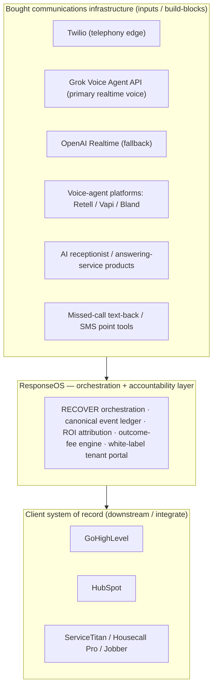

# ResponseOS — Competitor & Landscape Research

**Owner:** AJ Digital LLC / Audio Jones
**Status:** Draft v0.1 — landscape map and positioning input. Capability claims are kept to what is *generally* true; anything uncertain is marked "varies / verify."
**Last updated:** 2026-05-27
**Companion docs:** [`./RESPONSEOS_MARKET_RESEARCH.md`](./RESPONSEOS_MARKET_RESEARCH.md) · [`./RESPONSEOS_NAMING_RISK_RESEARCH.md`](./RESPONSEOS_NAMING_RISK_RESEARCH.md) · [`../PRD.md`](../PRD.md) · [`../product-spec.md`](../product-spec.md) · [`../architecture.md`](../architecture.md)

> **Integrity note.** This document does **not** quote competitor pricing or specific feature specifics unless verified, and avoids them by default because they change fast. Where a capability is named, it is stated only at the level we are reasonably confident is generally true; finer detail is marked **"varies / verify."** No funding figures, market shares, or revenue numbers are asserted as fact.

---

## 1. Purpose

Map the landscape around ResponseOS into categories, state where ResponseOS sits relative to each, and give an honest where-it-wins / where-it's-weak read plus a moat analysis and a monitoring list. The throughline: **ResponseOS is the orchestration + accountability layer that sits ABOVE bought communications infrastructure and BELOW the client's CRM/FSM.** It is not a voice-agent platform and not an AI receptionist clone.

The internal framework is **RECOVER** (Respond, Evaluate, Capture, Offer, Verify, Escalate, Report — see [`../PRD.md`](../PRD.md)). Competitive coverage is best understood as "which RECOVER stages does this category actually own?"

---

## 2. Where ResponseOS sits (stack map)

ResponseOS consumes infrastructure as inputs, orchestrates the full RECOVER lifecycle on top, and writes outcomes into the client's CRM/FSM as system of record.

---

## 3. The five competitive categories

### Category 1 — AI voice-agent platforms / dev infrastructure
**Examples:** Retell, Vapi, Bland; plus **Grok Voice** and **OpenAI Realtime** as underlying model/runtime providers.

- **What they generally are:** developer building-blocks for realtime voice agents — turn-taking, low-latency speech, telephony integration, call handling. Architecturally they differ (e.g., Vapi positions as a bring-your-own-LLM/TTS/telephony orchestration layer; Bland is oriented to high-volume outbound; Retell emphasizes managed voice quality/latency). (Directional, retrieved 2026-05-27; https://www.retellai.com/blog/best-voice-ai-providers — exact features/pricing **vary / verify**.)
- **Relationship to ResponseOS:** **inputs / build-blocks and potential partners, not direct competitors.** ResponseOS already designates Grok Voice as primary realtime voice and OpenAI Realtime as fallback (see [`../PRD.md`](../PRD.md) / [`../architecture.md`](../architecture.md)). These cover (at most) the **Respond** stage; they do not do qualification routing, follow-up orchestration, ROI attribution, or outcome accountability.
- **Risk:** one of them could move *up* the stack into orchestration + reporting (see §6).

### Category 2 — AI receptionist / answering-service products
**Examples:** "answer the phone" point solutions (named generically; specific vendors **vary / verify**).

- **What they generally are:** productized AI (or human) answering that picks up calls, takes messages, sometimes books appointments.
- **Relationship to ResponseOS:** **partial overlap on the Respond stage only.** They answer; they generally do not run the full RECOVER lifecycle (qualify → capture to a canonical ledger → orchestrate multi-touch follow-up → verify → prove ROI with attribution → outcome-based pricing).
- **Why ResponseOS is not this:** explicitly per [`../PRD.md`](../PRD.md), "the receptionist is one input." ResponseOS is the recovery layer on top of every demand signal.

### Category 3 — Missed-call text-back / SMS automation point tools
**Examples:** standalone missed-call-text-back / SMS-automation apps, plus this capability **bundled into CRMs** (e.g., GoHighLevel bundles missed-call-text-back into base plans with no add-on fee — verified, retrieved 2026-05-27; https://help.gohighlevel.com/support/solutions/articles/155000006652-ai-product-pricing).

- **What they generally are:** when a call is missed, auto-send an SMS; sometimes light follow-up sequences.
- **Relationship to ResponseOS:** **narrow overlap on early Respond/Offer touches.** This is now commoditized table stakes (it ships free inside CRMs), so it is a feature ResponseOS subsumes, not a category it competes in head-on.

### Category 4 — CRM / FSM platforms
**Examples:** **GoHighLevel, HubSpot** (CRM); **ServiceTitan, Housecall Pro, Jobber** (FSM).

- **What they generally are:** systems of record for contacts, pipelines, jobs, scheduling, invoicing; increasingly bundling AI/voice/text-back features.
- **Relationship to ResponseOS:** **systems of record / downstream + integration targets, with partial overlap** as they add AI features. ResponseOS uses **HubSpot as CRM system of record** internally and integrates with the client's CRM (often GoHighLevel or HubSpot). ResponseOS orchestrates *above* the CRM and writes outcomes *into* it.
- **Why not a head-on competitor (today):** their AI features are point capabilities inside a system of record, not an outcome-accountable, cross-channel recovery layer with ROI attribution. But this is the **most strategically important adjacency** because of how much they can bundle (see §6).

### Category 5 — Agencies / done-for-you AI automation shops
- **What they generally are:** services businesses that install/configure voice + automation stacks (often on top of GoHighLevel and a voice platform) for a setup fee + retainer.
- **Relationship to ResponseOS:** **the closest GTM competitors** — they chase the same buyer with a similar "we'll handle your calls/leads" pitch.
- **Where they differ:** typically project/config-shaped, not a productized multi-tenant platform with a canonical event ledger and outcome-fee engine. Their accountability is usually "we set it up," not "here is your verified recovered revenue."
- **Strategic note:** this category is also a **channel** — a white-label/partner motion can convert competitor-agencies into distribution (see [`./RESPONSEOS_MARKET_RESEARCH.md`](./RESPONSEOS_MARKET_RESEARCH.md) §9).

---

## 4. Category comparison

RECOVER stages: **R**espond · **E**valuate · **C**apture · **O**ffer · **V**erify · **Es**calate · **Re**port. ✅ = generally covers · ◑ = partial / varies · ❌ = generally not. Outcome accountability = does the category sell *verified outcomes* (not just activity)? All ratings are **general judgments**; vendor specifics **vary / verify**.

| Category | R | E | C | O | V | Es | Re | Outcome accountability | Multi-tenant platform | Primary buyer |
|---|---|---|---|---|---|---|---|---|---|---|
| **ResponseOS** | ✅ | ✅ | ✅ | ✅ | ✅ | ✅ | ✅ | **Yes — outcome-fee on verified results** | **Yes** | Founder-led service biz |
| Voice-agent platforms (Retell/Vapi/Bland; Grok/OpenAI as providers) | ✅ | ◑ | ◑ | ◑ | ❌ | ◑ | ❌ | No (usage-priced infra) | Dev platform | Developers / builders |
| AI receptionist / answering services | ✅ | ◑ | ◑ | ◑ | ◑ | ◑ | ❌ | No | Varies | SMB owner |
| Missed-call text-back / SMS tools | ◑ | ❌ | ◑ | ◑ | ❌ | ❌ | ❌ | No | Varies | SMB owner |
| CRM / FSM (GHL, HubSpot, ServiceTitan, Housecall, Jobber) | ◑ | ◑ | ✅ | ◑ | ◑ | ◑ | ◑ | No (system of record) | Yes | SMB → mid-market |
| Agencies / done-for-you shops | ◑ | ◑ | ◑ | ◑ | ◑ | ◑ | ◑ | Rarely / project-shaped | No (services) | SMB owner |

The pattern: lots of categories touch **Respond** and **Capture**; almost none own **Report** as *verified ROI attribution* tied to **outcome pricing**. That gap is the ResponseOS thesis.

---

## 5. Where ResponseOS wins / where it's weak

### Wins
- **Full-lifecycle accountability.** Owns all seven RECOVER stages as one system; sells *verified recovered revenue*, not minutes or messages.
- **ROI attribution.** The canonical event ledger ([`../architecture.md`](../architecture.md), [`../data-schema.md`](../data-schema.md)) makes "this is what we recovered for you" defensible — the foundation for outcome fees.
- **Provider-agnostic by design.** Sits above swappable infrastructure (Grok Voice primary, OpenAI Realtime fallback, Twilio edge); not captive to one voice vendor's roadmap or pricing.
- **Multi-tenant + white-label.** Built as a platform, enabling a partner/agency channel that pure services shops can't match.
- **Qualification discipline.** The paid Phase 1 assessment filters for fit and builds trust before install — a posture point tools and most agencies skip.

### Weak / exposed
- **Category-perception risk.** Buyers may mentally file ResponseOS as "an AI receptionist," collapsing it into a commoditized, cheaper category. Messaging must fight this constantly.
- **Dependency on upstream providers.** Margin and reliability ride on Grok/OpenAI/Twilio pricing and availability (mitigated by the adapter pattern, not eliminated).
- **CRM bundling pressure.** If GoHighLevel/HubSpot bundle "good enough" orchestration + reporting, the value gap narrows.
- **Outcome-fee operational burden.** "Verified" must be unambiguous and cheap to compute, or outcome billing creates disputes and support load.
- **Services-heavy early delivery.** Early engagements may lean on hands-on setup, capping scalability until productized onboarding matures.
- **Single-vertical concentration (early).** Home-services focus is a strength for GTM but a concentration risk until later verticals open.

---

## 6. Moat analysis

| Moat element | Strength | Notes |
|---|---|---|
| **Canonical event ledger** | Medium–High | Cross-provider, replayable, audit-grade record is hard to bolt onto a point tool; foundation for everything else. (See [`../architecture.md`](../architecture.md).) |
| **RECOVER orchestration** | Medium | The end-to-end lifecycle is the product; the framework itself is not legally ownable (see naming doc) but the implemented system + SOPs are. |
| **ROI attribution** | High | Turning raw events into *defensible recovered-revenue claims* is the differentiator and the pricing justification. |
| **Outcome-fee engine** | Medium–High | Aligning price to verified results is a commercial moat *if* "verified" is rigorous; weak if contestable. Roadmapped (billing/outcome-fee ledger is v0.5 per [`../ROADMAP.md`](../ROADMAP.md)). |
| **White-label / multi-tenant** | Medium | Enables the agency channel and franchise/multi-location story; converts a competitor category into distribution. |
| **Trust + proof loop** | Medium | Paid assessment → measured ROI → reference-able local wins compounds in a referral-driven market. |

Honest read: **no single moat is a wall.** The defensibility is the *combination* — ledger + attribution + outcome pricing + white-label — plus accumulated client-specific tuning and proof. Individually, each piece is replicable; together, with switching costs and proof, they're sticky.

---

## 7. Competitive risks (someone moving up/down the stack)

| Risk | Vector | Severity | Early mitigation |
|---|---|---|---|
| **Voice platform moves up** | Retell/Vapi/Bland (or Grok/OpenAI) add orchestration + reporting + CRM sync | Medium–High | Stay provider-agnostic; compete on cross-provider ledger + ROI + outcome pricing they won't prioritize for SMB trades |
| **CRM bundles the layer** | GoHighLevel/HubSpot ship "good enough" recovery orchestration + ROI dashboards | Medium–High | Integrate deeply as the accountability layer; out-specialize on verified-ROI + vertical depth; own the outcome-fee relationship |
| **FSM expands upstream** | ServiceTitan/Housecall/Jobber add inbound AI + attribution | Medium | Position as the cross-channel layer that spans tools the FSM doesn't, and integrate as system of record downstream |
| **Agencies productize** | A done-for-you shop builds a real multi-tenant platform with outcome pricing | Medium | Move first on the platform + white-label; recruit agencies as partners before they become rivals |
| **AI receptionist players add follow-up + reporting** | Point solutions extend into Evaluate/Offer/Report | Medium | Lead with full-lifecycle + ROI proof; don't get drawn into a feature-parity / price race on "answering" |
| **Voice commoditization** | "Answer the phone" → free/near-free everywhere | High | Never price or position on answering; price on recovered revenue (cross-ref [`./RESPONSEOS_MARKET_RESEARCH.md`](./RESPONSEOS_MARKET_RESEARCH.md) §8) |

---

## 8. Monitoring list

Track over time; refresh capability/pricing reads (which **vary / verify**) on a regular cadence:

- **Voice platforms / providers:** Retell, Vapi, Bland, **Grok Voice**, **OpenAI Realtime**, ElevenLabs, Deepgram — watch for moves up-stack into orchestration/reporting and into SMB-trades GTM.
- **CRM:** GoHighLevel (especially — closest bundling threat and channel), HubSpot — watch AI/voice/text-back + reporting bundling.
- **FSM:** ServiceTitan, Housecall Pro, Jobber — watch inbound AI + attribution features.
- **AI receptionist / answering:** the productized "answer the phone" set (track new entrants and feature creep into follow-up/reporting).
- **Agencies / done-for-you AI shops:** especially any productizing into multi-tenant platforms or adopting outcome-based pricing.
- **Adjacent "Response/Respond" software names** (also a brand-confusion watch — see [`./RESPONSEOS_NAMING_RISK_RESEARCH.md`](./RESPONSEOS_NAMING_RISK_RESEARCH.md)): respond.io and similar.

For each, track: RECOVER-stage coverage, whether they sell *verified outcomes*, target buyer, vertical focus, and any up/down-stack expansion.

---

## 9. Assumptions (consolidated)

- Voice-agent platforms remain primarily *infrastructure/build-blocks* (partner/input posture) rather than pivoting into SMB-trades outcome orchestration in the near term.
- CRMs/FSMs will keep bundling point AI features but won't (soon) ship a rigorous cross-provider ROI-attribution + outcome-fee layer for founder-led trades.
- The agency category is both the closest GTM competitor and a viable distribution channel.
- "Verified recovered revenue" can be made rigorous and cheap enough to support outcome-fee billing (also flagged in the market doc; v0.5 roadmap item).
- RECOVER-stage coverage ratings in §4 reflect *general* category behavior; individual vendors will differ.

## 10. Open questions / needs validation

1. **Refresh per-vendor capability + pricing** for each named competitor and date-stamp; do not rely on memory. (All pricing/feature specifics here are intentionally left as "vary / verify.")
2. **Confirm voice-platform roadmaps** re: orchestration/reporting expansion (public changelogs, launch posts).
3. **Confirm CRM/FSM AI-feature scope** (GoHighLevel, HubSpot, ServiceTitan, Housecall Pro, Jobber) and how far their reporting/attribution goes.
4. **Survey the agency landscape** in home services: how many productize vs. configure; do any offer outcome-based pricing?
5. **Pressure-test the moat** with prospects: which differentiators (ledger, ROI, outcome pricing, white-label) actually change a buying decision?
6. **Validate the "not just an AI receptionist" perception gap** in real sales conversations (ties to market-doc §6 buyer-behavior research).

> Sources retrieved 2026-05-27 (directional landscape context only; specific features/pricing change and must be re-verified):
> - Retell AI — best voice AI providers (Retell/Vapi/Bland landscape, vendor-published, directional): https://www.retellai.com/blog/best-voice-ai-providers
> - GoHighLevel — AI product pricing (missed-call-text-back bundling, plan structure): https://help.gohighlevel.com/support/solutions/articles/155000006652-ai-product-pricing
